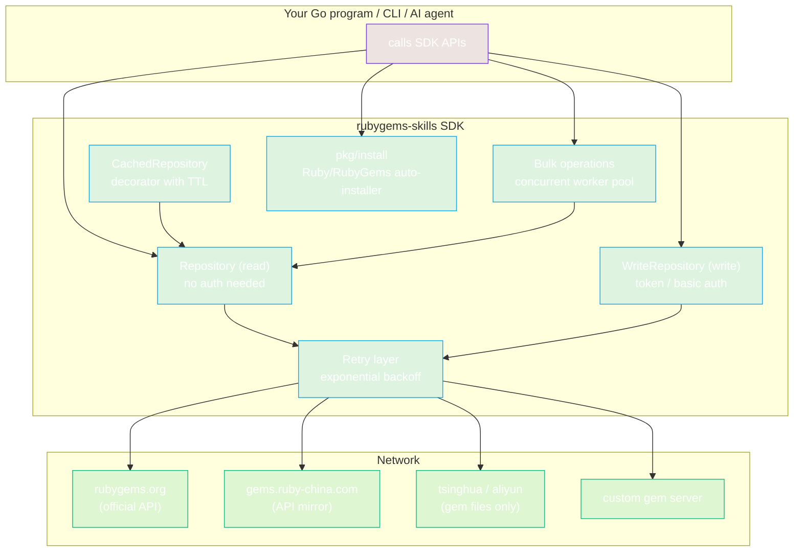
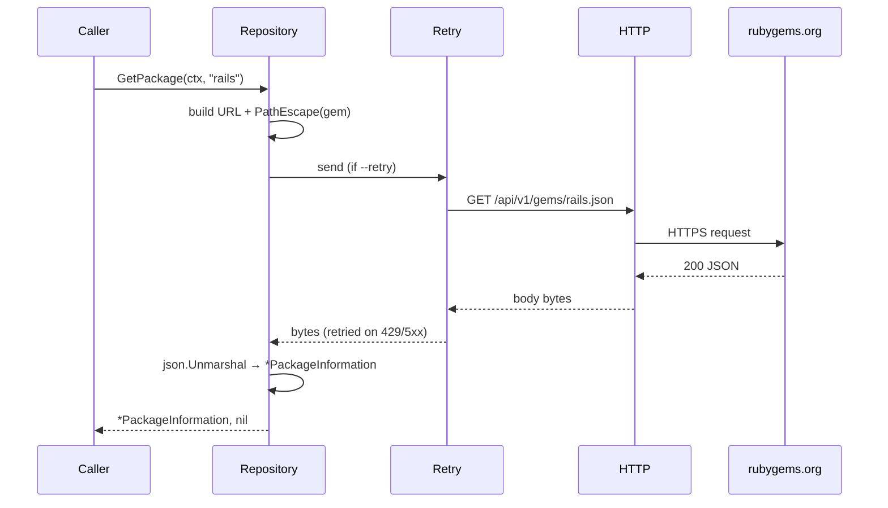

# rubygems-skills

[](https://pkg.go.dev/github.com/scagogogo/rubygems-skills)
[](https://goreportcard.com/report/github.com/scagogogo/rubygems-skills)
[](https://opensource.org/licenses/MIT)
[](https://go.dev/)
[](https://scagogogo.github.io/rubygems-skills/)

> 📖 **Documentation**: [https://scagogogo.github.io/rubygems-skills/](https://scagogogo.github.io/rubygems-skills/)

> 🇨🇳 [Simplified Chinese](README.zh-CN.md)

A production-ready Go SDK for the [RubyGems.org](https://rubygems.org) API. It provides a complete, type-safe client that covers **all public API v1 and v2 endpoints** — including package queries, search, versions, downloads, dependencies, user/owner management, API key management, MFA status, webhooks, attestations, and gem publishing — with built-in caching, concurrent bulk operations, retry with exponential backoff, mirror repository support, and a full-featured CLI.

> This README is written for **AI agents** as the primary reader. Every command is copy-paste-runnable; every code block is self-contained; signatures are stated explicitly so agents can generate correct code without trial-and-error.

---

## TL;DR for Agents

**What this is:** A Go module that wraps the entire RubyGems.org HTTP API into typed Go interfaces.

**Module path:** `github.com/scagogogo/rubygems-skills`
**Min Go version:** 1.21
**Two interfaces:** `Repository` (read, no auth needed) and `WriteRepository` (write, needs API token or HTTP Basic auth).

**Fastest path to a working call:**

```bash
# 1. Add to a Go module that already exists (run inside the consumer module)
go get github.com/scagogogo/rubygems-skills@latest
```

```go
// 2. Minimal runnable program — save as main.go and `go run main.go`
package main

import (
	"context"
	"fmt"

	"github.com/scagogogo/rubygems-skills/pkg/repository"
)

func main() {
	pkg, err := repository.NewRepository().GetPackage(context.Background(), "rails")
	if err != nil {
		panic(err)
	}
	fmt.Printf("%s %s — %d downloads\n", pkg.Name, pkg.Version, pkg.Downloads)
}
```

**Pre-check before generating code:** confirm the consumer module targets Go ≥ 1.21 and has network egress to `https://rubygems.org`. No Ruby/RubyGems runtime is required to use the SDK — only if you call the `pkg/install` auto-installer.

---

## Agent Quick Reference

### Fact sheet (machine-readable)

| Key | Value |
|-----|-------|
| module | `github.com/scagogogo/rubygems-skills` |
| go version | `1.21` |
| default server | `https://rubygems.org` |
| auth (read, optional) | Bearer token via `Options.SetToken` — raises rate-limit quota |
| auth (write) | Bearer token (publish/yank/owners/webhooks) **or** HTTP Basic (API key + profile endpoints) |
| request body encoding | `application/x-www-form-urlencoded` (NOT JSON) for API key & write endpoints |
| path param encoding | `url.PathEscape` (applied internally) |
| query param encoding | `url.QueryEscape` (applied internally) |
| retry | opt-in via `Options.SetRetryOptions`; default retries any error (3 attempts, exp backoff) |
| caching | opt-in decorator: `NewCachedRepository(repo, ttl, cache)` |

### Constructor signatures (verbatim)

```go
// Read client (no options = official source, no auth, no retry, no cache)
func NewRepository(options ...*Options) *RepositoryImpl

// Write client (requires a token via options)
func NewWriteRepository(options *Options) *WriteRepositoryImpl

// Cached read client — wraps any Repository
func NewCachedRepository(repo Repository, ttl time.Duration, cache cache.Cache) *CachedRepository

// Mirror factories (return *RepositoryImpl)
func NewRubyChinaRepository() *RepositoryImpl      // https://gems.ruby-china.com
func NewTSingHuaRepository() *RepositoryImpl       // https://mirrors.tuna.tsinghua.edu.cn/rubygems
func NewAliYunRepository() *RepositoryImpl         // https://mirrors.aliyun.com/rubygems
func NewCustomRepository(serverURL string) *RepositoryImpl  // any gem server

// Options builder (chainable, each method returns *Options)
func NewOptions() *Options
func (o *Options) SetToken(token string) *Options
func (o *Options) SetProxy(proxyURL string) *Options
func (o *Options) SetRetryOptions(opts *RetryOptions) *Options

// Retry builder
func NewDefaultRetryOptions() *RetryOptions
func (r *RetryOptions) WithMaxAttempts(n int) *RetryOptions
func (r *RetryOptions) WithWaitTime(d time.Duration) *RetryOptions
func (r *RetryOptions) WithExponentialBackoff(b bool) *RetryOptions

// Cross-platform Ruby/RubyGems auto-installer
func NewInstaller(options ...*InstallOptions) *Installer
func (i *Installer) Install(ctx context.Context) (*InstallResult, error)
func (i *Installer) IsInstalled() (bool, *RubyInfo, error)
```

### Error predicates (use these, not string matching)

```go
repository.IsNotFound(err)      // 404
repository.IsRateLimited(err)   // 429
repository.IsUnauthorized(err)  // 401/403

var apiErr *repository.APIError
errors.As(err, &apiErr)  // apiErr.StatusCode, apiErr.URL, apiErr.Response
```

---

## Installation

> Audience: an AI agent adding this SDK to a Go project. Steps are ordered; each must succeed before the next.

**Step 1 — Verify the consumer environment.** The target module must already be a Go module with Go ≥ 1.21.

```bash
# Run inside the consumer module root. Both commands must succeed.
test -f go.mod                       # ensure a go.mod exists
grep -q '^go 1\.\(2[1-9]\|[3-9]\)' go.mod  # ensure Go >= 1.21
```

**Step 2 — Add the dependency.**

```bash
go get github.com/scagogogo/rubygems-skills@latest
```

> After `go get`, the module is recorded as `// indirect` in `go.mod` until you import a package. The next step handles that automatically.

**Step 3 — Verify it compiles** (catches version/Go mismatches immediately and records transitive deps in `go.sum`):

```bash
# Write a one-line main.go that imports the SDK, then:
go mod tidy && go build ./...
```

If `go build ./...` reports `missing go.sum entry for ... go-requests`, run `go mod tidy` — it pulls the transitive dependency (`github.com/crawler-go-go-go/go-requests`) into `go.sum`. This is expected on first import.

**Step 4 — (Optional) Auto-install Ruby/RubyGems on the host.** Only needed if the agent's workflow itself executes `gem`/`ruby` binaries — not needed to call the SDK.

```go
import "github.com/scagogogo/rubygems-skills/pkg/install"

func ensureRuby() error {
	inst := install.NewInstaller()
	if ok, _, _ := inst.IsInstalled(); ok {
		return nil // already present
	}
	_, err := inst.Install(context.Background())
	return err
}
```

The installer auto-detects OS and package manager (apt/yum/dnf/apk/pacman/brew/choco/scoop/zypper) and runs the appropriate install command with sudo where required. Pass options to customize:

```go
opts := install.NewInstallOptions().
	WithRubyVersion("3.2").
	WithBundler(true).
	WithTimeout(300)
inst := install.NewInstaller(opts)
```

**Step 5 — (Optional) Build the bundled CLI** for ad-hoc inspection from a shell:

```bash
go build -o rubygems ./cmd/rubygems/
./rubygems get rails --json
```

---

## Why This SDK?

If you're building Go tooling that interacts with the Ruby gem ecosystem — dependency analysis, security auditing, registry mirroring, CI/CD integration, or data pipelines — you need a reliable, typed API client. This SDK eliminates the need to hand-craft HTTP calls, parse JSON, handle rate limits, and manage retries. It wraps every RubyGems.org endpoint into idiomatic Go with proper error types, URL-safe parameter encoding, and optional caching out of the box.

---

## Features

- **Complete API Coverage** — All RubyGems API v1/v2 endpoints: packages, search, versions, downloads, dependencies, reverse dependencies, user profiles, owners, API keys, MFA, webhooks, attestations, and gem publishing
- **Multi-Repository Support** — Built-in mirrors (Ruby China, Tsinghua, Alibaba Cloud) plus `NewCustomRepository()` for private/custom gem servers
- **Smart Error Handling** — Typed errors (`IsNotFound`, `IsRateLimited`, `IsUnauthorized`) with structured `APIError` for programmatic handling
- **Automatic Retry** — Configurable retry with exponential backoff for transient failures (network errors, 429, 5xx). All request types (GET, POST, DELETE, form, multipart) support retry
- **URL-Safe Encoding** — All path and query parameters are properly encoded via `url.PathEscape` / `url.QueryEscape` to handle special characters
- **In-Memory Cache** — Thread-safe cache with TTL support, auto-cleanup, and `Cache` interface for custom implementations
- **Bulk Operations** — Concurrent batch requests with configurable concurrency for high-throughput data collection
- **Auto-Install** — Cross-platform automatic Ruby/RubyGems installation supporting apt, yum, dnf, apk, pacman, brew, choco, scoop, and zypper
- **HTTP Proxy & Auth** — Full support for corporate proxy environments, API token authentication, and HTTP Basic authentication
- **CLI Tool** — Command-line interface for quick queries with JSON output, mirror selection, and auto-install
- **Type-Safe Models** — Complete Go struct definitions matching the RubyGems API JSON schema
- **Comprehensive Tests** — Unit tests for all packages, Docker-based cross-platform integration tests, and race detector coverage

---

## Architecture



**Layering:** callers hit `Repository` / `WriteRepository`; `CachedRepository` decorates `Repository`; bulk operations fan out over `Repository`; every HTTP call flows through the optional retry layer to a chosen server. The auto-installer is independent — it provisions Ruby on the host, no network to rubygems.org required.

## Request flow



On a 404 the SDK returns an error satisfying `IsNotFound`; on 429, `IsRateLimited`; on 401/403, `IsUnauthorized`. With `--retry` enabled, transient failures (network errors, 429, 5xx) are retried with exponential backoff before surfacing.

---

## Quick Install

```bash
go get github.com/scagogogo/rubygems-skills
```

**Requirements:** Go 1.21+. For the step-by-step agent install (with `go mod tidy` and verification), see [Installation](#installation) above.

---

## Usage Recipes

> Each recipe is self-contained. An agent may copy any block directly into a `main.go`.

### Using Mirror Repositories

```go
// Ruby China Mirror (recommended for users in China)
repo := repository.NewRubyChinaRepository()

// Tsinghua University Mirror
repo := repository.NewTSingHuaRepository()

// Alibaba Cloud Mirror
repo := repository.NewAliYunRepository()

// Custom / Private gem server
repo := repository.NewCustomRepository("https://gems.example.com")
```

### Caching

```go
import (
    "time"
    "github.com/scagogogo/rubygems-skills/pkg/cache"
    "github.com/scagogogo/rubygems-skills/pkg/repository"
)

memCache := cache.NewMemoryCache(10*time.Minute, 30*time.Minute)
cachedRepo := repository.NewCachedRepository(repo, 5*time.Minute, memCache)

// First call hits the API
pkg, _ := cachedRepo.GetPackage(ctx, "rails")

// Second call returns from cache
pkg, _ = cachedRepo.GetPackage(ctx, "rails")

cachedRepo.ClearCache()
cachedRepo.Close()
```

### Bulk Concurrent Requests

```go
gems := []string{"rails", "rack", "activesupport", "rake", "bundler"}
options := repository.NewBulkOptions().WithMaxConcurrency(5)
results := repo.BulkGetPackages(ctx, gems, options)

for _, result := range results {
    if result.Error != nil {
        fmt.Printf("%s failed: %v\n", result.Key, result.Error)
        continue
    }
    fmt.Printf("%s: v%s (%d downloads)\n", result.Value.Name, result.Value.Version, result.Value.Downloads)
}
```

### Error Handling

```go
pkg, err := repo.GetPackage(ctx, "non-existent-gem")
if err != nil {
    if repository.IsNotFound(err) {
        fmt.Println("Package not found")
    } else if repository.IsRateLimited(err) {
        fmt.Println("Rate limited — back off and retry")
    } else if repository.IsUnauthorized(err) {
        fmt.Println("Authentication failed")
    } else {
        var apiErr *repository.APIError
        if errors.As(err, &apiErr) {
            fmt.Printf("HTTP %d at %s: %s\n", apiErr.StatusCode, apiErr.URL, apiErr.Response)
        }
    }
}
```

### Authentication & Proxy

```go
// API Token (increases rate limits)
options := repository.NewOptions().SetToken("your-api-token")
repo := repository.NewRepository(options)

// HTTP Proxy (corporate environments)
options := repository.NewOptions().SetProxy("http://127.0.0.1:7890")
repo := repository.NewRepository(options)
```

### Custom Retry Strategy

```go
retryOpts := repository.NewDefaultRetryOptions().
    WithMaxAttempts(5).
    WithWaitTime(2 * time.Second).
    WithExponentialBackoff(true)

options := repository.NewOptions().SetRetryOptions(retryOpts)
repo := repository.NewRepository(options)
```

### Write Operations (Auth Required)

```go
options := repository.NewOptions().SetToken("your-api-token")
writeRepo := repository.NewWriteRepository(options)

// Yank (unpublish) a gem version
result, err := writeRepo.YankGem(ctx, "my-gem", "1.0.0")

// Manage gem owners
err = writeRepo.AddGemOwner(ctx, "my-gem", "user@example.com", "owner")
err = writeRepo.RemoveGemOwner(ctx, "my-gem", "user@example.com")

// Manage webhooks
err = writeRepo.CreateWebhook(ctx, "my-gem", "https://example.com/webhook")
webhooks, err := writeRepo.ListWebhooks(ctx)
err = writeRepo.DeleteWebhook(ctx, "my-gem", "https://example.com/webhook")
```

### API Key Management (HTTP Basic Auth)

```go
// Retrieve a legacy API key
apiKey, err := writeRepo.GetAPIKey(ctx, "username", "password")

// Create a new scoped API key
req := &models.CreateAPIKeyRequest{
    Name:   "ci-key",
    Scopes: []string{"push_rubygem", "yank_rubygem"},
    MFA:    "enabled",
}
apiKey, err = writeRepo.CreateAPIKey(ctx, "username", "password", req)

// Update an API key's scopes
updateReq := &models.UpdateAPIKeyRequest{
    APIKey: "existing-key-value",
    Scopes: []string{"index_rubygems"},
}
apiKey, err = writeRepo.UpdateAPIKey(ctx, "username", "password", updateReq)
```

### MFA Status

```go
// Check MFA status for the authenticated user (requires API Token)
status, err := repo.GetMFAStatus(ctx)
fmt.Printf("MFA enabled: %v, level: %s\n", status.Enabled, status.Level)
```

### Authenticated User Profile

```go
// Get your full profile (including private fields, requires HTTP Basic Auth)
profile, err := writeRepo.GetMyProfile(ctx, "username", "password")
```

### V2 API — Richer Version Details

```go
// Detailed version info via API v2 (includes spec_sha, yanked, full deps)
detail, err := repo.GetGemVersionDetail(ctx, "rails", "7.0.5")
fmt.Printf("Yanked: %v\n", detail.Yanked)
fmt.Printf("Spec SHA: %s\n", detail.SpecSha)

// File checksums for a version
contents, err := repo.GetGemVersionContents(ctx, "rails", "7.0.5")
for file, sha := range contents.Files {
    fmt.Printf("  %s: %s\n", file, sha)
}
```

### User & Owner Info

```go
profile, err := repo.GetUserProfile(ctx, "qrush")
gems, err := repo.GetGemsByOwner(ctx, "qrush")
owners, err := repo.GetGemOwners(ctx, "rails")
```

### Version-Level Reverse Dependencies

```go
// Get packages that depend on a specific version (fullName = "gemname-version")
deps, err := repo.GetVersionReverseDependencies(ctx, "rack-2.2.7")
```

### Top Downloads & Autocomplete

```go
topGems, err := repo.TopDownloads(ctx)
suggestions, err := repo.SearchAutocomplete(ctx, "rails")
```

---

## CLI Tool

The CLI is built on [cobra](https://github.com/spf13/cobra) and exposes the full SDK as subcommands. Global flags (`--mirror`, `--token`, `--proxy`, `--cache`, `--retry`, `--json`, `--timeout`) apply to most commands.

```bash
go build -o rubygems ./cmd/rubygems/
```

### Read commands

```bash
./rubygems get rails                         # package info
./rubygems search rails --limit 10           # search
./rubygems autocomplete rail                 # autocomplete suggestions
./rubygems versions rails --limit 20         # version list
./rubygems latest-version rails              # latest version
./rubygems version-detail rails 8.1.3        # v2 detailed version info
./rubygems version-contents rails 8.1.3      # v2 file checksums
./rubygems downloads                         # total repo downloads
./rubygems version-downloads rails 8.1.3     # version download count
./rubygems top-downloads --limit 10          # top downloaded gems
./rubygems deps rails rack                   # dependencies (deprecated API)
./rubygems rdeps rack --limit 50             # reverse dependencies
./rubygems version-rdeps rack-2.2.7          # version-level reverse deps
./rubygems latest-gems                       # recently published
./rubygems just-updated                      # recently updated
./rubygems user-profile qrush                # user profile
./rubygems owned-gems                        # your gems (--token)
./rubygems gems-by-owner qrush               # gems by owner
./rubygems gem-owners rails                  # gem owners
./rubygems attestations rails 8.1.3          # sigstore attestations
./rubygems mfa-status                        # MFA status (--token)
```

### Bulk commands

```bash
./rubygems bulk-get rails rack bundler --concurrency 5
./rubygems bulk-versions rails,rack --concurrency 3
./rubygems bulk-deps rails,rack
./rubygems bulk-rdeps rails,rack
```

### Write commands (require `--token` or HTTP Basic auth)

```bash
./rubygems push ./my-gem-1.0.0.gem                              # publish a gem
./rubygems yank my-gem 1.0.0                                     # yank a version
./rubygems yank my-gem 1.0.0 --platform x86_64-linux            # yank with platform
./rubygems add-owner my-gem user@example.com --role owner        # add owner
./rubygems remove-owner my-gem user@example.com                  # remove owner
./rubygems update-owner my-gem user@example.com --role owner     # update owner role
./rubygems list-webhooks                                         # list webhooks
./rubygems create-webhook my-gem https://example.com/hook        # create webhook
./rubygems delete-webhook my-gem https://example.com/hook        # delete webhook
./rubygems fire-webhook my-gem https://example.com/hook          # test-fire webhook
./rubygems get-api-key --user name                               # retrieve API key (Basic)
./rubygems create-api-key --user name --name ci --scopes push_rubygem,yank_rubygem
./rubygems update-api-key --user name --api-key KEY --scopes index_rubygems
./rubygems my-profile --user name                                # full profile (Basic)
```

### Auto-install command

```bash
./rubygems install                 # auto-install Ruby/RubyGems
./rubygems install --force         # force reinstall
./rubygems install --no-dev --no-bundler
./rubygems platform                # detect OS/distro/package manager
```

### Global options

```bash
./rubygems get rails --json                  # JSON output
./rubygems get rails --mirror ruby-china     # use a mirror
./rubygems get rails --cache                 # enable in-memory cache
./rubygems get rails --token $RUBYGEMS_TOKEN # authenticate
./rubygems get rails --proxy http://127.0.0.1:7890   # HTTP proxy
./rubygems get rails --retry --retry-attempts 5      # retry with backoff
./rubygems get rails --timeout 60                    # request timeout (seconds)
./rubygems get rails --server https://gems.example.com  # custom server
```

> **Mirror note:** Only the official source and `ruby-china` provide the RubyGems.org API. The `tsinghua` and `aliyun` mirrors only serve gem files and will return 404 for API calls.

Run `./rubygems --help` or `./rubygems <command> --help` for full usage.

---

## API Reference

### Repository Interface (Read Operations)

| Method | Endpoint | Description |
|--------|----------|-------------|
| `GetPackage(ctx, gem)` | `GET /api/v1/gems/{gem}.json` | Get detailed package info |
| `Search(ctx, query, page)` | `GET /api/v1/search.json?query=` | Search packages |
| `SearchAutocomplete(ctx, query)` | `GET /api/v1/search/autocomplete.json` | Search autocomplete suggestions |
| `GetGemVersions(ctx, gem)` | `GET /api/v1/versions/{gem}.json` | List all versions |
| `GetGemLatestVersion(ctx, gem)` | `GET /api/v1/versions/{gem}/latest.json` | Get latest version |
| `GetGemVersionDetail(ctx, gem, ver)` | `GET /api/v2/rubygems/{gem}/versions/{ver}.json` | **V2** Detailed version info |
| `GetTimeFrameVersions(ctx, from, to)` | `GET /api/v1/timeframe_versions.json` | Versions in time range |
| `Downloads(ctx)` | `GET /api/v1/downloads.json` | Total repository downloads |
| `VersionDownloads(ctx, gem, ver)` | `GET /api/v1/downloads/{gem}-{ver}.json` | Version download count |
| `TopDownloads(ctx)` | `GET /api/v1/downloads/all.json` | Top 50 most downloaded gems |
| `GetDependencies(ctx, gems...)` | `GET /api/v1/dependencies?gems=` | Dependency info |
| `GetReverseDependencies(ctx, gem)` | `GET /api/v1/gems/{gem}/reverse_dependencies.json` | Reverse dependencies |
| `GetVersionReverseDependencies(ctx, fullName)` | `GET /api/v1/versions/{fullName}/reverse_dependencies.json` | Version-level reverse dependencies |
| `LatestGems(ctx)` | `GET /api/v1/activity/latest.json` | Recently published gems |
| `JustUpdatedGems(ctx)` | `GET /api/v1/activity/just_updated.json` | Recently updated gems |
| `GetUserProfile(ctx, handle)` | `GET /api/v1/profiles/{handle}.json` | User profile info |
| `GetOwnedGems(ctx)` | `GET /api/v1/gems.json` | List your gems (auth required) |
| `GetGemsByOwner(ctx, handle)` | `GET /api/v1/owners/{handle}/gems.json` | Gems by user |
| `GetGemOwners(ctx, gem)` | `GET /api/v1/gems/{gem}/owners.json` | Gem owners |
| `GetAttestations(ctx, gem, ver)` | `GET /api/v1/attestations/{gem}-{ver}.json` | Sigstore attestations |
| `GetGemVersionContents(ctx, gem, ver)` | `GET /api/v2/rubygems/{gem}/versions/{ver}/contents.json` | **V2** Version file checksums |
| `GetMFAStatus(ctx)` | `GET /api/v1/multifactor_auth` | MFA status (auth required) |
| `BulkGetPackages(ctx, gems, opts)` | (concurrent) | Bulk package fetch |
| `BulkGetVersions(ctx, gems, opts)` | (concurrent) | Bulk version fetch |
| `BulkGetDependencies(ctx, gems, opts)` | (concurrent) | Bulk dependency fetch |
| `BulkGetReverseDependencies(ctx, gems, opts)` | (concurrent) | Bulk reverse dependency fetch |

### WriteRepository Interface (Auth Required)

| Method | Endpoint | Description |
|--------|----------|-------------|
| `PushGem(ctx, file)` | `POST /api/v1/gems` | Publish a gem |
| `YankGem(ctx, gem, ver)` | `DELETE /api/v1/gems/yank` | Yank (unpublish) a version |
| `YankGemWithPlatform(ctx, gem, ver, platform)` | `DELETE /api/v1/gems/yank` | Yank with platform |
| `AddGemOwner(ctx, gem, email, role)` | `POST /api/v1/gems/{gem}/owners` | Add gem owner |
| `RemoveGemOwner(ctx, gem, email)` | `DELETE /api/v1/gems/{gem}/owners` | Remove gem owner |
| `UpdateGemOwnerRole(ctx, gem, email, role)` | `PATCH /api/v1/gems/{gem}/owners` | Update owner role |
| `ListWebhooks(ctx)` | `GET /api/v1/web_hooks.json` | List webhooks |
| `CreateWebhook(ctx, gem, url)` | `POST /api/v1/web_hooks` | Create webhook |
| `DeleteWebhook(ctx, gem, url)` | `DELETE /api/v1/web_hooks/remove` | Delete webhook |
| `FireWebhook(ctx, gem, url)` | `POST /api/v1/web_hooks/fire` | Test fire webhook |
| `GetAPIKey(ctx, user, pass)` | `GET /api/v1/api_key` | Retrieve API key (Basic Auth) |
| `CreateAPIKey(ctx, user, pass, req)` | `POST /api/v1/api_key` | Create scoped API key (Basic Auth) |
| `UpdateAPIKey(ctx, user, pass, req)` | `PATCH /api/v1/api_key` | Update API key scopes (Basic Auth) |
| `GetMyProfile(ctx, user, pass)` | `GET /api/v1/profiles/me.json` | Full authenticated profile (Basic Auth) |

---

## Project Structure

```
rubygems-skills/
├── cmd/rubygems/              # CLI tool
├── examples/                  # Usage examples
│   ├── basic_usage.go
│   ├── bulk/main.go
│   └── cache/main.go
├── pkg/
│   ├── cache/                 # Cache interface & memory implementation
│   ├── install/               # Cross-platform auto-install
│   ├── models/                # JSON data models (APIKey, MFAStatus, etc.)
│   └── repository/            # Repository client
│       ├── repository.go      # Core client & read interface
│       ├── write_repository.go # Write operations & auth interface
│       ├── mirrors.go         # Mirror & custom repository factories
│       ├── options.go         # Client configuration
│       ├── errors.go          # Typed API errors
│       ├── retry.go           # Retry logic with backoff
│       ├── bulk_operations.go # Concurrent batch operations
│       └── cached_repository.go # Cache decorator
├── tests/
│   └── integration/           # Integration tests
├── go.mod
└── LICENSE
```

---

## Rate Limits

RubyGems.org enforces API rate limits. See the [official documentation](https://guides.rubygems.org/rubygems-org-rate-limits/) for details. Using an API token increases your request quota significantly.

---

## Testing

```bash
# Run all unit tests (no network)
go test -short -v ./...

# Run all tests including live API tests
go test -v ./...

# Run with race detector
go test -short -race -v ./...

# Coverage report
go test -short -coverprofile=cover.out ./... && go tool cover -func=cover.out | tail -1
```

**Coverage target.** `pkg/` packages aim for 100% statement coverage; `cmd/`
(the CLI thin layer) is covered to ~89% — `main()` is an entry point and
`installCmd` drives real OS package managers, both intentionally excluded
from isolated unit tests. Run `go tool cover -func=cover.out` to see
per-function numbers.

### Testability design

All I/O (HTTP, filesystem, `os/exec`, runtime detection) is hidden behind
package-level injectable seams so unit tests run hermetically — no network,
no real subprocess, no host mutation:

- **HTTP**: `Options.SetHTTPClient(http.Client)` lets tests inject a
  `httptest.Server`-backed transport; mirror/custom constructors accept a
  custom server URL.
- **CLI factories**: `cmd/rubygems` exposes `newRepoFunc` / `newWriteRepoFunc`
  package vars and a `buildRootCmd()` helper, so tests swap in a stubbed
  repository pointing at an `httptest.Server` and drive cobra via `SetArgs`
  with stdout captured through an `os.Pipe`.
- **Installer**: `pkg/install` routes every `os.ReadFile` / `os.Stat` /
  `exec.LookPath` / `exec.Command` / `runtime.GOOS` call through injectable
  vars (`osReadFile`, `osStat`, `detectOSFunc`, `detectArchFunc`, `runner`)
  plus a `commandRunner` interface with a programmable `fakeRunner`, reaching
  100% coverage across every platform / package-manager / distro branch.

### Error decision tree

```
err != nil
 │
 ├─ repository.IsNotFound(err)      → 404: gem/version/user does not exist
 ├─ repository.IsRateLimited(err)   → 429: back off, retry, or add --token
 ├─ repository.IsUnauthorized(err)  → 401/403: missing/invalid token or Basic auth
 └─ else → errors.As(err, &apiErr)  → apiErr.StatusCode / .URL / .Response
```

---

## Contributing

Contributions are welcome! Before submitting a PR, please ensure:

1. All tests pass: `go test -short -race ./...`
2. No vet warnings: `go vet ./...`
3. New code includes tests
4. Code is formatted: `gofmt -s -w .`
5. Documentation is updated

---

## License

MIT — see [LICENSE](LICENSE) for details.

---

## References

- [RubyGems API v2 Guide](https://guides.rubygems.org/rubygems-org-api-v2/)
- [RubyGems API v1 Guide](https://guides.rubygems.org/rubygems-org-api/)
- [RubyGems Rate Limits](https://guides.rubygems.org/rubygems-org-rate-limits/)
