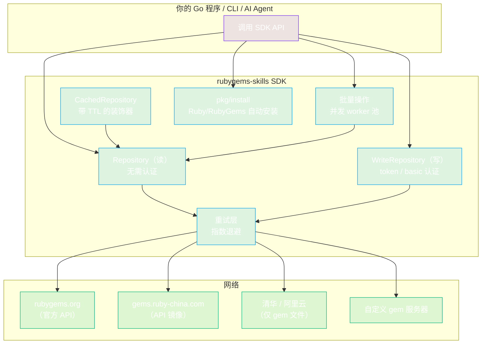
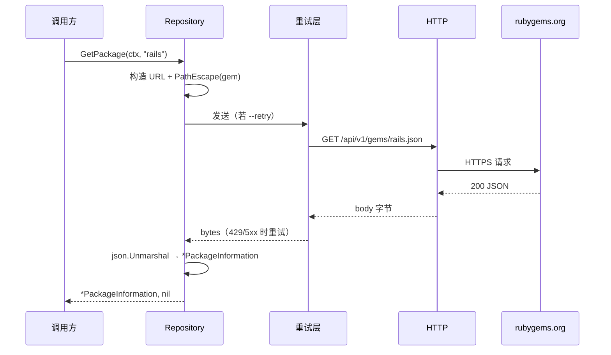

# rubygems-skills

[](https://pkg.go.dev/github.com/scagogogo/rubygems-skills)
[](https://goreportcard.com/report/github.com/scagogogo/rubygems-skills)
[](https://opensource.org/licenses/MIT)
[](https://go.dev/)
[](https://scagogogo.github.io/rubygems-skills/)

> 📖 **文档站**: [https://scagogogo.github.io/rubygems-skills/](https://scagogogo.github.io/rubygems-skills/)

[🇬🇧 English](README.md)

一个面向 [RubyGems.org](https://rubygems.org) API 的生产级 Go SDK。提供完整的、类型安全的客户端，覆盖**全部公开 API v1 与 v2 端点**——包括包查询、搜索、版本、下载统计、依赖关系、用户/所有者管理、API Key 管理、MFA 状态、Webhook、签名认证和 Gem 发布——并内置缓存、并发批量操作、指数退避重试、镜像源支持和功能完整的命令行工具。

> 本 README 以 **AI Agent** 为主要读者撰写。所有命令均可直接复制执行；每个代码块自包含；函数签名明确列出，Agent 无需试错即可生成正确代码。

---

## Agent 速览

**这是什么：** 一个把整个 RubyGems.org HTTP API 封装为类型化 Go 接口的 Go module。

**Module 路径：** `github.com/scagogogo/rubygems-skills`
**最低 Go 版本：** 1.21
**两个接口：** `Repository`（读，无需认证）和 `WriteRepository`（写，需要 API Token 或 HTTP Basic 认证）。

**最快跑通路径：**

```bash
# 1. 添加到已存在的 Go module（在消费方 module 根目录执行）
go get github.com/scagogogo/rubygems-skills@latest
```

```go
// 2. 最小可运行程序 — 保存为 main.go 后 `go run main.go`
package main

import (
	"context"
	"fmt"

	"github.com/scagogogo/rubygems-skills/pkg/repository"
)

func main() {
	pkg, err := repository.NewRepository().GetPackage(context.Background(), "rails")
	if err != nil {
		panic(err)
	}
	fmt.Printf("%s %s — %d downloads\n", pkg.Name, pkg.Version, pkg.Downloads)
}
```

**生成代码前预检：** 确认消费方 module 目标 Go ≥ 1.21，且能访问 `https://rubygems.org`。使用 SDK 本身不需要 Ruby/RubyGems 运行时——只有调用 `pkg/install` 自动安装器时才需要。

---

## Agent 快速参考

### 信息表（机器可读）

| 键 | 值 |
|-----|-----|
| module | `github.com/scagogogo/rubygems-skills` |
| go 版本 | `1.21` |
| 默认服务器 | `https://rubygems.org` |
| 认证（读，可选） | 通过 `Options.SetToken` 传 Bearer token — 提升限流配额 |
| 认证（写） | Bearer token（发布/撤回/所有者/webhook）**或** HTTP Basic（API key + profile 端点） |
| 请求体编码 | `application/x-www-form-urlencoded`（非 JSON），适用于 API key 及写端点 |
| 路径参数编码 | `url.PathEscape`（内部已应用） |
| 查询参数编码 | `url.QueryEscape`（内部已应用） |
| 重试 | 通过 `Options.SetRetryOptions` 开启；默认重试任意错误（3 次尝试，指数退避） |
| 缓存 | 可选装饰器：`NewCachedRepository(repo, ttl, cache)` |

### 构造函数签名（原文照抄）

```go
// 读客户端（无 options = 官方源、无认证、无重试、无缓存）
func NewRepository(options ...*Options) *RepositoryImpl

// 写客户端（需通过 options 传入 token）
func NewWriteRepository(options *Options) *WriteRepositoryImpl

// 缓存读客户端 — 包装任意 Repository
func NewCachedRepository(repo Repository, ttl time.Duration, cache cache.Cache) *CachedRepository

// 镜像源工厂（返回 *RepositoryImpl）
func NewRubyChinaRepository() *RepositoryImpl      // https://gems.ruby-china.com
func NewTSingHuaRepository() *RepositoryImpl       // https://mirrors.tuna.tsinghua.edu.cn/rubygems
func NewAliYunRepository() *RepositoryImpl         // https://mirrors.aliyun.com/rubygems
func NewCustomRepository(serverURL string) *RepositoryImpl  // 任意 gem 服务器

// Options 构造器（链式，每个方法返回 *Options）
func NewOptions() *Options
func (o *Options) SetToken(token string) *Options
func (o *Options) SetProxy(proxyURL string) *Options
func (o *Options) SetRetryOptions(opts *RetryOptions) *Options

// 重试构造器
func NewDefaultRetryOptions() *RetryOptions
func (r *RetryOptions) WithMaxAttempts(n int) *RetryOptions
func (r *RetryOptions) WithWaitTime(d time.Duration) *RetryOptions
func (r *RetryOptions) WithExponentialBackoff(b bool) *RetryOptions

// 跨平台 Ruby/RubyGems 自动安装器
func NewInstaller(options ...*InstallOptions) *Installer
func (i *Installer) Install(ctx context.Context) (*InstallResult, error)
func (i *Installer) IsInstalled() (bool, *RubyInfo, error)
```

### 错误判定（用这些，不要做字符串匹配）

```go
repository.IsNotFound(err)      // 404
repository.IsRateLimited(err)   // 429
repository.IsUnauthorized(err)  // 401/403

var apiErr *repository.APIError
errors.As(err, &apiErr)  // apiErr.StatusCode, apiErr.URL, apiErr.Response
```

---

## 安装

> 受众：将本 SDK 添加到 Go 项目的 AI Agent。步骤有序执行，前一步必须成功才能进行下一步。

**第 1 步 — 校验消费方环境。** 目标 module 必须已是 Go ≥ 1.21 的 Go module。

```bash
# 在消费方 module 根目录执行。两条命令都必须成功。
test -f go.mod                       # 确认存在 go.mod
grep -q '^go 1\.\(2[1-9]\|[3-9]\)' go.mod  # 确认 Go >= 1.21
```

**第 2 步 — 添加依赖。**

```bash
go get github.com/scagogogo/rubygems-skills@latest
```

> `go get` 之后，模块在 `go.mod` 中会先标记为 `// indirect`，直到你真正 import 某个包。下一步会自动处理。

**第 3 步 — 验证编译**（立即捕获版本/Go 不匹配，并把传递依赖写入 `go.sum`）：

```bash
# 写一个 import 了 SDK 的 main.go，然后：
go mod tidy && go build ./...
```

如果 `go build ./...` 报 `missing go.sum entry for ... go-requests`，执行 `go mod tidy` 即可——它会将传递依赖（`github.com/crawler-go-go-go/go-requests`）写入 `go.sum`。首次导入时这是预期行为。

**第 4 步 —（可选）在主机上自动安装 Ruby/RubyGems。** 仅当 Agent 的工作流本身要执行 `gem`/`ruby` 二进制时才需要——调用 SDK 不需要。

```go
import "github.com/scagogogo/rubygems-skills/pkg/install"

func ensureRuby() error {
	inst := install.NewInstaller()
	if ok, _, _ := inst.IsInstalled(); ok {
		return nil // 已安装
	}
	_, err := inst.Install(context.Background())
	return err
}
```

安装器自动检测操作系统和包管理器（apt/yum/dnf/apk/pacman/brew/choco/scoop/zypper），并在需要时使用 sudo 执行相应安装命令。可通过 options 自定义：

```go
opts := install.NewInstallOptions().
	WithRubyVersion("3.2").
	WithBundler(true).
	WithTimeout(300)
inst := install.NewInstaller(opts)
```

**第 5 步 —（可选）构建内置 CLI**，便于从 shell 临时查询：

```bash
go build -o rubygems ./cmd/rubygems/
./rubygems get rails --json
```

---

## 为什么需要这个 SDK？

如果你在构建与 Ruby Gem 生态交互的 Go 工具——依赖分析、安全审计、仓库镜像、CI/CD 集成或数据管道——你需要一个可靠的、类型化的 API 客户端。本 SDK 免去了手工编写 HTTP 请求、解析 JSON、处理限流和管理重试的繁琐工作，将所有 RubyGems.org 端点封装为地道的 Go 接口，提供规范的错误类型、URL 安全编码和开箱即用的可选缓存。

---

## 功能特性

- **完整 API 覆盖** — 覆盖全部 RubyGems API v1/v2 端点：包、搜索、版本、下载、依赖、反向依赖、用户资料、所有者、API Key、MFA、Webhook、签名认证和 Gem 发布
- **多仓库支持** — 内置镜像源（Ruby China、清华大学、阿里云）以及 `NewCustomRepository()` 支持私有/自定义 Gem 服务器
- **智能错误处理** — 类型化错误（`IsNotFound`、`IsRateLimited`、`IsUnauthorized`）与结构化 `APIError` 支持编程式处理
- **自动重试** — 可配置的指数退避重试，应对瞬态故障（网络错误、429、5xx）。所有请求类型（GET、POST、DELETE、表单、multipart）均支持重试
- **URL 安全编码** — 所有路径和查询参数通过 `url.PathEscape` / `url.QueryEscape` 正确编码，安全处理特殊字符
- **内存缓存** — 线程安全缓存，支持 TTL、自动清理，提供 `Cache` 接口用于自定义实现
- **批量操作** — 可配置并发度的批量请求，满足高吞吐数据采集需求
- **自动安装** — 跨平台自动安装 Ruby/RubyGems，支持 apt、yum、dnf、apk、pacman、brew、choco、scoop 和 zypper
- **HTTP 代理与认证** — 完整支持企业代理环境、API Token 认证和 HTTP Basic 认证
- **命令行工具** — 支持快速查询、JSON 输出、镜像选择和自动安装的 CLI 工具
- **类型安全模型** — 完整的 Go 结构体定义，与 RubyGems API JSON 格式一一对应
- **全面测试** — 所有包的单元测试、基于 Docker 的跨平台集成测试和竞态检测覆盖

---

## 架构



**分层：** 调用方使用 `Repository` / `WriteRepository`；`CachedRepository` 装饰 `Repository`；批量操作在 `Repository` 上扇出；每次 HTTP 调用经可选的重试层到达所选服务器。自动安装器独立工作——它在主机上安装 Ruby，不需要访问 rubygems.org。

## 请求流程



404 时 SDK 返回满足 `IsNotFound` 的错误；429 时 `IsRateLimited`；401/403 时 `IsUnauthorized`。开启 `--retry` 时，瞬态故障（网络错误、429、5xx）会先以指数退避重试，再向上抛出。

---

## 快速安装

```bash
go get github.com/scagogogo/rubygems-skills
```

**环境要求：** Go 1.21+。如需分步骤的 Agent 安装指引（含 `go mod tidy` 与编译验证），见上方的[安装](#安装)章节。

---

## 用法配方

> 每个配方自包含。Agent 可将任意代码块直接复制进 `main.go`。

### 使用镜像源

```go
// Ruby China 镜像（推荐国内用户使用）
repo := repository.NewRubyChinaRepository()

// 清华大学镜像
repo := repository.NewTSingHuaRepository()

// 阿里云镜像
repo := repository.NewAliYunRepository()

// 自定义 / 私有 Gem 服务器
repo := repository.NewCustomRepository("https://gems.example.com")
```

### 缓存

```go
import (
    "time"
    "github.com/scagogogo/rubygems-skills/pkg/cache"
    "github.com/scagogogo/rubygems-skills/pkg/repository"
)

memCache := cache.NewMemoryCache(10*time.Minute, 30*time.Minute)
cachedRepo := repository.NewCachedRepository(repo, 5*time.Minute, memCache)

// 首次调用访问 API
pkg, _ := cachedRepo.GetPackage(ctx, "rails")

// 第二次调用从缓存返回
pkg, _ = cachedRepo.GetPackage(ctx, "rails")

cachedRepo.ClearCache()
cachedRepo.Close()
```

### 批量并发请求

```go
gems := []string{"rails", "rack", "activesupport", "rake", "bundler"}
options := repository.NewBulkOptions().WithMaxConcurrency(5)
results := repo.BulkGetPackages(ctx, gems, options)

for _, result := range results {
    if result.Error != nil {
        fmt.Printf("%s 失败: %v\n", result.Key, result.Error)
        continue
    }
    fmt.Printf("%s: v%s (下载量 %d)\n", result.Value.Name, result.Value.Version, result.Value.Downloads)
}
```

### 错误处理

```go
pkg, err := repo.GetPackage(ctx, "non-existent-gem")
if err != nil {
    if repository.IsNotFound(err) {
        fmt.Println("包不存在")
    } else if repository.IsRateLimited(err) {
        fmt.Println("触发限流，请稍后重试")
    } else if repository.IsUnauthorized(err) {
        fmt.Println("认证失败")
    } else {
        var apiErr *repository.APIError
        if errors.As(err, &apiErr) {
            fmt.Printf("HTTP %d at %s: %s\n", apiErr.StatusCode, apiErr.URL, apiErr.Response)
        }
    }
}
```

### 认证与代理

```go
// API Token（提升限流配额）
options := repository.NewOptions().SetToken("your-api-token")
repo := repository.NewRepository(options)

// HTTP 代理（企业环境）
options := repository.NewOptions().SetProxy("http://127.0.0.1:7890")
repo := repository.NewRepository(options)
```

### 自定义重试策略

```go
retryOpts := repository.NewDefaultRetryOptions().
    WithMaxAttempts(5).
    WithWaitTime(2 * time.Second).
    WithExponentialBackoff(true)

options := repository.NewOptions().SetRetryOptions(retryOpts)
repo := repository.NewRepository(options)
```

### 写操作（需要认证）

```go
options := repository.NewOptions().SetToken("your-api-token")
writeRepo := repository.NewWriteRepository(options)

// 撤回（下架）某个版本
result, err := writeRepo.YankGem(ctx, "my-gem", "1.0.0")

// 管理 Gem 所有者
err = writeRepo.AddGemOwner(ctx, "my-gem", "user@example.com", "owner")
err = writeRepo.RemoveGemOwner(ctx, "my-gem", "user@example.com")

// 管理 Webhook
err = writeRepo.CreateWebhook(ctx, "my-gem", "https://example.com/webhook")
webhooks, err := writeRepo.ListWebhooks(ctx)
err = writeRepo.DeleteWebhook(ctx, "my-gem", "https://example.com/webhook")
```

### API Key 管理（HTTP Basic 认证）

```go
// 获取传统 API Key
apiKey, err := writeRepo.GetAPIKey(ctx, "username", "password")

// 创建带作用域的新 API Key
req := &models.CreateAPIKeyRequest{
    Name:   "ci-key",
    Scopes: []string{"push_rubygem", "yank_rubygem"},
    MFA:    "enabled",
}
apiKey, err = writeRepo.CreateAPIKey(ctx, "username", "password", req)

// 更新 API Key 的作用域
updateReq := &models.UpdateAPIKeyRequest{
    APIKey: "existing-key-value",
    Scopes: []string{"index_rubygems"},
}
apiKey, err = writeRepo.UpdateAPIKey(ctx, "username", "password", updateReq)
```

### MFA 状态

```go
// 查看已认证用户的 MFA 状态（需要 API Token）
status, err := repo.GetMFAStatus(ctx)
fmt.Printf("MFA 已启用: %v, 级别: %s\n", status.Enabled, status.Level)
```

### 已认证用户资料

```go
// 获取完整用户资料（包含私有字段，需要 HTTP Basic 认证）
profile, err := writeRepo.GetMyProfile(ctx, "username", "password")
```

### V2 API — 更丰富的版本详情

```go
// 通过 API v2 获取详细版本信息（包含 spec_sha、yanked 状态和完整依赖信息）
detail, err := repo.GetGemVersionDetail(ctx, "rails", "7.0.5")
fmt.Printf("已撤回: %v\n", detail.Yanked)
fmt.Printf("Spec SHA: %s\n", detail.SpecSha)

// 获取某个版本的文件校验和
contents, err := repo.GetGemVersionContents(ctx, "rails", "7.0.5")
for file, sha := range contents.Files {
    fmt.Printf("  %s: %s\n", file, sha)
}
```

### 用户与所有者信息

```go
profile, err := repo.GetUserProfile(ctx, "qrush")
gems, err := repo.GetGemsByOwner(ctx, "qrush")
owners, err := repo.GetGemOwners(ctx, "rails")
```

### 版本级别反向依赖

```go
// 获取依赖特定版本的其他包（fullName 格式为 "gemname-version"）
deps, err := repo.GetVersionReverseDependencies(ctx, "rack-2.2.7")
```

### 下载排行与自动补全

```go
topGems, err := repo.TopDownloads(ctx)
suggestions, err := repo.SearchAutocomplete(ctx, "rails")
```

---

## 命令行工具

CLI 基于 [cobra](https://github.com/spf13/cobra) 构建，将整个 SDK 暴露为子命令。全局 flag（`--mirror`、`--token`、`--proxy`、`--cache`、`--retry`、`--json`、`--timeout`）适用于绝大多数命令。

```bash
go build -o rubygems ./cmd/rubygems/
```

### 读命令

```bash
./rubygems get rails                         # 包信息
./rubygems search rails --limit 10           # 搜索
./rubygems autocomplete rail                 # 自动补全建议
./rubygems versions rails --limit 20         # 版本列表
./rubygems latest-version rails              # 最新版本
./rubygems version-detail rails 8.1.3        # v2 详细版本信息
./rubygems version-contents rails 8.1.3      # v2 文件校验和
./rubygems downloads                         # 仓库总下载量
./rubygems version-downloads rails 8.1.3     # 版本下载量
./rubygems top-downloads --limit 10          # 下载排行
./rubygems deps rails rack                   # 依赖（API 已废弃）
./rubygems rdeps rack --limit 50             # 反向依赖
./rubygems version-rdeps rack-2.2.7          # 版本级反向依赖
./rubygems latest-gems                       # 最近发布
./rubygems just-updated                      # 最近更新
./rubygems user-profile qrush                # 用户资料
./rubygems owned-gems                        # 你的 Gem（--token）
./rubygems gems-by-owner qrush               # 某用户的 Gem
./rubygems gem-owners rails                  # Gem 所有者
./rubygems attestations rails 8.1.3          # Sigstore 签名
./rubygems mfa-status                        # MFA 状态（--token）
```

### 批量命令

```bash
./rubygems bulk-get rails rack bundler --concurrency 5
./rubygems bulk-versions rails,rack --concurrency 3
./rubygems bulk-deps rails,rack
./rubygems bulk-rdeps rails,rack
```

### 写命令（需要 `--token` 或 HTTP Basic 认证）

```bash
./rubygems push ./my-gem-1.0.0.gem                              # 发布 Gem
./rubygems yank my-gem 1.0.0                                     # 撤回版本
./rubygems yank my-gem 1.0.0 --platform x86_64-linux            # 带平台撤回
./rubygems add-owner my-gem user@example.com --role owner        # 添加所有者
./rubygems remove-owner my-gem user@example.com                  # 移除所有者
./rubygems update-owner my-gem user@example.com --role owner     # 更新所有者角色
./rubygems list-webhooks                                         # 列出 Webhook
./rubygems create-webhook my-gem https://example.com/hook        # 创建 Webhook
./rubygems delete-webhook my-gem https://example.com/hook        # 删除 Webhook
./rubygems fire-webhook my-gem https://example.com/hook          # 测试触发 Webhook
./rubygems get-api-key --user name                               # 获取 API Key（Basic）
./rubygems create-api-key --user name --name ci --scopes push_rubygem,yank_rubygem
./rubygems update-api-key --user name --api-key KEY --scopes index_rubygems
./rubygems my-profile --user name                                # 完整资料（Basic）
```

### 自动安装命令

```bash
./rubygems install                 # 自动安装 Ruby/RubyGems
./rubygems install --force         # 强制重装
./rubygems install --no-dev --no-bundler
./rubygems platform                # 探测 OS/发行版/包管理器
```

### 全局选项

```bash
./rubygems get rails --json                  # JSON 输出
./rubygems get rails --mirror ruby-china     # 使用镜像
./rubygems get rails --cache                 # 开启内存缓存
./rubygems get rails --token $RUBYGEMS_TOKEN # 认证
./rubygems get rails --proxy http://127.0.0.1:7890   # HTTP 代理
./rubygems get rails --retry --retry-attempts 5      # 重试与退避
./rubygems get rails --timeout 60                    # 请求超时（秒）
./rubygems get rails --server https://gems.example.com  # 自定义服务器
```

> **镜像说明：** 只有官方源和 `ruby-china` 提供 RubyGems.org API。`tsinghua` 和 `aliyun` 镜像只提供 gem 文件下载，API 调用会返回 404。

执行 `./rubygems --help` 或 `./rubygems <命令> --help` 查看完整用法。

---

## API 参考

### Repository 接口（读操作）

| 方法 | 端点 | 说明 |
|------|------|------|
| `GetPackage(ctx, gem)` | `GET /api/v1/gems/{gem}.json` | 获取包详细信息 |
| `Search(ctx, query, page)` | `GET /api/v1/search.json?query=` | 搜索包 |
| `SearchAutocomplete(ctx, query)` | `GET /api/v1/search/autocomplete.json` | 搜索自动补全建议 |
| `GetGemVersions(ctx, gem)` | `GET /api/v1/versions/{gem}.json` | 列出所有版本 |
| `GetGemLatestVersion(ctx, gem)` | `GET /api/v1/versions/{gem}/latest.json` | 获取最新版本 |
| `GetGemVersionDetail(ctx, gem, ver)` | `GET /api/v2/rubygems/{gem}/versions/{ver}.json` | **V2** 详细版本信息 |
| `GetTimeFrameVersions(ctx, from, to)` | `GET /api/v1/timeframe_versions.json` | 时间范围内的版本 |
| `Downloads(ctx)` | `GET /api/v1/downloads.json` | 仓库总下载量 |
| `VersionDownloads(ctx, gem, ver)` | `GET /api/v1/downloads/{gem}-{ver}.json` | 版本下载量 |
| `TopDownloads(ctx)` | `GET /api/v1/downloads/all.json` | 下载量前 50 的 Gem |
| `GetDependencies(ctx, gems...)` | `GET /api/v1/dependencies?gems=` | 依赖信息 |
| `GetReverseDependencies(ctx, gem)` | `GET /api/v1/gems/{gem}/reverse_dependencies.json` | 反向依赖 |
| `GetVersionReverseDependencies(ctx, fullName)` | `GET /api/v1/versions/{fullName}/reverse_dependencies.json` | 版本级别反向依赖 |
| `LatestGems(ctx)` | `GET /api/v1/activity/latest.json` | 最近发布的 Gem |
| `JustUpdatedGems(ctx)` | `GET /api/v1/activity/just_updated.json` | 最近更新的 Gem |
| `GetUserProfile(ctx, handle)` | `GET /api/v1/profiles/{handle}.json` | 用户资料 |
| `GetOwnedGems(ctx)` | `GET /api/v1/gems.json` | 你的 Gem 列表（需认证） |
| `GetGemsByOwner(ctx, handle)` | `GET /api/v1/owners/{handle}/gems.json` | 某用户拥有的 Gem |
| `GetGemOwners(ctx, gem)` | `GET /api/v1/gems/{gem}/owners.json` | Gem 所有者 |
| `GetAttestations(ctx, gem, ver)` | `GET /api/v1/attestations/{gem}-{ver}.json` | Sigstore 签名认证 |
| `GetGemVersionContents(ctx, gem, ver)` | `GET /api/v2/rubygems/{gem}/versions/{ver}/contents.json` | **V2** 版本文件校验和 |
| `GetMFAStatus(ctx)` | `GET /api/v1/multifactor_auth` | MFA 状态（需认证） |
| `BulkGetPackages(ctx, gems, opts)` | (并发) | 批量获取包信息 |
| `BulkGetVersions(ctx, gems, opts)` | (并发) | 批量获取版本信息 |
| `BulkGetDependencies(ctx, gems, opts)` | (并发) | 批量获取依赖信息 |
| `BulkGetReverseDependencies(ctx, gems, opts)` | (并发) | 批量获取反向依赖信息 |

### WriteRepository 接口（需要认证）

| 方法 | 端点 | 说明 |
|------|------|------|
| `PushGem(ctx, file)` | `POST /api/v1/gems` | 发布 Gem |
| `YankGem(ctx, gem, ver)` | `DELETE /api/v1/gems/yank` | 撤回（下架）版本 |
| `YankGemWithPlatform(ctx, gem, ver, platform)` | `DELETE /api/v1/gems/yank` | 带平台撤回 |
| `AddGemOwner(ctx, gem, email, role)` | `POST /api/v1/gems/{gem}/owners` | 添加 Gem 所有者 |
| `RemoveGemOwner(ctx, gem, email)` | `DELETE /api/v1/gems/{gem}/owners` | 移除 Gem 所有者 |
| `UpdateGemOwnerRole(ctx, gem, email, role)` | `PATCH /api/v1/gems/{gem}/owners` | 更新所有者角色 |
| `ListWebhooks(ctx)` | `GET /api/v1/web_hooks.json` | 列出 Webhook |
| `CreateWebhook(ctx, gem, url)` | `POST /api/v1/web_hooks` | 创建 Webhook |
| `DeleteWebhook(ctx, gem, url)` | `DELETE /api/v1/web_hooks/remove` | 删除 Webhook |
| `FireWebhook(ctx, gem, url)` | `POST /api/v1/web_hooks/fire` | 测试触发 Webhook |
| `GetAPIKey(ctx, user, pass)` | `GET /api/v1/api_key` | 获取 API Key（Basic Auth） |
| `CreateAPIKey(ctx, user, pass, req)` | `POST /api/v1/api_key` | 创建带作用域的 API Key（Basic Auth） |
| `UpdateAPIKey(ctx, user, pass, req)` | `PATCH /api/v1/api_key` | 更新 API Key 作用域（Basic Auth） |
| `GetMyProfile(ctx, user, pass)` | `GET /api/v1/profiles/me.json` | 完整认证用户资料（Basic Auth） |

---

## 项目结构

```
rubygems-skills/
├── cmd/rubygems/              # 命令行工具
├── examples/                  # 使用示例
│   ├── basic_usage.go
│   ├── bulk/main.go
│   └── cache/main.go
├── pkg/
│   ├── cache/                 # 缓存接口与内存实现
│   ├── install/               # 跨平台自动安装
│   ├── models/                # JSON 数据模型（APIKey、MFAStatus 等）
│   └── repository/            # 仓库客户端
│       ├── repository.go      # 核心客户端与读接口
│       ├── write_repository.go # 写操作与认证接口
│       ├── mirrors.go         # 镜像源与自定义仓库工厂
│       ├── options.go         # 客户端配置
│       ├── errors.go          # 类型化 API 错误
│       ├── retry.go           # 退避重试逻辑
│       ├── bulk_operations.go # 并发批量操作
│       └── cached_repository.go # 缓存装饰器
├── tests/
│   └── integration/           # 集成测试
├── go.mod
└── LICENSE
```

---

## 速率限制

RubyGems.org 实施了 API 速率限制。详情请参阅[官方文档](https://guides.rubygems.org/rubygems-org-rate-limits/)。使用 API Token 可以显著提升请求配额。

---

## 测试

```bash
# 运行所有单元测试（不需要网络）
go test -short -v ./...

# 运行所有测试（包括实时 API 测试）
go test -v ./...

# 带竞态检测运行
go test -short -race -v ./...

# 覆盖率报告
go test -short -coverprofile=cover.out ./... && go tool cover -func=cover.out | tail -1
```

**覆盖率目标。** `pkg/` 各包追求 100% 语句覆盖；`cmd/`（CLI 薄封装层）约 89% ——
`main()` 是入口点、`installCmd` 驱动真实系统包管理器，二者刻意不纳入隔离单测。
运行 `go tool cover -func=cover.out` 可查看每个函数的覆盖率。

### 可测性设计

所有 I/O（HTTP、文件系统、`os/exec`、运行时检测）都隐藏在可注入的包级接缝之后，
使单元测试在无网络、无真实子进程、无宿主机改动的前提下运行：

- **HTTP**：`Options.SetHTTPClient(http.Client)` 允许测试注入 `httptest.Server`
  支撑的 transport；镜像/自定义构造器接受自定义服务器 URL。
- **CLI 工厂**：`cmd/rubygems` 暴露 `newRepoFunc` / `newWriteRepoFunc` 包级变量
  与 `buildRootCmd()` 辅助函数，测试可注入指向 `httptest.Server` 的桩仓库，
  通过 `SetArgs` 驱动 cobra 并用 `os.Pipe` 捕获 stdout。
- **安装器**：`pkg/install` 将每一次 `os.ReadFile` / `os.Stat` / `exec.LookPath` /
  `exec.Command` / `runtime.GOOS` 调用都路由到可注入变量（`osReadFile`、`osStat`、
  `detectOSFunc`、`detectArchFunc`、`runner`）以及带可编程 `fakeRunner` 的
  `commandRunner` 接口，覆盖每个平台 / 包管理器 / 发行版分支，达到 100% 覆盖。

### 错误决策树

```
err != nil
 │
 ├─ repository.IsNotFound(err)      → 404：gem/版本/用户不存在
 ├─ repository.IsRateLimited(err)   → 429：退避、重试，或加 --token
 ├─ repository.IsUnauthorized(err)  → 401/403：token 或 Basic 认证缺失/无效
 └─ else → errors.As(err, &apiErr)  → apiErr.StatusCode / .URL / .Response
```

---

## 贡献

欢迎贡献！提交 PR 前请确保：

1. 所有测试通过：`go test -short -race ./...`
2. 无 vet 警告：`go vet ./...`
3. 新代码包含测试
4. 代码已格式化：`gofmt -s -w .`
5. 文档已更新

---

## 许可证

MIT — 详见 [LICENSE](LICENSE)。

---

## 参考

- [RubyGems API v2 指南](https://guides.rubygems.org/rubygems-org-api-v2/)
- [RubyGems API v1 指南](https://guides.rubygems.org/rubygems-org-api/)
- [RubyGems 速率限制](https://guides.rubygems.org/rubygems-org-rate-limits/)
