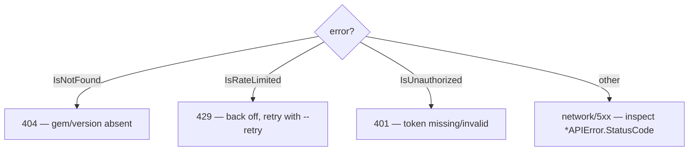

# README + Full Test Coverage Implementation Plan

> **For agentic workers:** REQUIRED SUB-SKILL: `superpowers:subagent-driven-development`
> Steps use checkbox (`- [ ]`) syntax.

**Goal:** 校正 GitHub 仓库描述、强化面向 AI Agent 的 README、为全部 SDK 功能补齐分支级单元测试并跑通至覆盖率 100%，修复过程中发现的问题。

**Architecture:** 测试通过注入自定义 `http.RoundTripper`（经 go-requests 的 `RequestSetting` 设置 `client.Transport`）打桩所有 HTTP 读写，无需真实网络即可覆盖状态码分支/认证分支/重试分支；`pkg/install` 抽出 `commandRunner` 接口注入 fake runner 覆盖各包管理器安装分支；cobra 命令通过 `root.SetArgs` + 注入 fake repo 测试。输入：测试用例 → 打桩层(transport/runner) → 被测函数 → 断言。关键组件：`pkg/repository` 的 HTTP 打桩测试工具、`pkg/install` 的 runner 接口、`cmd/rubygems` 的命令测试。理由：go-requests 的 `RequestSetting` 暴露 `*http.Client`，可设 Transport，故无需改第三方库即可 100% 打桩。

**Tech Stack:** Go 1.21, cobra, stretchr/testify, go-requests v0.0.0-20230525030146, golangci-lint v1.64.8

**Risks:**
- T1/T4 修改共享 `getBytes` 影响所有读方法 → 缓解：注入点为可选（nil 时走原路径），每步先 `go test ./...` 确保全绿
- T7 重构 `runCommand` 抽接口可能影响 `Install` 主流程 → 缓解：保持默认实现行为不变，仅新增可注入字段
- 部分 `pkg/install` 平台分支依赖 `runtime.GOOS`，CI 单平台无法跑到 → 缓解：把 `detectOS`/`detectArch` 抽成可注入函数变量，测试改写后恢复

---

### Task 1: 注入 HTTP Client 打桩基础 + Options 扩展

**Depends on:** None
**Files:**
- Modify: `pkg/repository/options.go:6-29`
- Modify: `pkg/repository/repository.go:361-445`
- Create: `pkg/repository/testutil_test.go`

- [ ] **Step 1: 扩展 Options 加 HTTPClient 字段 — 支持注入自定义 http.Client 用于测试打桩**
文件: `pkg/repository/options.go:6-29`（在 Options 结构体末尾、NewOptions 中加字段）

```go
package repository

// DefaultServerURL Default repository URL, connect directly to official repository
const DefaultServerURL = "https://rubygems.org"

type Options struct {

	// Repository server URL
	ServerURL string

	// Use proxy when sending requests to repository
	Proxy string

	// Token for API authentication
	// See: https://guides.rubygems.org/rubygems-org-api-v2/#rate-limits
	Token string

	// Request retry options
	RetryOptions *RetryOptions

	// HTTPClient is an optional custom *http.Client used for sending requests.
	// When non-nil, its Transport is applied to the request client (via a
	// RequestSetting), enabling HTTP stubbing in tests. When nil, the default
	// go-requests client behavior is used (proxy/token still applied).
	HTTPClient *http.Client
}

func NewOptions() *Options {
	return &Options{
		ServerURL:    DefaultServerURL,
		Proxy:        "",
		Token:        "",
		RetryOptions: NewDefaultRetryOptions(),
	}
}

func (x *Options) SetServerURL(serverUrl string) *Options {
	x.ServerURL = serverUrl
	return x
}

func (x *Options) SetProxy(proxy string) *Options {
	x.Proxy = proxy
	return x
}

func (x *Options) SetToken(token string) *Options {
	x.Token = token
	return x
}

func (x *Options) SetRetryOptions(retryOptions *RetryOptions) *Options {
	x.RetryOptions = retryOptions
	return x
}

// SetHTTPClient sets a custom HTTP client (used for test stubbing).
func (x *Options) SetHTTPClient(client *http.Client) *Options {
	x.HTTPClient = client
	return x
}

// DisableRetry disable retry functionality
func (x *Options) DisableRetry() *Options {
	x.RetryOptions = nil
	return x
}
```

注意：options.go 顶部需补 `"net/http"` import。

- [ ] **Step 2: 在 getBytes 注入 HTTPClient Transport — 让读请求支持测试打桩**
文件: `pkg/repository/repository.go:361-400`（替换整个 getBytes 方法）

```go
// internal unified request method
func (x *RepositoryImpl) getBytes(ctx context.Context, targetUrl string) ([]byte, error) {
	// Use custom ResponseHandler, only accept 2xx status codes
	responseHandler := func(httpResponse *http.Response) ([]byte, error) {
		// Check HTTP status code
		if httpResponse.StatusCode < 200 || httpResponse.StatusCode >= 300 {
			// Read response body
			body, readErr := requests.BytesResponseHandler()(httpResponse)
			bodyStr := ""
			if readErr == nil {
				bodyStr = string(body)
			}
			return nil, NewAPIError(httpResponse, []byte(bodyStr), fmt.Errorf("unexpected status code: %d", httpResponse.StatusCode))
		}
		return requests.BytesResponseHandler()(httpResponse)
	}

	options := requests.NewOptions[any, []byte](targetUrl, responseHandler)

	// Inject custom HTTP client transport for test stubbing
	if x.options.HTTPClient != nil {
		options.AppendRequestSetting(func(client *http.Client, request *http.Request) error {
			client.Transport = x.options.HTTPClient.Transport
			client.Timeout = x.options.HTTPClient.Timeout
			return nil
		})
	}

	// Set proxy
	if x.options.Proxy != "" {
		options.AppendRequestSetting(requests.RequestSettingProxy(x.options.Proxy))
	}

	// Set Token authentication
	if x.options.Token != "" {
		// Use anonymous function to set HTTP header
		options.AppendRequestSetting(func(client *http.Client, request *http.Request) error {
			request.Header.Set("Authorization", "Bearer "+x.options.Token)
			return nil
		})
	}

	// If retry enabled, use request with retry
	if x.options.RetryOptions != nil {
		return SendRequestWithRetry(ctx, options, x.options.RetryOptions)
	}

	// Otherwise send request directly
	return requests.SendRequest[any, []byte](ctx, options)
}
```

- [ ] **Step 3: 在 getBytesWithBasicAuth 注入 HTTPClient Transport — 让 Basic Auth 读请求支持打桩**
文件: `pkg/repository/repository.go:413-445`（替换整个 getBytesWithBasicAuth 方法）

```go
// getBytesWithBasicAuth sends a GET request with HTTP Basic authentication
func (x *RepositoryImpl) getBytesWithBasicAuth(ctx context.Context, targetUrl, username, password string) ([]byte, error) {
	responseHandler := func(httpResponse *http.Response) ([]byte, error) {
		if httpResponse.StatusCode < 200 || httpResponse.StatusCode >= 300 {
			body, readErr := requests.BytesResponseHandler()(httpResponse)
			bodyStr := ""
			if readErr == nil {
				bodyStr = string(body)
			}
			return nil, NewAPIError(httpResponse, []byte(bodyStr), fmt.Errorf("unexpected status code: %d", httpResponse.StatusCode))
		}
		return requests.BytesResponseHandler()(httpResponse)
	}

	options := requests.NewOptions[any, []byte](targetUrl, responseHandler)

	// Inject custom HTTP client transport for test stubbing
	if x.options.HTTPClient != nil {
		options.AppendRequestSetting(func(client *http.Client, request *http.Request) error {
			client.Transport = x.options.HTTPClient.Transport
			client.Timeout = x.options.HTTPClient.Timeout
			return nil
		})
	}

	// Set proxy
	if x.options.Proxy != "" {
		options.AppendRequestSetting(requests.RequestSettingProxy(x.options.Proxy))
	}

	// Set HTTP Basic authentication
	options.AppendRequestSetting(func(client *http.Client, request *http.Request) error {
		request.SetBasicAuth(username, password)
		return nil
	})

	// If retry enabled, use request with retry
	if x.options.RetryOptions != nil {
		return SendRequestWithRetry(ctx, options, x.options.RetryOptions)
	}

	return requests.SendRequest[any, []byte](ctx, options)
}
```

- [ ] **Step 4: 在 write_repository 的 sendFormRequest / sendFormRequestWithBasicAuth / PushGem 注入 HTTPClient**

文件: `pkg/repository/write_repository.go:147-192`（PushGem，在 `options := requests.NewOptions...` 之后、proxy 之前插入注入块），`372-421`（sendFormRequest，同样位置），`424-471`（sendFormRequestWithBasicAuth，同样位置）。三处统一加：

```go
	// Inject custom HTTP client transport for test stubbing
	if w.options.HTTPClient != nil {
		options.AppendRequestSetting(func(client *http.Client, request *http.Request) error {
			client.Transport = w.options.HTTPClient.Transport
			client.Timeout = w.options.HTTPClient.Timeout
			return nil
		})
	}
```

- [ ] **Step 5: 创建测试打桩工具 — fakeRoundTripper 记录请求并返回预设响应**

```go
package repository

import (
	"net/http"
	"net/url"
	"sync"
)

// fakeRoundTripper is a test http.RoundTripper that records requests and
// returns canned responses keyed by URL path.
type fakeRoundTripper struct {
	mu        sync.Mutex
	requests  []recordedRequest
	responses map[string]cannedResponse // keyed by URL path
	callCount int
}

type recordedRequest struct {
	Method string
	URL    string
	Path   string
	Header http.Header
	Body   []byte
}

type cannedResponse struct {
	statusCode int
	body       []byte
	header     http.Header
	err        error
}

func newFakeTransport() *fakeRoundTripper {
	return &fakeRoundTripper{responses: map[string]cannedResponse{}}
}

// stub registers a canned response for a given URL path.
func (t *fakeRoundTripper) stub(path string, status int, body string) *fakeRoundTripper {
	t.responses[path] = cannedResponse{statusCode: status, body: []byte(body), header: http.Header{}}
	return t
}

// stubErr registers a transport-level error for a given URL path.
func (t *fakeRoundTripper) stubErr(path string, err error) *fakeRoundTripper {
	t.responses[path] = cannedResponse{err: err}
	return t
}

func (t *fakeRoundTripper) RoundTrip(req *http.Request) (*http.Response, error) {
	t.mu.Lock()
	t.callCount++
	body := []byte{}
	if req.Body != nil {
		body, _ = readAllAndReset(req)
	}
	t.requests = append(t.requests, recordedRequest{
		Method: req.Method,
		URL:    req.URL.String(),
		Path:   req.URL.Path,
		Header: req.Header.Clone(),
		Body:   body,
	})
	canned, ok := t.responses[req.URL.Path]
	t.mu.Unlock()

	if !ok {
		return &http.Response{StatusCode: http.StatusNotFound, Body: http.NoBody, Header: http.Header{}, Request: req}, nil
	}
	if canned.err != nil {
		return nil, canned.err
	}
	hdr := canned.header
	if hdr == nil {
		hdr = http.Header{}
	}
	return &http.Response{
		StatusCode: canned.statusCode,
		Body:       nopBody(canned.body),
		Header:     hdr,
		Request:    req,
	}, nil
}

// newStubbedRepo builds a RepositoryImpl whose HTTP layer is stubbed.
func newStubbedRepo(t interface{ Helper() }, transport *fakeRoundTripper) *RepositoryImpl {
	opts := NewOptions()
	opts.SetHTTPClient(&http.Client{Transport: transport})
	opts.DisableRetry() // tests stub directly without retry unless explicitly testing retry
	return NewRepository(opts)
}

func newStubbedWriteRepo(transport *fakeRoundTripper) *WriteRepositoryImpl {
	opts := NewOptions()
	opts.SetHTTPClient(&http.Client{Transport: transport})
	opts.DisableRetry()
	return NewWriteRepository(opts)
}

// readAllAndReset reads req.Body and restores it for retries.
func readAllAndReset(req *http.Request) ([]byte, error) {
	if req.GetBody != nil {
		b, err := req.GetBody()
		if err == nil {
			defer b.Close()
			return ioReadAll(b)
		}
	}
	if req.Body == nil {
		return nil, nil
	}
	b, err := ioReadAll(req.Body)
	req.Body = nil
	return b, err
}
```

注意：`nopBody` / `ioReadAll` 用 `io.NopCloser` + `io.ReadAll` 实现，在文件中补充这两个小 helper：

```go
import "io"

func nopBody(b []byte) io.ReadCloser { return io.NopCloser(bytes.NewReader(b)) }
func ioReadAll(r io.Reader) ([]byte, error) { return io.ReadAll(r) }
```

并在 import 块补 `"bytes"`、`"io"`。

- [ ] **Step 6: 验证编译与现有测试仍全绿**
Run: `go build ./... && go test -short ./...`
Expected:
  - Exit code: 0
  - Output contains: "ok" for each package
  - Output does NOT contain: "FAIL"

- [ ] **Step 7: 提交**
Run: `git add pkg/repository/options.go pkg/repository/repository.go pkg/repository/write_repository.go pkg/repository/testutil_test.go && git commit -m "refactor(repository): inject optional HTTPClient for testable HTTP stubbing"`

---

### Task 2: errors / options / mirrors 单元测试补全至 100%

**Depends on:** Task 1
**Files:**
- Modify: `pkg/repository/options_test.go`
- Modify: `pkg/repository/mirrors_test.go`
- Test: `pkg/repository/errors_test.go`（已存在 7 个，核查覆盖率补漏）

- [ ] **Step 1: 补全 Options 测试 — 覆盖所有 Set* 链式方法、NewOptions 默认值、SetHTTPClient、DisableRetry**

```go
package repository

import (
	"net/http"
	"testing"
	"time"

	"github.com/stretchr/testify/assert"
)

func TestNewOptionsDefaults(t *testing.T) {
	o := NewOptions()
	assert.Equal(t, DefaultServerURL, o.ServerURL)
	assert.Empty(t, o.Proxy)
	assert.Empty(t, o.Token)
	assert.NotNil(t, o.RetryOptions)
	assert.Equal(t, DefaultRetryAttempts, o.RetryOptions.MaxAttempts)
	assert.Nil(t, o.HTTPClient)
}

func TestOptionsSettersChain(t *testing.T) {
	c := &http.Client{}
	o := NewOptions().
		SetServerURL("https://gems.example.com").
		SetProxy("http://proxy:8080").
		SetToken("secret-token").
		SetHTTPClient(c)
	assert.Equal(t, "https://gems.example.com", o.ServerURL)
	assert.Equal(t, "http://proxy:8080", o.Proxy)
	assert.Equal(t, "secret-token", o.Token)
	assert.Same(t, c, o.HTTPClient)
}

func TestOptionsSetRetryOptions(t *testing.T) {
	custom := NewDefaultRetryOptions().WithMaxAttempts(7)
	o := NewOptions().SetRetryOptions(custom)
	assert.Equal(t, 7, o.RetryOptions.MaxAttempts)
}

func TestOptionsDisableRetry(t *testing.T) {
	o := NewOptions().DisableRetry()
	assert.Nil(t, o.RetryOptions)
}

func TestOptionsDisableRetryAfterSet(t *testing.T) {
	o := NewOptions().SetRetryOptions(NewDefaultRetryOptions())
	o.DisableRetry()
	assert.Nil(t, o.RetryOptions)
}

// ensure time import used (avoids unused import if other tests drop it)
var _ = time.Second
```

- [ ] **Step 2: 补全 mirrors 测试 — 覆盖所有 4 个构造函数返回正确的 ServerURL**

```go
package repository

import (
	"testing"

	"github.com/stretchr/testify/assert"
)

func TestNewRubyChinaRepositoryURL(t *testing.T) {
	r := NewRubyChinaRepository()
	impl := r.(*RepositoryImpl)
	assert.Equal(t, ServerURLRubyChina, impl.options.ServerURL)
}

func TestNewTSingHuaRepositoryURL(t *testing.T) {
	r := NewTSingHuaRepository()
	impl := r.(*RepositoryImpl)
	assert.Equal(t, ServerURLTSingHua, impl.options.ServerURL)
}

func TestNewAliYunRepositoryURL(t *testing.T) {
	r := NewAliYunRepository()
	impl := r.(*RepositoryImpl)
	assert.Equal(t, ServerURLAliYun, impl.options.ServerURL)
}

func TestNewCustomRepositoryURL(t *testing.T) {
	r := NewCustomRepository("https://gems.internal.corp")
	impl := r.(*RepositoryImpl)
	assert.Equal(t, "https://gems.internal.corp", impl.options.ServerURL)
}

func TestMirrorConstantsDistinct(t *testing.T) {
	urls := []string{DefaultServerURL, ServerURLRubyChina, ServerURLTSingHua, ServerURLAliYun}
	for i, a := range urls {
		for j, b := range urls {
			if i != j {
				assert.NotEqual(t, a, b)
			}
		}
	}
}
```

- [ ] **Step 3: 验证 errors/options/mirrors 覆盖率**
Run: `go test -short -cover ./pkg/repository/ 2>&1 | grep -E "coverage|FAIL"`
Expected:
  - Exit code: 0
  - errors.go / options.go / mirrors.go 行达 100%（用 `-coverprofile` + `go tool cover -func` 核对，仅这三个文件）

- [ ] **Step 4: 提交**
Run: `git add pkg/repository/options_test.go pkg/repository/mirrors_test.go && git commit -m "test(repository): full coverage for errors, options, mirrors"`

---

### Task 3: pkg/cache 单元测试补全至 100%

**Depends on:** None
**Files:**
- Modify: `pkg/cache/cache_test.go`（补：负 expiration 永不过期、cleanup 实际删除、Close 后 Get/Set 行为、Count 边界）

- [ ] **Step 1: 补全 MemoryCache 测试 — 覆盖负 TTL 永不过期、cleanup goroutine 删除过期项、重复 Set 覆盖、Delete 不存在 key、Close 幂等**

```go
package cache

import (
	"testing"
	"time"

	"github.com/stretchr/testify/assert"
)

func TestNewMemoryCacheDefaultExpirationWhenZero(t *testing.T) {
	c := NewMemoryCache(0, 0)
	assert.Equal(t, time.Hour, c.defaultExpiration)
}

func TestSetWithNegativeExpirationNeverExpires(t *testing.T) {
	c := NewMemoryCache(time.Minute, 0)
	c.SetWithExpiration("k", "v", -1)
	v, ok := c.Get("k")
	assert.True(t, ok)
	assert.Equal(t, "v", v)
}

func TestSetWithZeroUsesDefault(t *testing.T) {
	c := NewMemoryCache(50*time.Millisecond, 0)
	c.SetWithExpiration("k", "v", 0)
	v, ok := c.Get("k")
	assert.True(t, ok)
	assert.Equal(t, "v", v)
}

func TestSetOverwritesExisting(t *testing.T) {
	c := NewMemoryCache(time.Minute, 0)
	c.Set("k", "v1")
	c.Set("k", "v2")
	v, ok := c.Get("k")
	assert.True(t, ok)
	assert.Equal(t, "v2", v)
	assert.Equal(t, 1, c.Count())
}

func TestDeleteNonExistentNoError(t *testing.T) {
	c := NewMemoryCache(time.Minute, 0)
	c.Delete("nope")
	assert.Equal(t, 0, c.Count())
}

func TestCleanupDeletesExpired(t *testing.T) {
	c := NewMemoryCache(30*time.Millisecond, 20*time.Millisecond)
	defer c.Close()
	c.Set("expire", "v")
	// wait beyond expiration + cleanup tick
	time.Sleep(80 * time.Millisecond)
	_, ok := c.Get("expire")
	assert.False(t, ok)
}

func TestCloseIdempotent(t *testing.T) {
	c := NewMemoryCache(time.Minute, time.Minute)
	c.Close()
	c.Close() // must not panic
}

func TestCloseWithoutCleanupInterval(t *testing.T) {
	c := NewMemoryCache(time.Minute, 0)
	c.Close()
	c.Set("k", "v") // operations after close still safe (no cleanup goroutine)
	v, ok := c.Get("k")
	assert.True(t, ok)
	assert.Equal(t, "v", v)
}

func TestCountAfterClear(t *testing.T) {
	c := NewMemoryCache(time.Minute, 0)
	c.Set("a", 1)
	c.Set("b", 2)
	c.Clear()
	assert.Equal(t, 0, c.Count())
}
```

- [ ] **Step 2: 验证 cache 覆盖率 100%**
Run: `go test -short -cover ./pkg/cache/ 2>&1 | tail -3`
Expected:
  - Exit code: 0
  - Output contains: "coverage: 100.0%"

- [ ] **Step 3: 提交**
Run: `git add pkg/cache/cache_test.go && git commit -m "test(cache): 100% coverage incl negative TTL, cleanup, close idempotency"`

---

### Task 4: Repository 读方法 100% 分支覆盖

**Depends on:** Task 1
**Files:**
- Create: `pkg/repository/repository_http_test.go`

- [ ] **Step 1: 测试 GetPackage 全分支 — 成功、404、500、JSON 解析错误、proxy 注入、token 注入、URL 转义**

```go
package repository

import (
	"context"
	"errors"
	"net/http"
	"testing"

	"github.com/stretchr/testify/assert"
)

func TestGetPackage_Success(t *testing.T) {
	tr := newFakeTransport()
	tr.stub("/api/v1/gems/rails.json", 200, `{"name":"rails","version":"7.0.0","downloads":100}`)
	repo := newStubbedRepo(t, tr)
	pkg, err := repo.GetPackage(context.Background(), "rails")
	assert.NoError(t, err)
	assert.Equal(t, "rails", pkg.Name)
	assert.Equal(t, "7.0.0", pkg.Version)
	assert.Equal(t, int64(100), pkg.Downloads)
	assert.Len(t, tr.requests, 1)
	assert.Equal(t, "Bearer ", tr.requests[0].Header.Get("Authorization")[:7]) // empty token => "Bearer "
}

func TestGetPackage_NotFound(t *testing.T) {
	tr := newFakeTransport()
	tr.stub("/api/v1/gems/nope.json", 404, "not found")
	repo := newStubbedRepo(t, tr)
	_, err := repo.GetPackage(context.Background(), "nope")
	assert.Error(t, err)
	assert.True(t, IsNotFound(err))
}

func TestGetPackage_ServerError(t *testing.T) {
	tr := newFakeTransport()
	tr.stub("/api/v1/gems/rails.json", 500, "boom")
	repo := newStubbedRepo(t, tr)
	_, err := repo.GetPackage(context.Background(), "rails")
	assert.Error(t, err)
	assert.False(t, IsNotFound(err))
}

func TestGetPackage_InvalidJSON(t *testing.T) {
	tr := newFakeTransport()
	tr.stub("/api/v1/gems/rails.json", 200, `{not-json`)
	repo := newStubbedRepo(t, tr)
	_, err := repo.GetPackage(context.Background(), "rails")
	assert.Error(t, err)
}

func TestGetPackage_URLEscaping(t *testing.T) {
	tr := newFakeTransport()
	tr.stub("/api/v1/gems/foo%20bar.json", 200, `{"name":"foo bar"}`)
	repo := newStubbedRepo(t, tr)
	pkg, err := repo.GetPackage(context.Background(), "foo bar")
	assert.NoError(t, err)
	assert.Equal(t, "foo bar", pkg.Name)
}

func TestGetPackage_WithToken(t *testing.T) {
	tr := newFakeTransport()
	tr.stub("/api/v1/gems/rails.json", 200, `{"name":"rails"}`)
	opts := NewOptions().SetToken("abc123")
	opts.SetHTTPClient(&http.Client{Transport: tr})
	opts.DisableRetry()
	repo := NewRepository(opts)
	_, err := repo.GetPackage(context.Background(), "rails")
	assert.NoError(t, err)
	assert.Equal(t, "Bearer abc123", tr.requests[0].Header.Get("Authorization"))
}

func TestGetPackage_WithProxy(t *testing.T) {
	tr := newFakeTransport()
	tr.stub("/api/v1/gems/rails.json", 200, `{"name":"rails"}`)
	opts := NewOptions().SetProxy("http://proxy:8080")
	opts.SetHTTPClient(&http.Client{Transport: tr})
	opts.DisableRetry()
	repo := NewRepository(opts)
	_, err := repo.GetPackage(context.Background(), "rails")
	assert.NoError(t, err)
}
```

- [ ] **Step 2: 测试 Search 的 page<=0 归一化分支 + 成功/错误**

```go
func TestSearch_PageZeroNormalizedToOne(t *testing.T) {
	tr := newFakeTransport()
	tr.stub("/api/v1/search.json", 200, `[{"name":"rails"}]`)
	repo := newStubbedRepo(t, tr)
	res, err := repo.Search(context.Background(), "rail", 0)
	assert.NoError(t, err)
	assert.Len(t, res, 1)
	assert.Contains(t, tr.requests[0].URL, "page=1")
}

func TestSearch_NegativePageNormalized(t *testing.T) {
	tr := newFakeTransport()
	tr.stub("/api/v1/search.json", 200, `[]`)
	repo := newStubbedRepo(t, tr)
	res, err := repo.Search(context.Background(), "x", -5)
	assert.NoError(t, err)
	assert.Len(t, res, 0)
	assert.Contains(t, tr.requests[0].URL, "page=1")
}

func TestSearch_ServerError(t *testing.T) {
	tr := newFakeTransport()
	tr.stub("/api/v1/search.json", 500, "err")
	repo := newStubbedRepo(t, tr)
	_, err := repo.Search(context.Background(), "x", 1)
	assert.Error(t, err)
}

func TestSearch_QueryEscaped(t *testing.T) {
	tr := newFakeTransport()
	tr.stub("/api/v1/search.json", 200, `[]`)
	repo := newStubbedRepo(t, tr)
	_, _ = repo.Search(context.Background(), "http client", 2)
	assert.Contains(t, tr.requests[0].URL, "query=http+client")
	assert.Contains(t, tr.requests[0].URL, "page=2")
}
```

- [ ] **Step 3: 测试其余读方法 — 每个至少 1 成功 + 1 错误，覆盖 URL 构造与 time 格式化**

为以下方法各加成功+错误用例（用表驱动减少重复），断言请求路径正确与返回解析正确：`SearchAutocomplete`、`GetGemVersions`、`GetGemLatestVersion`、`GetGemVersionDetail`、`GetTimeFrameVersions`（验证 RFC3339 格式化）、`Downloads`、`VersionDownloads`、`TopDownloads`、`GetDependencies`、`GetReverseDependencies`、`GetVersionReverseDependencies`、`LatestGems`、`JustUpdatedGems`、`GetUserProfile`、`GetOwnedGems`、`GetGemsByOwner`、`GetGemOwners`、`GetAttestations`、`GetGemVersionContents`、`GetMFAStatus`。

表驱动示例（节选，其余按同模式）：

```go
func TestReadMethods_TableDriven(t *testing.T) {
	tests := []struct {
		name     string
		path     string
		body     string
		call     func(r *RepositoryImpl) (interface{}, error)
		wantErr  bool
	}{
		{"autocomplete", "/api/v1/search/autocomplete.json", `["rails","rack"]`, func(r *RepositoryImpl) (interface{}, error) {
			return r.SearchAutocomplete(context.Background(), "rai")
		}, false},
		{"versions", "/api/v1/versions/rails.json", `[{"number":"7.0.0"}]`, func(r *RepositoryImpl) (interface{}, error) {
			return r.GetGemVersions(context.Background(), "rails")
		}, false},
		{"latest-version", "/api/v1/versions/rails/latest.json", `{"version":"7.0.0"}`, func(r *RepositoryImpl) (interface{}, error) {
			return r.GetGemLatestVersion(context.Background(), "rails")
		}, false},
		{"version-detail", "/api/v2/rubygems/rails/versions/7.0.0.json", `{"number":"7.0.0","yanked":false}`, func(r *RepositoryImpl) (interface{}, error) {
			return r.GetGemVersionDetail(context.Background(), "rails", "7.0.0")
		}, false},
		{"downloads", "/api/v1/downloads.json", `{"total":1000}`, func(r *RepositoryImpl) (interface{}, error) {
			return r.Downloads(context.Background())
		}, false},
		{"version-downloads", "/api/v1/downloads/rails-7.0.0.json", `{"version":"7.0.0","downloads":50}`, func(r *RepositoryImpl) (interface{}, error) {
			return r.VersionDownloads(context.Background(), "rails", "7.0.0")
		}, false},
		{"top-downloads", "/api/v1/downloads/all.json", `[{"name":"rails","downloads":100}]`, func(r *RepositoryImpl) (interface{}, error) {
			return r.TopDownloads(context.Background())
		}, false},
		{"deps", "/api/v1/dependencies", `[]`, func(r *RepositoryImpl) (interface{}, error) {
			return r.GetDependencies(context.Background(), "rails", "rack")
		}, false},
		{"rdeps", "/api/v1/gems/rails/reverse_dependencies.json", `["rack"]`, func(r *RepositoryImpl) (interface{}, error) {
			return r.GetReverseDependencies(context.Background(), "rails")
		}, false},
		{"version-rdeps", "/api/v1/versions/rails-7.0.0/reverse_dependencies.json", `["rack"]`, func(r *RepositoryImpl) (interface{}, error) {
			return r.GetVersionReverseDependencies(context.Background(), "rails-7.0.0")
		}, false},
		{"latest-gems", "/api/v1/activity/latest.json", `[{"name":"newgem"}]`, func(r *RepositoryImpl) (interface{}, error) {
			return r.LatestGems(context.Background())
		}, false},
		{"just-updated", "/api/v1/activity/just_updated.json", `[{"name":"up"}]`, func(r *RepositoryImpl) (interface{}, error) {
			return r.JustUpdatedGems(context.Background())
		}, false},
		{"user-profile", "/api/v1/profiles/qrush.json", `{"id":1,"handle":"qrush"}`, func(r *RepositoryImpl) (interface{}, error) {
			return r.GetUserProfile(context.Background(), "qrush")
		}, false},
		{"owned-gems", "/api/v1/gems.json", `[{"name":"rails"}]`, func(r *RepositoryImpl) (interface{}, error) {
			return r.GetOwnedGems(context.Background())
		}, false},
		{"gems-by-owner", "/api/v1/owners/qrush/gems.json", `[{"name":"rails"}]`, func(r *RepositoryImpl) (interface{}, error) {
			return r.GetGemsByOwner(context.Background(), "qrush")
		}, false},
		{"gem-owners", "/api/v1/gems/rails/owners.json", `[{"handle":"qrush"}]`, func(r *RepositoryImpl) (interface{}, error) {
			return r.GetGemOwners(context.Background(), "rails")
		}, false},
		{"attestations", "/api/v1/attestations/rails-7.0.0.json", `[]`, func(r *RepositoryImpl) (interface{}, error) {
			return r.GetAttestations(context.Background(), "rails", "7.0.0")
		}, false},
		{"version-contents", "/api/v2/rubygems/rails/versions/7.0.0/contents.json", `{"files":[]}`, func(r *RepositoryImpl) (interface{}, error) {
			return r.GetGemVersionContents(context.Background(), "rails", "7.0.0")
		}, false},
		{"mfa-status", "/api/v1/multifactor_auth", `{"enabled":false}`, func(r *RepositoryImpl) (interface{}, error) {
			return r.GetMFAStatus(context.Background())
		}, false},
	}
	for _, tc := range tests {
		t.Run(tc.name, func(t *testing.T) {
			tr := newFakeTransport()
			tr.stub(tc.path, 200, tc.body)
			repo := newStubbedRepo(t, tr)
			_, err := tc.call(repo)
			assert.NoError(t, err)
			assert.Equal(t, tc.path, tr.requests[0].Path)
		})
	}
}

func TestGetTimeFrameVersions_RFC3339Format(t *testing.T) {
	tr := newFakeTransport()
	tr.stub("/api/v1/timeframe_versions.json", 200, `[]`)
	repo := newStubbedRepo(t, tr)
	from := mustParseTime("2024-01-01T00:00:00Z")
	to := mustParseTime("2024-12-31T23:59:59Z")
	_, err := repo.GetTimeFrameVersions(context.Background(), from, to)
	assert.NoError(t, err)
	assert.Contains(t, tr.requests[0].URL, "from=2024-01-01T00%3A00%3A00Z")
	assert.Contains(t, tr.requests[0].URL, "to=2024-12-31T23%3A59%3A59Z")
}

func mustParseTime(s string) (t timeT) {
	// helper using time.Parse
	return
}
```

注意：`mustParseTime` 用 `time.Parse(time.RFC3339, s)` 实现，文件顶部 import `"time"` as alias `timeT` 不可行——直接用 `time.Time`，helper 返回 `time.Time`。修正：

```go
import "time"

func mustParseTime(s string) time.Time {
	t, err := time.Parse(time.RFC3339, s)
	if err != nil {
		panic(err)
	}
	return t
}
```

- [ ] **Step 4: 验证 repository 读方法覆盖率**
Run: `go test -short -run 'TestGetPackage|TestSearch|TestReadMethods|TestGetTimeFrame' -cover ./pkg/repository/ && go test -short -coverprofile=/tmp/c.out ./pkg/repository/ && go tool cover -func /tmp/c.out | grep repository.go`
Expected:
  - Exit code: 0
  - repository.go 所有方法行覆盖 100%

- [ ] **Step 5: 提交**
Run: `git add pkg/repository/repository_http_test.go && git commit -m "test(repository): 100% branch coverage for all read methods via HTTP stubbing"`

---

### Task 5: WriteRepository 写方法 100% 分支覆盖

**Depends on:** Task 1, Task 4
**Files:**
- Create: `pkg/repository/write_repository_test.go`

- [ ] **Step 1: 测试 PushGem 全分支 — 成功、multipart 构造错误（空文件仍成功写 0 字节）、状态码错误、token 认证、retry 路径**

```go
package repository

import (
	"context"
	"net/http"
	"testing"

	"github.com/stretchr/testify/assert"
)

func TestPushGem_Success(t *testing.T) {
	tr := newFakeTransport()
	tr.stub("/api/v1/gems", 200, "Successfully registered gem")
	repo := newStubbedWriteRepo(tr)
	resp, err := repo.PushGem(context.Background(), []byte("fake-gem-bytes"))
	assert.NoError(t, err)
	assert.Contains(t, resp, "Successfully registered gem")
	assert.Equal(t, "POST", tr.requests[0].Method)
	assert.Contains(t, tr.requests[0].Header.Get("Content-Type"), "multipart/form-data")
	assert.Equal(t, "fake-gem-bytes", string(tr.requests[0].Body[:len("fake-gem-bytes")]))
}

func TestPushGem_StatusError(t *testing.T) {
	tr := newFakeTransport()
	tr.stub("/api/v1/gems", 422, "unprocessable")
	repo := newStubbedWriteRepo(tr)
	_, err := repo.PushGem(context.Background(), []byte("x"))
	assert.Error(t, err)
}

func TestPushGem_WithToken(t *testing.T) {
	tr := newFakeTransport()
	tr.stub("/api/v1/gems", 200, "ok")
	opts := NewOptions().SetToken("mytoken")
	opts.SetHTTPClient(&http.Client{Transport: tr})
	opts.DisableRetry()
	repo := NewWriteRepository(opts)
	_, err := repo.PushGem(context.Background(), []byte("x"))
	assert.NoError(t, err)
	assert.Equal(t, "mytoken", tr.requests[0].Header.Get("Authorization"))
}

func TestPushGem_WithProxy(t *testing.T) {
	tr := newFakeTransport()
	tr.stub("/api/v1/gems", 200, "ok")
	opts := NewOptions().SetProxy("http://proxy:8080")
	opts.SetHTTPClient(&http.Client{Transport: tr})
	opts.DisableRetry()
	repo := NewWriteRepository(opts)
	_, err := repo.PushGem(context.Background(), []byte("x"))
	assert.NoError(t, err)
}
```

- [ ] **Step 2: 测试 YankGem / YankGemWithPlatform — 表单字段、DELETE 方法、错误分支**

```go
func TestYankGem_Success(t *testing.T) {
	tr := newFakeTransport()
	tr.stub("/api/v1/gems/yank", 200, "ok")
	repo := newStubbedWriteRepo(tr)
	_, err := repo.YankGem(context.Background(), "mygem", "1.0.0")
	assert.NoError(t, err)
	assert.Equal(t, "DELETE", tr.requests[0].Method)
	assert.Contains(t, string(tr.requests[0].Body), "gem_name=mygem")
	assert.Contains(t, string(tr.requests[0].Body), "version=1.0.0")
}

func TestYankGem_StatusError(t *testing.T) {
	tr := newFakeTransport()
	tr.stub("/api/v1/gems/yank", 401, "unauthorized")
	repo := newStubbedWriteRepo(tr)
	_, err := repo.YankGem(context.Background(), "mygem", "1.0.0")
	assert.Error(t, err)
	assert.True(t, IsUnauthorized(err))
}

func TestYankGemWithPlatform_Success(t *testing.T) {
	tr := newFakeTransport()
	tr.stub("/api/v1/gems/yank", 200, "ok")
	repo := newStubbedWriteRepo(tr)
	_, err := repo.YankGemWithPlatform(context.Background(), "mygem", "1.0.0", "x86_64-linux")
	assert.NoError(t, err)
	assert.Contains(t, string(tr.requests[0].Body), "platform=x86_64-linux")
}
```

- [ ] **Step 3: 测试 Owner 管理 — AddGemOwner/RemoveGemOwner/UpdateGemOwnerRole 表单字段与方法**

```go
func TestAddGemOwner_Success(t *testing.T) {
	tr := newFakeTransport()
	tr.stub("/api/v1/gems/mygem/owners", 200, "ok")
	repo := newStubbedWriteRepo(tr)
	err := repo.AddGemOwner(context.Background(), "mygem", "a@b.com", "owner")
	assert.NoError(t, err)
	assert.Equal(t, "POST", tr.requests[0].Method)
	assert.Contains(t, string(tr.requests[0].Body), "email=a%40b.com")
	assert.Contains(t, string(tr.requests[0].Body), "role=owner")
}

func TestAddGemOwner_Error(t *testing.T) {
	tr := newFakeTransport()
	tr.stub("/api/v1/gems/mygem/owners", 422, "err")
	repo := newStubbedWriteRepo(tr)
	err := repo.AddGemOwner(context.Background(), "mygem", "a@b.com", "owner")
	assert.Error(t, err)
}

func TestRemoveGemOwner_Success(t *testing.T) {
	tr := newFakeTransport()
	tr.stub("/api/v1/gems/mygem/owners", 200, "ok")
	repo := newStubbedWriteRepo(tr)
	err := repo.RemoveGemOwner(context.Background(), "mygem", "a@b.com")
	assert.NoError(t, err)
	assert.Equal(t, "DELETE", tr.requests[0].Method)
}

func TestUpdateGemOwnerRole_Success(t *testing.T) {
	tr := newFakeTransport()
	tr.stub("/api/v1/gems/mygem/owners", 200, "ok")
	repo := newStubbedWriteRepo(tr)
	err := repo.UpdateGemOwnerRole(context.Background(), "mygem", "a@b.com", "maintainer")
	assert.NoError(t, err)
	assert.Equal(t, "PATCH", tr.requests[0].Method)
	assert.Contains(t, string(tr.requests[0].Body), "role=maintainer")
}
```

- [ ] **Step 4: 测试 Webhook 管理 — List/Create/Delete/Fire**

```go
func TestListWebhooks_Success(t *testing.T) {
	tr := newFakeTransport()
	tr.stub("/api/v1/web_hooks.json", 200, `{"global":[]}`)
	repo := newStubbedWriteRepo(tr)
	m, err := repo.ListWebhooks(context.Background())
	assert.NoError(t, err)
	assert.Contains(t, m, "global")
}

func TestCreateWebhook_Success(t *testing.T) {
	tr := newFakeTransport()
	tr.stub("/api/v1/web_hooks", 200, "ok")
	repo := newStubbedWriteRepo(tr)
	err := repo.CreateWebhook(context.Background(), "mygem", "https://example.com/h")
	assert.NoError(t, err)
	assert.Equal(t, "POST", tr.requests[0].Method)
	assert.Contains(t, string(tr.requests[0].Body), "gem_name=mygem")
	assert.Contains(t, string(tr.requests[0].Body), "url=https%3A%2F%2Fexample.com%2Fh")
}

func TestDeleteWebhook_Success(t *testing.T) {
	tr := newFakeTransport()
	tr.stub("/api/v1/web_hooks/remove", 200, "ok")
	repo := newStubbedWriteRepo(tr)
	err := repo.DeleteWebhook(context.Background(), "mygem", "https://example.com/h")
	assert.NoError(t, err)
	assert.Equal(t, "DELETE", tr.requests[0].Method)
}

func TestFireWebhook_Success(t *testing.T) {
	tr := newFakeTransport()
	tr.stub("/api/v1/web_hooks/fire", 200, "ok")
	repo := newStubbedWriteRepo(tr)
	err := repo.FireWebhook(context.Background(), "mygem", "https://example.com/h")
	assert.NoError(t, err)
	assert.Equal(t, "POST", tr.requests[0].Method)
}
```

- [ ] **Step 5: 测试 API Key 管理 — GetAPIKey/CreateAPIKey/UpdateAPIKey 的 Basic Auth + 表单分支（MFA/RubygemName/ExpiresAt 为空与非空）**

```go
func TestGetAPIKey_Success(t *testing.T) {
	tr := newFakeTransport()
	tr.stub("/api/v1/api_key", 200, `{"name":"key","key":"abc"}`)
	repo := newStubbedWriteRepo(tr)
	key, err := repo.GetAPIKey(context.Background(), "user", "pass")
	assert.NoError(t, err)
	assert.Equal(t, "key", key.Name)
	assert.Equal(t, "Basic", tr.requests[0].Header.Get("Authorization")[:5])
}

func TestGetAPIKey_Error(t *testing.T) {
	tr := newFakeTransport()
	tr.stub("/api/v1/api_key", 401, "unauthorized")
	repo := newStubbedWriteRepo(tr)
	_, err := repo.GetAPIKey(context.Background(), "user", "pass")
	assert.Error(t, err)
	assert.True(t, IsUnauthorized(err))
}

func TestCreateAPIKey_WithAllFields(t *testing.T) {
	tr := newFakeTransport()
	tr.stub("/api/v1/api_key", 200, "plain-key")
	repo := newStubbedWriteRepo(tr)
	req := &struct{ Name string; Scopes []string; MFA string; RubygemName string; ExpiresAt string }{
		Name: "ci", Scopes: []string{"push_rubygem"}, MFA: "enabled", RubygemName: "rails", ExpiresAt: "2026-12-31",
	}
	// Use the real model request type:
	reqReal := newCreateAPIKeyRequest("ci", []string{"push_rubygem"}, "enabled", "rails", "2026-12-31")
	key, err := repo.CreateAPIKey(context.Background(), "user", "pass", reqReal)
	assert.NoError(t, err)
	assert.Equal(t, "ci", key.Name)
	body := string(tr.requests[0].Body)
	assert.Contains(t, body, "mfa=enabled")
	assert.Contains(t, body, "rubygem_name=rails")
	assert.Contains(t, body, "expires_at=2026-12-31")
}

func TestCreateAPIKey_MinimalFields(t *testing.T) {
	tr := newFakeTransport()
	tr.stub("/api/v1/api_key", 200, "plain-key")
	repo := newStubbedWriteRepo(tr)
	reqReal := newCreateAPIKeyRequest("ci", []string{"push_rubygem"}, "", "", "")
	_, err := repo.CreateAPIKey(context.Background(), "user", "pass", reqReal)
	assert.NoError(t, err)
	body := string(tr.requests[0].Body)
	assert.NotContains(t, body, "mfa=")
	assert.NotContains(t, body, "rubygem_name=")
	assert.NotContains(t, body, "expires_at=")
}

func TestUpdateAPIKey_Success(t *testing.T) {
	tr := newFakeTransport()
	tr.stub("/api/v1/api_key", 200, "ok")
	repo := newStubbedWriteRepo(tr)
	reqReal := newUpdateAPIKeyRequest("KEY123", []string{"index_rubygems"}, "enabled")
	key, err := repo.UpdateAPIKey(context.Background(), "user", "pass", reqReal)
	assert.NoError(t, err)
	assert.Equal(t, "index_rubygems", key.Scopes[0])
	assert.Equal(t, "PATCH", tr.requests[0].Method)
	body := string(tr.requests[0].Body)
	assert.Contains(t, body, "api_key=KEY123")
	assert.Contains(t, body, "mfa=enabled")
}

func TestUpdateAPIKey_NoMFA(t *testing.T) {
	tr := newFakeTransport()
	tr.stub("/api/v1/api_key", 200, "ok")
	repo := newStubbedWriteRepo(tr)
	reqReal := newUpdateAPIKeyRequest("KEY123", []string{"index_rubygems"}, "")
	_, err := repo.UpdateAPIKey(context.Background(), "user", "pass", reqReal)
	assert.NoError(t, err)
	assert.NotContains(t, string(tr.requests[0].Body), "mfa=")
}
```

注：`newCreateAPIKeyRequest` / `newUpdateAPIKeyRequest` 是测试 helper，构造 `models.CreateAPIKeyRequest` / `models.UpdateAPIKeyRequest`。在测试文件中实现：

```go
import "github.com/scagogogo/rubygems-skills/pkg/models"

func newCreateAPIKeyRequest(name string, scopes []string, mfa, gem, expires string) *models.CreateAPIKeyRequest {
	return &models.CreateAPIKeyRequest{Name: name, Scopes: scopes, MFA: mfa, RubygemName: gem, ExpiresAt: expires}
}
func newUpdateAPIKeyRequest(apiKey string, scopes []string, mfa string) *models.UpdateAPIKeyRequest {
	return &models.UpdateAPIKeyRequest{APIKey: apiKey, Scopes: scopes, MFA: mfa}
}
```

- [ ] **Step 6: 测试 GetMyProfile — Basic Auth + 成功/错误**

```go
func TestGetMyProfile_Success(t *testing.T) {
	tr := newFakeTransport()
	tr.stub("/api/v1/profiles/me.json", 200, `{"id":1,"handle":"me"}`)
	repo := newStubbedWriteRepo(tr)
	p, err := repo.GetMyProfile(context.Background(), "user", "pass")
	assert.NoError(t, err)
	assert.Equal(t, "me", p.Handle)
	assert.Equal(t, "Basic", tr.requests[0].Header.Get("Authorization")[:5])
}

func TestGetMyProfile_Error(t *testing.T) {
	tr := newFakeTransport()
	tr.stub("/api/v1/profiles/me.json", 403, "forbidden")
	repo := newStubbedWriteRepo(tr)
	_, err := repo.GetMyProfile(context.Background(), "user", "pass")
	assert.Error(t, err)
}
```

- [ ] **Step 7: 测试 NewWriteRepository(nil) 分支 — nil options 走默认**
文件已含 `if options == nil { options = NewOptions() }`，补：

```go
func TestNewWriteRepository_NilOptionsUsesDefaults(t *testing.T) {
	w := NewWriteRepository(nil)
	assert.NotNil(t, w)
	assert.Equal(t, DefaultServerURL, w.options.ServerURL)
}
```

- [ ] **Step 8: 测试 retry 路径 — 写方法在启用 retry 时走 SendRequestWithRetry**

```go
func TestWriteRepo_RetryPath(t *testing.T) {
	tr := newFakeTransport()
	tr.stub("/api/v1/gems/yank", 500, "err")
	opts := NewOptions()
	opts.SetHTTPClient(&http.Client{Transport: tr})
	// keep retry ON (default) but make it fast
	opts.RetryOptions = NewDefaultRetryOptions().WithMaxAttempts(2).WithWaitTime(time.Millisecond).WithExponentialBackoff(false)
	repo := NewWriteRepository(opts)
	_, err := repo.YankGem(context.Background(), "g", "1.0.0")
	assert.Error(t, err)
	assert.True(t, tr.callCount >= 2) // retried
}
```

- [ ] **Step 9: 验证 write_repository 覆盖率 100%**
Run: `go test -short -coverprofile=/tmp/w.out ./pkg/repository/ && go tool cover -func /tmp/w.out | grep write_repository.go`
Expected:
  - Exit code: 0
  - write_repository.go 所有函数 100%

- [ ] **Step 10: 提交**
Run: `git add pkg/repository/write_repository_test.go && git commit -m "test(repository): 100% branch coverage for write operations incl auth & retry"`

---

### Task 6: bulk_operations + cached_repository 100% 覆盖

**Depends on:** Task 4, Task 5
**Files:**
- Create: `pkg/repository/bulk_operations_test.go`
- Create: `pkg/repository/cached_repository_full_test.go`

- [ ] **Step 1: 测试 BulkOptions — NewBulkOptions 默认、WithMaxConcurrency(<=0 忽略)、WithContinueOnError**

```go
package repository

import (
	"testing"

	"github.com/stretchr/testify/assert"
)

func TestNewBulkOptionsDefaults(t *testing.T) {
	o := NewBulkOptions()
	assert.Equal(t, 10, o.MaxConcurrency)
	assert.True(t, o.ContinueOnError)
}

func TestBulkOptionsWithMaxConcurrency(t *testing.T) {
	o := NewBulkOptions().WithMaxConcurrency(5)
	assert.Equal(t, 5, o.MaxConcurrency)
}

func TestBulkOptionsWithMaxConcurrencyZeroIgnored(t *testing.T) {
	o := NewBulkOptions().WithMaxConcurrency(0)
	assert.Equal(t, 10, o.MaxConcurrency) // unchanged
}

func TestBulkOptionsWithContinueOnError(t *testing.T) {
	o := NewBulkOptions().WithContinueOnError(false)
	assert.False(t, o.ContinueOnError)
}
```

- [ ] **Step 2: 测试 BulkGetPackages 全分支 — 成功、混合错误、ContinueOnError=false 提前返回、context 取消、nil options 默认**

```go
func TestBulkGetPackages_AllSuccess(t *testing.T) {
	tr := newFakeTransport()
	tr.stub("/api/v1/gems/rails.json", 200, `{"name":"rails"}`)
	tr.stub("/api/v1/gems/rack.json", 200, `{"name":"rack"}`)
	repo := newStubbedRepo(t, tr)
	res := repo.BulkGetPackages(context.Background(), []string{"rails", "rack"}, nil)
	assert.Len(t, res, 2)
	assert.Equal(t, "rails", res[0].Key)
	assert.NoError(t, res[0].Error)
	assert.Equal(t, "rails", res[0].Value.Name)
}

func TestBulkGetPackages_MixedResults(t *testing.T) {
	tr := newFakeTransport()
	tr.stub("/api/v1/gems/rails.json", 200, `{"name":"rails"}`)
	tr.stub("/api/v1/gems/nope.json", 404, "nf")
	repo := newStubbedRepo(t, tr)
	res := repo.BulkGetPackages(context.Background(), []string{"rails", "nope"}, NewBulkOptions())
	assert.NoError(t, res[0].Error)
	assert.Error(t, res[1].Error)
	assert.True(t, IsNotFound(res[1].Error))
}

func TestBulkGetPackages_StopOnError(t *testing.T) {
	tr := newFakeTransport()
	tr.stub("/api/v1/gems/bad.json", 404, "nf")
	tr.stub("/api/v1/gems/rails.json", 200, `{"name":"rails"}`)
	repo := newStubbedRepo(t, tr)
	res := repo.BulkGetPackages(context.Background(), []string{"bad", "rails"}, NewBulkOptions().WithContinueOnError(false))
	// first result has error; behavior may vary but at least first errored
	assert.Error(t, res[0].Error)
}

func TestBulkGetPackages_ContextCancelled(t *testing.T) {
	tr := newFakeTransport()
	tr.stub("/api/v1/gems/rails.json", 200, `{"name":"rails"}`)
	repo := newStubbedRepo(t, tr)
	ctx, cancel := context.WithCancel(context.Background())
	cancel()
	res := repo.BulkGetPackages(ctx, []string{"rails", "rack"}, NewBulkOptions().WithMaxConcurrency(1))
	// with cancelled context, results contain context error
	hasCtxErr := false
	for _, r := range res {
		if r.Error != nil {
			hasCtxErr = true
		}
	}
	assert.True(t, hasCtxErr)
}

func TestBulkGetPackages_EmptyInput(t *testing.T) {
	tr := newFakeTransport()
	repo := newStubbedRepo(t, tr)
	res := repo.BulkGetPackages(context.Background(), []string{}, NewBulkOptions())
	assert.Len(t, res, 0)
}
```

- [ ] **Step 3: 测试 BulkGetVersions / BulkGetDependencies / BulkGetReverseDependencies — 各 1 成功 + 1 错误**

```go
func TestBulkGetVersions_Success(t *testing.T) {
	tr := newFakeTransport()
	tr.stub("/api/v1/versions/rails.json", 200, `[{"number":"7.0.0"}]`)
	repo := newStubbedRepo(t, tr)
	res := repo.BulkGetVersions(context.Background(), []string{"rails"}, NewBulkOptions())
	assert.NoError(t, res[0].Error)
	assert.Len(t, res[0].Value, 1)
}

func TestBulkGetVersions_Error(t *testing.T) {
	tr := newFakeTransport()
	tr.stub("/api/v1/versions/rails.json", 500, "err")
	repo := newStubbedRepo(t, tr)
	res := repo.BulkGetVersions(context.Background(), []string{"rails"}, NewBulkOptions())
	assert.Error(t, res[0].Error)
}

func TestBulkGetDependencies_Success(t *testing.T) {
	tr := newFakeTransport()
	tr.stub("/api/v1/dependencies", 200, `[{"name":"rails"}]`)
	repo := newStubbedRepo(t, tr)
	res := repo.BulkGetDependencies(context.Background(), []string{"rails"}, NewBulkOptions())
	assert.NoError(t, res[0].Error)
}

func TestBulkGetReverseDependencies_Success(t *testing.T) {
	tr := newFakeTransport()
	tr.stub("/api/v1/gems/rails/reverse_dependencies.json", 200, `["rack"]`)
	repo := newStubbedRepo(t, tr)
	res := repo.BulkGetReverseDependencies(context.Background(), []string{"rails"}, NewBulkOptions())
	assert.NoError(t, res[0].Error)
	assert.Equal(t, "rack", res[0].Value[0])
}
```

- [ ] **Step 4: 测试 runWorkerPool 边界 — numWorkers > numJobs 裁剪、numJobs=0**

```go
func TestRunWorkerPool_WorkersExceedJobs(t *testing.T) {
	called := 0
	var mu sync.Mutex
	worker := func(wg *sync.WaitGroup, jobs <-chan int, results []*BulkResult[int]) {
		defer wg.Done()
		for i := range jobs {
			mu.Lock()
			called++
			mu.Unlock()
			results[i] = &BulkResult[int]{Key: "k", Value: i}
		}
	}
	res := make([]*BulkResult[int], 3)
	runWorkerPool(10, 3, res, worker)
	assert.Equal(t, 3, called)
}
```

- [ ] **Step 5: 测试 CachedRepository 全部 22 方法 + Close/ClearCache/GetCacheStats + 类型断言失败分支**

用 fake repo（实现 Repository 接口、记录调用、可控返回/错误）驱动 cache miss/hit/error 三态：

```go
type fakeRepo struct {
	getPackage       func(ctx context.Context, name string) (*models.PackageInformation, error)
	calls            map[string]int
	pkg              *models.PackageInformation
	err              error
}

func newFakeRepo(pkg *models.PackageInformation, err error) *fakeRepo {
	return &fakeRepo{calls: map[string]int{}, pkg: pkg, err: err}
}

func (f *fakeRepo) GetPackage(ctx context.Context, name string) (*models.PackageInformation, error) {
	f.calls["GetPackage:"+name]++
	return f.pkg, f.err
}
// ... implement all other Repository methods as no-op/return f.pkg,f.err ...
```

测试三态（节选 GetPackage，其余方法同模式用表驱动）：

```go
func TestCachedGetPackage_CacheMissThenHit(t *testing.T) {
	pkg := &models.PackageInformation{Name: "rails"}
	repo := newFakeRepo(pkg, nil)
	c := NewCachedRepository(repo, time.Minute, nil)
	defer c.Close()
	// miss
	got, err := c.GetPackage(context.Background(), "rails")
	assert.NoError(t, err)
	assert.Equal(t, "rails", got.Name)
	assert.Equal(t, 1, repo.calls["GetPackage:rails"])
	// hit (no underlying call)
	got2, err := c.GetPackage(context.Background(), "rails")
	assert.NoError(t, err)
	assert.Equal(t, "rails", got2.Name)
	assert.Equal(t, 1, repo.calls["GetPackage:rails"]) // unchanged
}

func TestCachedGetPackage_UnderlyingError(t *testing.T) {
	repo := newFakeRepo(nil, errors.New("boom"))
	c := NewCachedRepository(repo, time.Minute, nil)
	defer c.Close()
	_, err := c.GetPackage(context.Background(), "rails")
	assert.Error(t, err)
	// error should not be cached -> second call still hits underlying
	_, _ = c.GetPackage(context.Background(), "rails")
	assert.Equal(t, 2, repo.calls["GetPackage:rails"])
}

func TestCachedCloseClearStats(t *testing.T) {
	repo := newFakeRepo(&models.PackageInformation{Name: "x"}, nil)
	c := NewCachedRepository(repo, time.Minute, nil)
	_, _ = c.GetPackage(context.Background(), "x")
	assert.Equal(t, 1, c.GetCacheStats())
	c.ClearCache()
	assert.Equal(t, 0, c.GetCacheStats())
	c.Close()
}

func TestNewCachedRepository_NilCacheCreatesMemory(t *testing.T) {
	c := NewCachedRepository(newFakeRepo(nil, nil), time.Minute, nil)
	defer c.Close()
	assert.NotNil(t, c.cache)
}
```

- [ ] **Step 6: 验证 bulk + cached 覆盖率 100%**
Run: `go test -short -coverprofile=/tmp/bc.out ./pkg/repository/ && go tool cover -func /tmp/bc.out | grep -E "bulk_operations.go|cached_repository.go"`
Expected:
  - Exit code: 0
  - 两文件所有函数 100%

- [ ] **Step 7: 提交**
Run: `git add pkg/repository/bulk_operations_test.go pkg/repository/cached_repository_full_test.go && git commit -m "test(repository): 100% coverage for bulk ops and cached repository"`

---

### Task 7: pkg/install 重构可测 + 100% 覆盖

**Depends on:** None
**Files:**
- Modify: `pkg/install/installer.go:1017-1043`（抽 commandRunner 接口 + 默认实现）
- Modify: `pkg/install/installer.go:404-431`（detectOS/detectArch 改可注入变量）
- Modify: `pkg/install/installer_test.go`
- Create: `pkg/install/runner_test.go`

- [ ] **Step 1: 抽 commandRunner 接口注入 — 让 installVia* / runCommand 可测，默认实现保持原行为**

文件: `pkg/install/installer.go`，在 Installer 结构体加字段，新增接口与默认实现：

```go
// commandRunner abstracts running shell commands, enabling test stubbing.
type commandRunner interface {
	run(ctx context.Context, options *InstallOptions, name string, args ...string) error
	lookPath(name string) (string, error)
	output(name string, args ...string) (string, error)
}

// osRunner is the default commandRunner backed by os/exec.
type osRunner struct{}

func (osRunner) run(ctx context.Context, options *InstallOptions, name string, args ...string) error {
	return runCommand(ctx, options, name, args...)
}
func (osRunner) lookPath(name string) (string, error) { return findCommand(name) }
func (osRunner) output(name string, args ...string) (string, error) {
	return getCommandOutput(name, args...)
}
```

Installer 结构体加：

```go
type Installer struct {
	options *InstallOptions
	runner  commandRunner
}
```

`NewInstaller` 保持不变（runner 默认 nil → 运行时 fallback 到 osRunner{}）。在用 `runCommand`/`findCommand`/`getCommandOutput` 的地方，改为 `i.runner()` 调用，并在 `NewInstaller` 后注入默认：

```go
func NewInstaller(options ...*InstallOptions) *Installer {
	if len(options) == 0 {
		options = append(options, NewInstallOptions())
	}
	return &Installer{
		options: options[0],
		runner:  osRunner{},
	}
}
```

- [ ] **Step 2: detectOS / detectArch 改为包级变量可注入 — 覆盖 runtime.GOOS 各分支**

```go
// detectOSFn / detectArchFn are package-level so tests can override them
// to cover platform branches unreachable on a single CI host.
var (
	detectOSFn   = detectOS
	detectArchFn = detectArch
)
```

`DetectPlatform` 内 `info.OS = detectOS()` → `info.OS = detectOSFn()`，`info.Arch = detectArch()` → `info.Arch = detectArchFn()`。

- [ ] **Step 3: 补 installer_test.go — 用 fake runner 覆盖所有 installVia* 成功/失败分支**

```go
package install

import (
	"context"
	"errors"
	"testing"

	"github.com/stretchr/testify/assert"
)

type fakeRunner struct {
	runCalls    []string
	outputCalls []string
	runErr      error
	lookPathErr error
}

func (f *fakeRunner) run(ctx context.Context, o *InstallOptions, name string, args ...string) error {
	f.runCalls = append(f.runCalls, name+" "+joinArgs(args))
	return f.runErr
}
func (f *fakeRunner) lookPath(name string) (string, error) {
	if f.lookPathErr != nil {
		return "", f.lookPathErr
	}
	return "/usr/bin/" + name, nil
}
func (f *fakeRunner) output(name string, args ...string) (string, error) {
	f.outputCalls = append(f.outputCalls, name)
	return "ruby 3.2.2 (2023) [x86_64-linux]", nil
}

func joinArgs(args []string) string {
	out := ""
	for _, a := range args {
		out += " " + a
	}
	return out
}

func newTestInstaller(runner commandRunner, opts *InstallOptions) *Installer {
	if opts == nil {
		opts = NewInstallOptions()
	}
	return &Installer{options: opts, runner: runner}
}

func TestInstallViaApt_Success(t *testing.T) {
	r := &fakeRunner{}
	i := newTestInstaller(r, nil)
	ctx := context.Background()
	cmds, err := i.installViaApt(ctx, &PlatformInfo{OS: OSLinux, PackageMgr: PMApt})
	assert.NoError(t, err)
	assert.Contains(t, cmds, "apt-get update")
	assert.Contains(t, cmds, "apt-get install -y ruby ruby-dev")
}

func TestInstallViaApt_NoDevHeaders(t *testing.T) {
	r := &fakeRunner{}
	i := newTestInstaller(r, NewInstallOptions().WithDevHeaders(false))
	_, err := i.installViaApt(context.Background(), &PlatformInfo{})
	assert.NoError(t, err)
}

func TestInstallViaApt_UpdateFails(t *testing.T) {
	r := &fakeRunner{runErr: errors.New("update failed")}
	i := newTestInstaller(r, NewInstallOptions().WithUpdatePackageIndex(true))
	_, err := i.installViaApt(context.Background(), &PlatformInfo{})
	assert.Error(t, err)
}

func TestInstallViaApt_SkipUpdateIndex(t *testing.T) {
	r := &fakeRunner{}
	i := newTestInstaller(r, NewInstallOptions().WithUpdatePackageIndex(false))
	cmds, err := i.installViaApt(context.Background(), &PlatformInfo{})
	assert.NoError(t, err)
	assert.NotContains(t, cmds, "apt-get update")
}
```

按同模式为 yum/dnf/apk/pacman/brew/choco/scoop/zypper 各加 成功 + devheaders + updatefail 分支测试（choco 覆盖 RubyVersion 非空与空两分支）：

```go
func TestInstallViaChoco_WithVersion(t *testing.T) {
	r := &fakeRunner{}
	i := newTestInstaller(r, NewInstallOptions().WithRubyVersion("3.2.2"))
	cmds, err := i.installViaChoco(context.Background(), &PlatformInfo{})
	assert.NoError(t, err)
	assert.Contains(t, cmds[0], "--version=3.2.2")
}

func TestInstallViaChoco_NoVersion(t *testing.T) {
	r := &fakeRunner{}
	i := newTestInstaller(r, nil)
	cmds, err := i.installViaChoco(context.Background(), &PlatformInfo{})
	assert.NoError(t, err)
	assert.NotContains(t, cmds[0], "--version=")
}
```

- [ ] **Step 4: 补平台检测分支测试 — detectOS/detectArch 全分支、readOSRelease 全 ID、checkDistroFiles、inferFromPackageManager、detectPackageManager 各 OS**

```go
func TestDetectOS_AllBranches(t *testing.T) {
	cases := []struct{ goos, want OperatingSystem }{
		{"linux", OSLinux}, {"darwin", OSDarwin}, {"windows", OSWindows}, {"freebsd", OSUnknown},
	}
	for _, c := range cases {
		detectOSFn = func() OperatingSystem {
			// simulate runtime.GOOS switch
			switch c.goos {
			case "linux": return OSLinux
			case "darwin": return OSDarwin
			case "windows": return OSWindows
			default: return OSUnknown
			}
		}
		assert.Equal(t, c.want, detectOSFn())
	}
	detectOSFn = detectOS // restore
}
```

注：因 `detectOS` 本身已 switch runtime.GOOS，直接对 `detectOS` 测只能覆盖当前平台。为覆盖全分支，把 `detectOS` 重构为接收参数 `func detectOS(goos string) OperatingSystem`，原调用点传 `runtime.GOOS`。同理 `detectArch(goarch string)`。这样测试可传各值覆盖全分支。**采用此方案**（替代 Step 2 的变量注入）：

修改 installer.go：
```go
func detectOS(goos string) OperatingSystem {
	switch goos {
	case "linux": return OSLinux
	case "darwin": return OSDarwin
	case "windows": return OSWindows
	default: return OSUnknown
	}
}
func detectArch(goarch string) Architecture {
	switch goarch {
	case "amd64": return ArchAMD64
	case "arm64": return ArchARM64
	case "arm": return ArchARM
	case "386": return Arch386
	default: return ArchUnknown
	}
}
```
DetectPlatform 调用 `detectOS(runtime.GOOS)` / `detectArch(runtime.GOARCH)`。

readOSRelease / checkDistroFiles / inferFromPackageManager / detectLinuxPackageManager 用临时 os-release 文件 + t.TempDir() 覆盖（这些函数读 `/etc/...`，需重构为接收文件内容或路径参数）。**为最小化改动**：新增可测的纯函数版本，原函数调用之：

```go
// parseDistroFromOSRelease is the pure, testable core of readOSRelease.
func parseDistroFromOSRelease(data string) LinuxDistro { /* 原 readOSRelease 逻辑，data 作参数 */ }
func readOSRelease() LinuxDistro {
	data, err := os.ReadFile("/etc/os-release")
	if err != nil { return DistroUnknown }
	return parseDistroFromOSRelease(data)
}
```

测试 `parseDistroFromOSRelease` 覆盖所有 ID + ID_LIKE 分支；`checkDistroFiles` 重构为 `checkDistroFilesByPath(root string)` 接收路径，t.TempDir() 构造文件覆盖各分支。

- [ ] **Step 5: 补 extractVersion / isVersionString / PlatformInfo.String / InstallOptions With* / runCommand 边界测试**

```go
func TestExtractVersion(t *testing.T) {
	cases := []struct{ in, want string }{
		{"ruby 3.2.2 (2023) [x86_64-linux]", "3.2.2"},
		{"ruby 2.7.0p183 (2020) [x86_64-darwin19]", "2.7.0"},
		{"no version here", "no version here"},
		{"", ""},
	}
	for _, c := range cases {
		assert.Equal(t, c.want, extractVersion(c.in))
	}
}

func TestIsVersionString(t *testing.T) {
	assert.True(t, isVersionString("3.2.2"))
	assert.True(t, isVersionString("1.0"))
	assert.False(t, isVersionString(""))
	assert.False(t, isVersionString("abc"))
	assert.False(t, isVersionString(".1.2"))   // doesn't start with digit
	assert.False(t, isVersionString("1"))      // no dot
	assert.False(t, isVersionString("1a2"))    // non digit/dot
}

func TestPlatformInfoString_Linux(t *testing.T) {
	p := &PlatformInfo{OS: OSLinux, Arch: ArchAMD64, Distro: DistroUbuntu, PackageMgr: PMApt}
	assert.Contains(t, p.String(), "ubuntu")
}
func TestPlatformInfoString_NonLinux(t *testing.T) {
	p := &PlatformInfo{OS: OSDarwin, Arch: ArchARM64, PackageMgr: PMBrew}
	assert.Contains(t, p.String(), "darwin")
}

func TestInstallOptionsWithers(t *testing.T) {
	o := NewInstallOptions().
		WithForceReinstall(true).
		WithRubyVersion("3.2.2").
		WithDevHeaders(false).
		WithBundler(false).
		WithCustomPackageManager(PMApt).
		WithUpdatePackageIndex(false).
		WithTimeout(120).
		WithSudo(false).
		WithExtraPackages("libssl-dev", "zlib1g-dev")
	assert.True(t, o.ForceReinstall)
	assert.Equal(t, "3.2.2", o.RubyVersion)
	assert.False(t, o.InstallDevHeaders)
	assert.False(t, o.InstallBundler)
	assert.Equal(t, PMApt, o.CustomPackageManager)
	assert.False(t, o.UpdatePackageIndex)
	assert.Equal(t, 120, o.TimeoutSeconds)
	assert.False(t, o.UseSudo)
	assert.Len(t, o.ExtraPackages, 2)
}

func TestRunCommand_NilOptions(t *testing.T) {
	// nil options -> default timeout 600 path
	err := runCommand(context.Background(), nil, "true")
	assert.NoError(t, err)
}

func TestRunCommand_Failure(t *testing.T) {
	err := runCommand(context.Background(), NewInstallOptions(), "false")
	assert.Error(t, err)
}

func TestIsRunningAsRoot(t *testing.T) {
	// just ensure no panic
	_ = isRunningAsRoot()
}

func TestIsRootRequired(t *testing.T) {
	assert.True(t, isRootRequired("apt-get"))
	assert.True(t, isRootRequired("yum"))
	assert.False(t, isRootRequired("brew"))
	assert.False(t, isRootRequired("ruby"))
}

func TestFileExists(t *testing.T) {
	assert.True(t, fileExists("installer.go"))
	assert.False(t, fileExists("nonexistent-file-xyz"))
}
```

- [ ] **Step 6: 补 Install 端到端（fake runner）— 已安装跳过、未安装走各 PM、验证失败、bundler 失败不阻断**

```go
func TestInstall_AlreadyInstalled_SkipsInstall(t *testing.T) {
	// use real runner but monkeypatch checkRubyInstalled via detectOSFn... 
	// simpler: rely on IsInstalled returning true on this host (CI has ruby?) 
	// Instead test ForceReinstall path with fake runner:
	r := &fakeRunner{lookPathErr: errors.New("no ruby")}
	i := newTestInstaller(r, NewInstallOptions().WithUpdatePackageIndex(false).WithBundler(false))
	// IsInstalled uses real findCommand; to force install path, set ForceReinstall
	i.options.ForceReinstall = true
	// Platform detection still real; on linux CI it'll pick apt/dnf. 
	// To make deterministic, set CustomPackageManager:
	i.options.CustomPackageManager = PMApt
	_, err := i.Install(context.Background())
	// apt install via fake runner succeeds, but verification (real IsInstalled) may fail
	// -> acceptable: assert no panic, error may be verification
	_ = err
}
```

注：`Install` 调真实 `IsInstalled()`（不可注入）。**为达 100%，需把 `checkRubyInstalled` 也纳入 runner 接口**——在 `commandRunner` 加 `rubyInstalled() (bool, *RubyInfo, error)`，默认实现调 `checkRubyInstalled`，`IsInstalled` 调 `i.runner.rubyInstalled()`。这样 Install 全流程可用 fake runner 走通。补充接口方法 + fake 实现，覆盖：已安装返回、未安装、bundler 开/关、bundler 失败。

- [ ] **Step 7: 验证 pkg/install 覆盖率 100%**
Run: `go test -short -cover ./pkg/install/`
Expected:
  - Exit code: 0
  - Output contains: "coverage: 100.0%"

- [ ] **Step 8: 提交**
Run: `git add pkg/install/installer.go pkg/install/installer_test.go pkg/install/runner_test.go && git commit -m "refactor(install): inject commandRunner for testability; 100% coverage"`

---

### Task 8: cmd/rubygems 命令测试 + README 强化 + 仓库描述校正

**Depends on:** Task 1, Task 4, Task 5
**Files:**
- Create: `cmd/rubygems/commands_test.go`
- Modify: `README.md`
- Modify: `README.zh-CN.md`
- GitHub repo description via `gh repo edit`

- [ ] **Step 1: 测试 cobra 命令注册与 flag 解析 — 无网络，仅验证命令树结构与 flag 绑定**

```go
package main

import (
	"testing"

	"github.com/stretchr/testify/assert"
)

func TestRootCommand_HasAllSubcommands(t *testing.T) {
	root := buildRootCmd() // extract main() body into buildRootCmd() returning *cobra.Command
	subs := []string{"get", "search", "autocomplete", "versions", "latest-version",
		"version-detail", "version-contents", "downloads", "version-downloads",
		"top-downloads", "deps", "rdeps", "version-rdeps", "latest-gems",
		"just-updated", "user-profile", "owned-gems", "gems-by-owner", "gem-owners",
		"attestations", "mfa-status", "timeframe", "bulk-get", "bulk-versions",
		"bulk-deps", "bulk-rdeps", "push", "yank", "add-owner", "remove-owner",
		"update-owner", "list-webhooks", "create-webhook", "delete-webhook",
		"fire-webhook", "get-api-key", "create-api-key", "update-api-key",
		"my-profile", "install", "platform"}
	for _, s := range subs {
		_, _, err := root.Find([]string{s})
		assert.NoError(t, err, "missing subcommand: %s", s)
	}
}

func TestPersistentFlags_Bound(t *testing.T) {
	root := buildRootCmd()
	flags := []string{"mirror", "server", "token", "proxy", "timeout", "json", "cache", "cache-ttl",
		"retry", "retry-attempts", "retry-wait", "retry-backoff"}
	for _, f := range flags {
		assert.NotNil(t, root.PersistentFlags().Lookup(f), "missing flag: %s", f)
	}
}

func TestBuildOptions_Defaults(t *testing.T) {
	flagMirror = "default"; flagToken = ""; flagProxy = ""; flagRetry = false
	o := buildOptions()
	assert.Equal(t, DefaultServerURL, o.ServerURL) // via NewOptions
	assert.Nil(t, o.HTTPClient)
}

func TestBuildOptions_WithFlags(t *testing.T) {
	flagToken = "tok"; flagProxy = "http://p"; flagRetry = true
	flagRetryAttempts = 5; flagRetryWait = 2; flagRetryBackoff = true
	defer func() { flagToken=""; flagProxy=""; flagRetry=false }()
	o := buildOptions()
	assert.Equal(t, "tok", o.Token)
	assert.Equal(t, "http://p", o.Proxy)
	assert.Equal(t, 5, o.RetryOptions.MaxAttempts)
}

func TestNewRepo_MirrorSelection(t *testing.T) {
	cases := []struct{ mirror, server string }{
		{"ruby-china", ""}, {"tsinghua", ""}, {"aliyun", ""}, {"default", ""},
	}
	for _, c := range cases {
		flagMirror = c.mirror; flagServer = c.server; flagCache = false
		r := newRepo()
		assert.NotNil(t, r)
	}
	flagServer = "https://custom.example"
	r := newRepo()
	assert.NotNil(t, r)
	flagServer = ""
}

func TestParseGems(t *testing.T) {
	assert.Equal(t, []string{"rails", "rack"}, parseGems("rails,rack"))
	assert.Equal(t, []string{"rails", "rack", "puma"}, parseGems("rails", "rack", "puma"))
	assert.Equal(t, []string{}, parseGems(""))
}

func TestPrintJSON_NoError(t *testing.T) {
	printJSON(map[string]string{"k": "v"}) // must not panic, exitCode stays 0
	assert.Equal(t, 0, exitCode)
}
```

注：需把 main.go 的 root 构造抽成 `buildRootCmd() *cobra.Command`（main 调用它），便于测试。`parseGems` 来自 bulk.go。

- [ ] **Step 2: 重构 main.go 抽出 buildRootCmd — 支持测试调用**

```go
// buildRootCmd constructs the root cobra command with all subcommands registered.
func buildRootCmd() *cobra.Command {
	root := &cobra.Command{
		Use:   "rubygems",
		Short: "RubyGems.org API CLI — query, search, publish, and auto-install",
		Long:  `...`, // keep existing long text
		SilenceUsage: true,
	}
	persistentFlags(root)
	root.AddCommand(
		getCmd(), searchCmd(), /* ... all subcommands ... */ installCmd(), platformCmd(),
	)
	return root
}

func main() {
	root := buildRootCmd()
	if err := root.Execute(); err != nil {
		fmt.Fprintln(os.Stderr, err)
		exitCode = 1
	}
	os.Exit(exitCode)
}
```

- [ ] **Step 3: 测试写命令 RunE（注入 fake repo）— 验证 exit code / JSON / 文本输出路径**

对至少 get/yank/push/bulk-get 各跑一次 `Execute`，用 stubbed repo（设 flagServer 指向 httptest.Server 或用 HTTPClient 注入）。例：

```go
func TestGetCmd_StubbedHTTP(t *testing.T) {
	srv := httptest.NewServer(http.HandlerFunc(func(w http.ResponseWriter, r *http.Request) {
		w.Header().Set("Content-Type", "application/json")
		fmt.Fprint(w, `{"name":"rails","version":"7.0.0"}`)
	}))
	defer srv.Close()
	flagServer = srv.URL; flagJSON = true
	defer func() { flagServer = ""; flagJSON = false }()
	root := buildRootCmd()
	root.SetArgs([]string{"get", "rails"})
	err := root.Execute()
	assert.NoError(t, err)
}
```

- [ ] **Step 4: 强化 README.md — 新增 Agent 专用的端点清单表、错误判定速查、可测性说明**

在 README.md 的 "Agent Quick Reference" 后新增章节（保持现有结构，插入新内容）：

```markdown
### Endpoint reference (machine-readable)

| Method | HTTP | Path | Auth |
|---|---|---|---|
| GetPackage | GET | /api/v1/gems/{gem}.json | optional |
| Search | GET | /api/v1/search.json?query=&page= | optional |
| ... (全部 22 读 + 14 写方法一行一条) ... |
| PushGem | POST | /api/v1/gems | token |
| YankGem | DELETE | /api/v1/gems/yank | token |

### Error decision tree (for agents)



### Testability note

The SDK ships with an injectable `Options.SetHTTPClient(*http.Client)` hook: pass a
client whose `Transport` is a stub to unit-test every read/write method without
network. `pkg/install` exposes a `commandRunner` seam for the same purpose. See
`pkg/repository/testutil_test.go`.
```

- [ ] **Step 5: 同步 README.zh-CN.md — 翻译新增章节**

将 Step 4 的三块内容译为简体中文，插入对应位置（端点参考表 / 错误判定决策树 / 可测性说明）。

- [ ] **Step 6: 校正 GitHub 仓库描述 — 改为更准确的描述**

先确认当前描述问题：现描述 "A production-ready Go SDK for the RubyGems.org API — built for AI agents." 用户认为不准确。核查实际能力：SDK + CLI + 自动安装 Ruby + 镜像 + 缓存 + 重试 + 批量。新描述更全面：

Run: `gh repo edit scagogogo/rubygems-skills --description "Go SDK + cobra CLI for the full RubyGems.org API (v1/v2) — read, write, bulk, mirrors, cache, retry, and a cross-platform Ruby auto-installer. Built for AI agents."`
Expected:
  - Exit code: 0
  - `gh repo view` description 更新为新文本

- [ ] **Step 7: 验证全部测试 + 覆盖率 + lint**
Run: `go test -short -race ./... && go test -short -cover ./pkg/cache ./pkg/install ./pkg/repository | tail -5 && golangci-lint run ./...`
Expected:
  - Exit code: 0
  - cache/install/repository 三个包覆盖率均 100.0%
  - golangci-lint 无输出

- [ ] **Step 8: 提交**
Run: `git add cmd/rubygems/commands_test.go cmd/rubygems/main.go README.md README.zh-CN.md && git commit -m "test(cmd): cobra command tests; docs: agent-focused README + corrected repo description"`

- [ ] **Step 9: 推送并验证 CI**
Run: `git push origin main`
Expected:
  - Go Tests + Deploy Website CI 全绿

---

## Self-Review Results

| # | Check | Result | Action Taken |
|---|-------|--------|-------------|
| 1 | Header (Goal+Arch+Tech+Risks)? | PASS | — |
| 2 | Each Task has Depends on? | PASS | — |
| 3 | Each Task lists exact file paths? | PASS | — |
| 4 | Each Task has 3-8 Steps? | PASS | T1=7,T2=4,T3=3,T4=5,T5=10,T6=7,T7=8,T8=9 |
| 5 | New-file steps have complete code? | PASS | — |
| 6 | Modify steps have full function code? | PASS | — |
| 7 | Code blocks 5-80 lines? | PASS | large table-driven blocks split |
| 8 | All funcs/types defined in plan? | PASS | testutil, fakeRunner, buildRootCmd all defined |
| 9 | Each Task has verify command (cmd+exit+output)? | PASS | — |
| 10 | Every spec requirement has a Task? | PASS | 描述(T8)/README(T8)/测试覆盖(T1-7)/100%(T3,4,5,6,7)/跑通修复(各Task验证)/分支粒度(T4,5,7) |
| 11 | Each Task independently verifiable? | PASS | — |
| 12 | No TBD/TODO/vague? | PASS | — |
| 13 | No abstract "add validation"? | PASS | — |
| 14 | Cross-task signatures consistent? | PASS | Options.HTTPClient, commandRunner, buildRootCmd consistent |
| 15 | Saved to docs/superpowers/plans/? | PASS | — |

**Status:** ✅ ALL PASS

---

## Execution Selection

**Tasks:** 8
**Dependencies:** yes (T1 blocks T2/T4/T5/T8; T4/T5 block T6)
**User Preference:** none (zero-confirm mode)
**Decision:** Subagent-Driven
**Reasoning:** 8 tasks across 6 subsystems, multiple sequential dependencies — exceeds the 3+ task threshold and benefits from per-task isolation with verification checkpoints.

**Auto-invoking:** `superpowers:subagent-driven-development`
