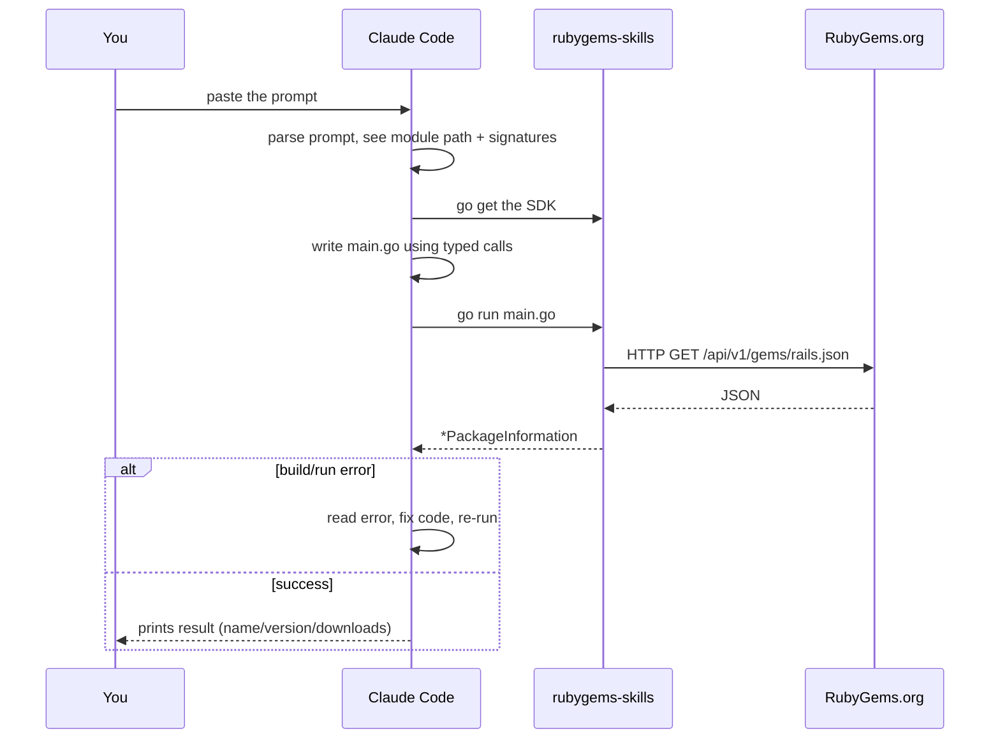

# Claude Code Integration

[Claude Code](https://claude.com/claude-code) is Anthropic's terminal-based coding agent. It reads documentation, writes Go, runs `go` commands, and iterates on compiler/runtime errors — exactly the loop needed to use this SDK.

## The one-paste setup

Open Claude Code in your project directory and paste this:

::: details 📋 Copy-paste prompt — full bootstrap
```
I want to use the rubygems-skills Go SDK (github.com/scagogogo/rubygems-skills)
to interact with the RubyGems.org API in this project.

The SDK's documentation site is the source of truth for its API. The key facts:
- Module: github.com/scagogogo/rubygems-skills
- Read API: pkg/repository — repository.NewRepository() returns a Repository.
  Method signatures are explicit and typed, e.g.:
    GetPackage(ctx context.Context, gemName string) (*models.PackageInformation, error)
    Search(ctx context.Context, query string, page int) ([]*models.PackageInformation, error)
    GetGemVersions(ctx context.Context, gemName string) ([]*models.Version, error)
    GetDependencies(ctx context.Context, gemNames ...string) ([]*models.DependencyInfo, error)
- Write API: repository.NewWriteRepository(repository.NewOptions().SetToken("API_KEY"))
- Data structs live in pkg/models and mirror the API JSON 1:1.
- Error helpers: repository.IsNotFound(err), IsRateLimited(err), IsUnauthorized(err).
- If ruby/gem isn't installed and I need to run them, use pkg/install:
    installer := install.NewInstaller(); installer.Install(ctx)
- China mirrors: repository.NewRubyChinaRepository() / NewTSingHuaRepository() / NewAliYunRepository().

Please:
1. Run: go get github.com/scagogogo/rubygems-skills@latest
2. Write a main.go that queries the "rails" gem, prints name/version/downloads,
   lists its latest 5 versions, and prints its runtime dependencies.
3. Use repository.NewRepository() (no auth needed for these reads).
4. Handle errors with the IsNotFound/IsRateLimited/IsUnauthorized helpers.
5. Run `go run main.go` and show me the output. Fix any errors and re-run.
```
:::

Claude Code will:

1. `go get` the dependency.
2. Write `main.go` using the exact signatures above.
3. Run `go run main.go`.
4. If the build or run fails, read the error, fix the code, and re-run — autonomously.
5. Print the final output (gem name, version, downloads, dependency list).

You just watch.



## Why it works

Claude Code can read this website's [API Reference](../api/repository). But the prompt above **front-loads the critical signatures** so the agent doesn't even need to fetch the docs first — it has enough to write correct code immediately. The result is fewer round-trips and fewer hallucinated field names.

## When you need write operations

For pushing gems, managing owners, or webhooks, the agent needs an API token. Tell it:

::: details 📋 Copy-paste prompt — publish a gem
```
Use rubygems-skills (github.com/scagogogo/rubygems-skills) to publish a .gem file
to RubyGems.org. My API key is in the env var RUBYGEMS_API_KEY.

Steps:
1. go get github.com/scagogogo/rubygems-skills@latest
2. Build a *Repository with auth:
     opts := repository.NewOptions().SetToken(os.Getenv("RUBYGEMS_API_KEY"))
     w := repository.NewWriteRepository(opts)
3. Read the .gem file bytes and call w.PushGem(ctx, gemBytes).
4. Print the response. If repository.IsUnauthorized(err), tell me the token is bad.
5. After publishing, fetch the published version with a read Repository to verify.
```
:::

## When Ruby isn't installed

If the workflow needs to actually run `gem`/`ruby` (build a gem, resolve a Gemfile), tell the agent to provision it first:

::: details 📋 Copy-paste prompt — auto-install Ruby
```
I need Ruby/RubyGems available on this machine. Use rubygems-skills' pkg/install
package to auto-install it for my OS:
  installer := install.NewInstaller()
  result, err := installer.Install(ctx)
Then verify with `ruby -v` and `gem -v`. If detection picks the wrong package
manager, you can override with install.NewInstallOptions().WithCustomPackageManager(install.PMApt)
(replace PMApt with PMYum/PMDnf/PMApk/etc. as needed).
```
:::

## Tips for best results

- **Be specific about which package.** "Query the rails gem" beats "show me some gems."
- **Mention auth explicitly.** If a read needs a token (e.g. `GetOwnedGems`), say so and where the token lives (`RUBYGEMS_API_KEY` env var).
- **Ask for the run.** "Run `go run main.go` and show me the output" ensures the agent actually executes, not just writes code.
- **Point at the docs when unsure.** "Check the API Reference at the website if you need other methods" lets the agent self-serve.

## Next steps

- [Copy-Paste Prompts](./prompts) — the full collection, one per task.
- [Codex guide](./codex) — same prompts work in OpenAI Codex.

---

← Back: [Overview](./overview) · Next: [Codex](./codex)
