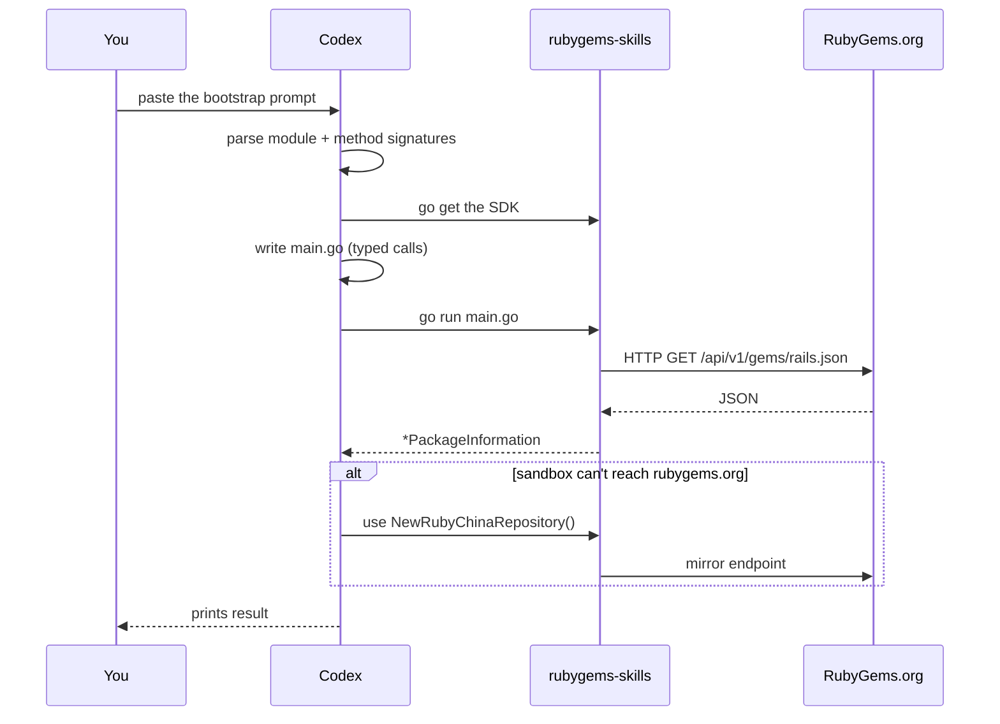

# Codex (OpenAI) Integration

[OpenAI Codex](https://openai.com/codex) is a cloud/terminal coding agent. Like Claude Code, it reads docs, writes Go, runs commands, and iterates. **The integration with rubygems-skills is identical** — the SDK's typed surface is the integration; the prompt just points the agent at it.

## The one-paste setup

In your Codex session, paste the same bootstrap prompt used for Claude Code:

::: details 📋 Copy-paste prompt — full bootstrap
```
I want to use the rubygems-skills Go SDK (github.com/scagogogo/rubygems-skills)
to interact with the RubyGems.org API in this project.

Key facts about the SDK:
- Module: github.com/scagogogo/rubygems-skills
- Read API: pkg/repository — repository.NewRepository() returns a Repository.
  Typed signatures, e.g.:
    GetPackage(ctx context.Context, gemName string) (*models.PackageInformation, error)
    Search(ctx context.Context, query string, page int) ([]*models.PackageInformation, error)
    GetGemVersions(ctx context.Context, gemName string) ([]*models.Version, error)
    GetDependencies(ctx context.Context, gemNames ...string) ([]*models.DependencyInfo, error)
- Write API: repository.NewWriteRepository(repository.NewOptions().SetToken("API_KEY"))
- Data structs: pkg/models, 1:1 with the API JSON.
- Error helpers: repository.IsNotFound(err), IsRateLimited(err), IsUnauthorized(err).
- Auto-install Ruby if missing: install.NewInstaller().Install(ctx)  (pkg/install)
- China mirrors: repository.NewRubyChinaRepository() / NewTSingHuaRepository() / NewAliYunRepository().

Please:
1. go get github.com/scagogogo/rubygems-skills@latest
2. Write main.go: query "rails", print name/version/downloads, list latest 5
   versions, print runtime dependencies.
3. Use repository.NewRepository() (no auth for these reads).
4. Handle errors with IsNotFound/IsRateLimited/IsUnauthorized.
5. Run `go run main.go`, show output, fix errors and re-run.
```
:::

Codex will install the dependency, write the code, run it, and iterate to a working result.



## Differences from Claude Code

Functionally, none — both agents write Go that calls the same typed functions. The only practical differences are:

| Aspect | Claude Code | Codex |
|---|---|---|
| Environment | Your local terminal | Cloud sandbox or local CLI |
| File access | Direct | Via its sandbox |
| Network | Your machine's | Sandbox's (mirrors help if geo-restricted) |

If Codex's sandbox has trouble reaching `rubygems.org`, tell it to use a mirror:

```
Use repository.NewRubyChinaRepository() instead of NewRepository() — the default endpoint is unreachable from here.
```

## Auth & secrets

For write operations, pass the token via an environment variable rather than hardcoding it in the prompt:

```
My RubyGems API key is in the env var RUBYGEMS_API_KEY.
Use repository.NewOptions().SetToken(os.Getenv("RUBYGEMS_API_KEY")).
```

This keeps the secret out of your prompt history.

## Auto-install in a sandbox

Codex's sandbox may be a fresh Linux image without Ruby. If the task needs to *run* `gem`/`ruby`, ask Codex to provision it:

```
If `ruby -v` fails, use pkg/install to install Ruby for this OS:
  installer := install.NewInstaller()
  result, err := installer.Install(ctx)
The installer detects the distro and picks apt/yum/dnf/apk/etc. automatically.
```

## Tips

- Codex tends to be thorough — give it a concrete acceptance criterion ("print the download count of rails") so it knows when to stop.
- Ask it to verify: "After writing, run `go vet ./...` and `go build ./...`."
- For multi-file tasks, name the files: "Create `internal/gemstats/reporter.go`."

## Next steps

- [Copy-Paste Prompts](./prompts) — task-specific prompts that work in both Claude Code and Codex.
- [Claude Code guide](./claude-code) — the Anthropic side.

---

← Back: [Claude Code](./claude-code) · Next: [Copy-Paste Prompts](./prompts)
