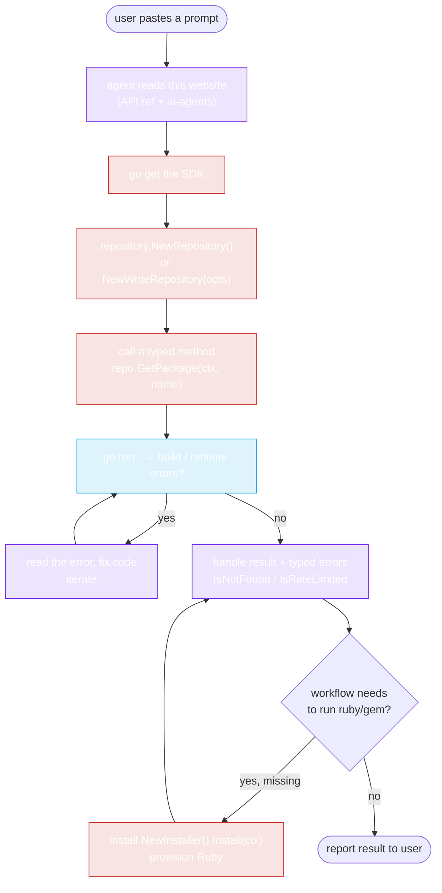

# AI Agent Integration — Overview

rubygems-skills was designed **for AI coding agents first**. The entire API surface is exposed as explicit, typed Go interfaces with stable signatures — so Claude Code, Codex, Cursor, and friends can read the SDK's function signatures and generate correct code on the first try, without trial-and-error or docs scavenging.

## Why agents love this SDK

1. **Explicit signatures.** Every method takes a `context.Context` and returns `(typedResult, error)`. No reflection, no `interface{}` blobs, no stringly-typed JSON. An agent reading `GetPackage(ctx context.Context, gemName string) (*models.PackageInformation, error)` knows exactly what to write.

2. **Types as the source of truth.** The `pkg/models` structs are a 1:1 mirror of the API JSON. An agent doesn't translate prose into Go — it reads Go.

3. **One module path, four packages.** `pkg/repository` (read/write), `pkg/models` (data), `pkg/install` (auto-install Ruby), `pkg/cache` (caching). The agent knows where everything lives.

4. **Typed errors.** `IsNotFound` / `IsRateLimited` / `IsUnauthorized` let the agent write robust error handling without guessing status codes.

5. **Auto-install for when Ruby isn't there.** If the agent's workflow needs to *run* `gem`/`ruby` (build a `.gem`, resolve a Gemfile), `pkg/install` provisions it — no human intervention needed.

## How an agent discovers and uses it

A capable agent (Claude Code, Codex) follows this flow:

```
1. Read this website (especially the API Reference + this section).
2. go get github.com/scagogogo/rubygems-skills@latest
3. Construct a Repository: repository.NewRepository()
4. Call a typed method: repo.GetPackage(ctx, "rails")
5. Use the returned *models.PackageInformation struct.
6. Handle errors with repository.IsNotFound / IsRateLimited / IsUnauthorized.
7. (If Ruby is needed and missing) install.NewInstaller().Install(ctx).
```



## The two integrations

| Agent | Guide | Strength |
|---|---|---|
| **Claude Code** (Anthropic) | [Claude Code guide](./claude-code) | Reads this website, writes Go, runs `go run`, iterates on errors. |
| **Codex** (OpenAI) | [Codex guide](./codex) | Same — terminal-based, runs commands, edits files. |

Both work identically against this SDK because the integration is **just "write Go that calls our functions"** — there's no agent-specific protocol, MCP server, or plugin required. The prompts in the next pages simply *tell the agent the SDK exists and how to use it*.

## The prompts

The whole point: **a user copies a prompt, pastes it into Claude Code or Codex, and waits.** The agent reads this site, sets up the project, writes the code, installs deps, runs it, and reports back.

→ [**Copy-Paste Prompts**](./prompts) — the ready-to-use prompt collection.

::: tip Why a prompt instead of an MCP server?
An MCP server would couple this SDK to a specific agent runtime and add a long-running process. A *prompt* is agent-agnostic, zero-dependency, and portable — it works in Claude Code, Codex, Cursor, Copilot Chat, or any agent that can read docs and write Go. The SDK's typed surface *is* the integration; the prompt just points the agent at it.
:::

## What to tell an agent in general

If you're writing your own prompt, hit these points:

1. The module path: `github.com/scagogogo/rubygems-skills`
2. The read entry point: `repository.NewRepository()` → `repo.GetPackage(ctx, name)`
3. The write entry point: `repository.NewWriteRepository(repository.NewOptions().SetToken(...))`
4. Error helpers: `repository.IsNotFound`, `IsRateLimited`, `IsUnauthorized`
5. (Optional) auto-install: `install.NewInstaller().Install(ctx)` if Ruby is missing
6. Point the agent at this website for the full API reference

---

Next: [Claude Code](./claude-code).
