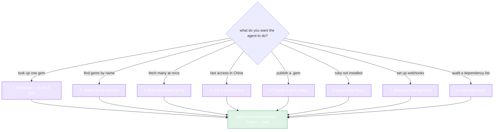

# Copy-Paste Prompts

Each prompt below is self-contained — copy the block, paste it into **Claude Code** or **Codex**, and wait. The agent reads this website if it needs more, writes the code, installs deps, runs it, and reports back.

::: tip How to use
Click the disclosure triangle on a card to expand the prompt. Select the text inside the code fence. Paste into your agent. Replace placeholders like `YOUR_GEM_NAME` or `$RUBYGEMS_API_KEY` as noted.
:::

Not sure which prompt you need? Pick by what you're trying to do:



---

## 1. Bootstrap — query a gem

The starter task. Gets the SDK installed and makes a first successful API call.

::: details 📋 Prompt
```
Use the rubygems-skills Go SDK (github.com/scagogogo/rubygems-skills) to query
the RubyGems.org API.

1. go get github.com/scagogogo/rubygems-skills@latest
2. Write main.go that:
   - Calls repo := repository.NewRepository()
   - Gets the gem "rails" via repo.GetPackage(ctx, "rails")
   - Prints Name, Version, Downloads, and SourceCodeURI
3. Handle errors with repository.IsNotFound / IsRateLimited / IsUnauthorized.
4. Run `go run main.go` and show me the output. Fix errors and re-run.
```
:::

---

## 2. Search & list versions

::: details 📋 Prompt
```
Using rubygems-skills (github.com/scagogogo/rubygems-skills), write a Go program
that:
1. Searches RubyGems for the query "http client" (page 1) via repo.Search and
   prints each result's Name and Info.
2. Lists the versions of "rails" via repo.GetGemVersions and prints the 5 most
   recent version Numbers.
3. Prints the runtime dependencies of "rails" — from pkg.Dependencies.Runtime
   on the PackageInformation returned by repo.GetPackage.
Use repository.NewRepository(). Run it with `go run .` and show output.
```
:::

---

## 3. Bulk fetch many gems

::: details 📋 Prompt
```
Using rubygems-skills (github.com/scagogogo/rubygems-skills), fetch metadata for
these gems in parallel: rails, puma, sidekiq, redis, rake, bundler, rack,
faraday, httparty, nokogiri.

Use repo.BulkGetPackages(ctx, names, repository.NewBulkOptions().WithMaxConcurrency(5)).
Print each gem's Name, Version, Downloads. If a result's Error is non-nil, print
the error instead. Use repository.NewRepository(). Run and show output.
```
:::

---

## 4. Use a China mirror (fast access behind GFW)

::: details 📋 Prompt
```
Use rubygems-skills (github.com/scagogogo/rubygems-skills) with the Ruby China
mirror for fast access:
  repo := repository.NewRubyChinaRepository()
Query the "rails" gem and print Name, Version, Downloads. Also wrap it in a
cache with a 10-minute TTL:
  cached := repository.NewCachedRepository(repo, 10*time.Minute, nil)
Call GetPackage twice and confirm the second call is served from cache (you can
time both with time.Since). Run and show output.
```
:::

---

## 5. Publish a gem (write operation)

::: details 📋 Prompt
```
Use rubygems-skills (github.com/scagogogo/rubygems-skills) to publish a .gem file
to RubyGems.org. My API key is in the env var RUBYGEMS_API_KEY.

1. go get github.com/scagogogo/rubygems-skills@latest
2. Build a write client:
     opts := repository.NewOptions().SetToken(os.Getenv("RUBYGEMS_API_KEY"))
     w := repository.NewWriteRepository(opts)
3. Read the file ./mygem-0.1.0.gem into bytes and call w.PushGem(ctx, bytes).
4. Print the response string. If repository.IsUnauthorized(err), tell me the
   token is invalid; if IsRateLimited, tell me to wait.
5. Verify by querying the published version with a read Repository.
```
:::

---

## 6. Auto-install Ruby when it's missing

::: details 📋 Prompt
```
Check whether Ruby is installed (ruby -v). If not, use rubygems-skills' pkg/install
to auto-install it for this OS:
  installer := install.NewInstaller()
  result, err := installer.Install(ctx)
Print the InstallResult. Then verify with `ruby -v` and `gem -v`.
If detection picks the wrong package manager, override with
install.NewInstallOptions().WithCustomPackageManager(install.PMApt).
```
:::

---

## 7. Webhook management

::: details 📋 Prompt
```
Using rubygems-skills (github.com/scagogogo/rubygems-skills), manage webhooks for
my "mygem" gem. My RubyGems credentials: username in $RUBYGEMS_USER, password in
$RUBYGEMS_PASS.

1. repo := repository.NewWriteRepository(repository.NewOptions().SetToken(os.Getenv("RUBYGEMS_API_KEY")))
   (or use Basic Auth via the username/password where the SDK requires it)
2. List existing webhooks: w.ListWebhooks(ctx)
3. Create one: w.CreateWebhook(ctx, "mygem", "https://example.com/hook")
4. Fire it: w.FireWebhook(ctx, "mygem", "https://example.com/hook")
5. Delete it: w.DeleteWebhook(ctx, "mygem", "https://example.com/hook")
Print the result of each step. Handle IsUnauthorized explicitly.
```
:::

---

## 8. Full audit script — your dependencies

::: details 📋 Prompt
```
Using rubygems-skills (github.com/scagogogo/rubygems-skills), write an audit tool.
Given a list of gem names in a text file (one per line), for each gem:
1. Fetch the package via repo.GetPackage.
2. Fetch its versions via repo.GetGemVersions.
3. Report: latest version number, total downloads, whether it's yanked, its
   licenses, and its source_code_uri.
Use BulkGetPackages with MaxConcurrency(4) for the package fetches. Write
results to a CSV file ./audit_report.csv. Use repository.NewRepository() with
a 15-minute CachedRepository wrapper. Run it on the file ./gems.txt and show
the first few CSV rows.
```
:::

---

## Writing your own prompt

If none of the above fits, build your own from these building blocks:

1. **State the module:** `github.com/scagogogo/rubygems-skills`
2. **State the entry point:** `repository.NewRepository()` (read) or `repository.NewWriteRepository(repository.NewOptions().SetToken(...))` (write)
3. **Name the method(s):** from the [API Reference](../api/repository) — give the exact signature so the agent doesn't guess.
4. **Name the model fields:** from [`pkg/models`](../api/models) — e.g. `pkg.Dependencies.Runtime`, `pkg.SourceCodeURI`.
5. **Specify error handling:** `repository.IsNotFound / IsRateLimited / IsUnauthorized`.
6. **Ask it to run:** `Run \`go run main.go\` and show me the output. Fix errors and re-run.`
7. **Point at the docs:** `The SDK's website has the full API reference if you need more methods.`

The clearer the signature hints, the fewer round-trips — but even a vague prompt works, because the agent can always read this website to fill the gaps.

---

← Back: [Codex](./codex) · Up: [AI Agent Integration](./overview)
