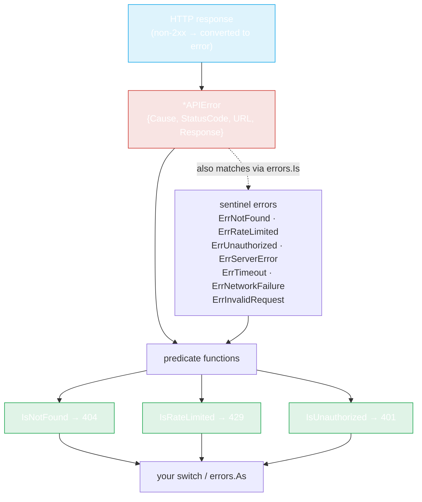

# Errors

`pkg/repository/errors.go`. Errors are typed — you branch on *why* a call failed using predicate functions, and you can dig into the full HTTP response when you need to.



A failing HTTP response is wrapped in an `*APIError` carrying the status code, URL, and body. From there you can either call a predicate (`IsNotFound`, …) or `errors.Is` against a sentinel. Both paths reach the same answer.

## The predicate functions

```go
func IsNotFound(err error) bool       // HTTP 404
func IsRateLimited(err error) bool    // HTTP 429
func IsUnauthorized(err error) bool   // HTTP 401
```

These unwrap the error and inspect the underlying `*APIError`'s status code. They're the recommended way to handle errors — no string matching, no status-code literals in your code.

```go
pkg, err := repo.GetPackage(ctx, "some-gem")
switch {
case repository.IsNotFound(err):
    fmt.Println("gem not found")
case repository.IsRateLimited(err):
    fmt.Println("slow down")
case repository.IsUnauthorized(err):
    fmt.Println("need a token")
case err != nil:
    log.Fatal(err)
}
```

## The APIError type

When a request fails at the HTTP layer, the SDK wraps the failure in an `*APIError`:

```go
type APIError struct {
    Cause      error  // underlying error, if any
    StatusCode int    // HTTP status (404, 429, 500, ...)
    URL        string // request URL that failed
    Response   string // raw response body (as a string)
}

func (e *APIError) Error() string
func NewAPIError(resp *http.Response, body []byte, cause error) *APIError
```

`Error()` returns `API error (status: <code>, url: <url>): <cause>`. `URL` is the request URL (taken from `resp.Request.URL`); `Response` is the body bytes converted to a string.

## Sentinel errors

The package also exports a set of sentinel `error` values for classification. They back the predicates and are useful with `errors.Is`:

```go
var (
    ErrInvalidRequest  = errors.New("invalid request parameters")
    ErrNotFound        = errors.New("resource not found")
    ErrServerError     = errors.New("server error")
    ErrRateLimited     = errors.New("request rate limited")
    ErrUnauthorized    = errors.New("unauthorized")
    ErrTimeout         = errors.New("request timeout")
    ErrNetworkFailure  = errors.New("network failure")
)
```

The predicates check the `*APIError` status code first (so an HTTP 404 from the live API is detected even when no sentinel is wrapped), then fall back to `errors.Is` against the sentinel — so both `errors.Is(err, repository.ErrNotFound)` and `repository.IsNotFound(err)` work for the corresponding cases.

## Inspecting details

For the full response body (e.g. the API's own error message):

```go
var apiErr *repository.APIError
if errors.As(err, &apiErr) {
    fmt.Println("status:", apiErr.StatusCode)
    fmt.Println("url:", apiErr.URL)
    fmt.Println("body:", apiErr.Response)
    if apiErr.Cause != nil {
        fmt.Println("cause:", apiErr.Cause)
    }
}
```

## Status-code reference

| Status | Predicate | Meaning | Retried by default? |
|---|---|---|---|
| 404 | `IsNotFound` | gem/version/user doesn't exist | **yes** (default retries any error — supply a predicate to exclude) |
| 401 | `IsUnauthorized` | missing/invalid token | **yes** (same caveat) |
| 403 | — | forbidden (token lacks scope) | **yes** |
| 429 | `IsRateLimited` | rate limit hit | **yes** |
| 5xx | — | server error | **yes** |
| network | — | DNS/TLS/connection | **yes** |

See [Retry & Backoff](../guide/retry) for how the retry layer interacts with these. The default `ShouldRetry` is `err != nil`, so **every** error is retried up to `MaxAttempts`; to avoid wasting attempts on 404/401, supply a predicate that returns `false` for `IsNotFound` / `IsUnauthorized`.

## Network errors

A non-HTTP failure (DNS, TLS, connection refused) surfaces as a plain `error` wrapping the cause. None of the three predicates match it — treat it as transient and often retryable:

```go
if err != nil && !repository.IsNotFound(err) && !repository.IsUnauthorized(err) {
    // transient: rate-limited-after-retries, 5xx-after-retries, or network
    log.Printf("transient failure: %v", err)
}
```

## Helper: NewAPIError

You generally won't call `NewAPIError` directly — the SDK constructs `*APIError` internally in `getJson`/`getBytes`. It's exported for advanced cases (e.g. wrapping a raw HTTP response you've fetched yourself into the same typed error).

---

← Back: [Options](./options) · Up: [API Reference](./repository)
