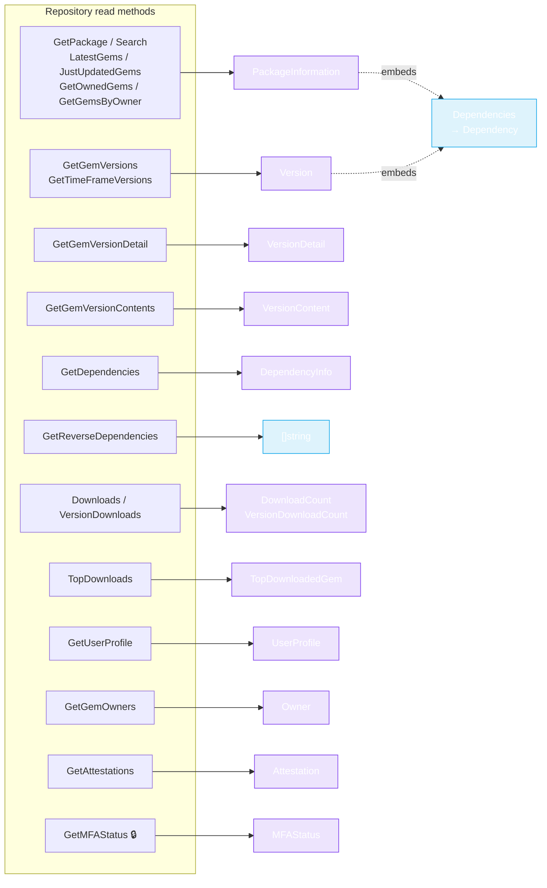

# Models

The `pkg/models` package holds the Go structs that map 1:1 to the RubyGems.org API JSON. Every `Repository`/`WriteRepository` method returns one of these — you never parse JSON yourself.



🔒 = requires a token. `PackageInformation` and `Version` both embed a `Dependencies` struct (runtime + development `Dependency` lists) — see the struct definitions below.

## PackageInformation

Returned by `GetPackage`, `Search`, `LatestGems`, `JustUpdatedGems`, `GetOwnedGems`, `GetGemsByOwner`. (`pkg/models/package_information.go`)

```go
type PackageInformation struct {
    Name             string
    Downloads        int
    Version          string
    VersionCreatedAt time.Time
    VersionDownloads int
    Platform         string
    Authors          string
    Info             string
    Licenses         []string
    Metadata         Metadata
    Yanked           bool
    Sha              string
    ProjectURI       string
    GemURI           string
    HomepageURI      string
    WikiURI          string
    DocumentationURI string
    MailingListURI   string
    SourceCodeURI    string
    BugTrackerURI    string
    ChangelogURI     string
    FundingURI       interface{}
    Dependencies     Dependencies  // see below
}

type Dependencies struct {
    Development []*Dependency
    Runtime     []*Dependency
}

type Dependency struct {
    Name         string  // e.g. "railties"
    Requirements string  // e.g. "= 7.0.5"
}
```

The `Dependencies` sub-struct gives the gem's own declared dev/runtime deps. Note this is **different** from `DependencyInfo` (the `/api/v1/dependencies` endpoint result) — see below.

## Version

Returned by `GetGemVersions`, `GetTimeFrameVersions`. (`pkg/models/version.go`)

```go
type Version struct {
    Authors         string
    BuiltAt         time.Time
    CreatedAt       time.Time
    Description     string
    DownloadsCount  int
    Metadata        *Metadata
    Number          string   // the version string, e.g. "7.0.5"
    Summary         string
    Platform        string
    RubygemsVersion string
    RubyVersion     string
    Prerelease      bool
    Licenses        []string
    Requirements    []string  // e.g. [">= 2.5.0", "< 3.0"]
    Sha             string
}

type LatestVersion struct {
    Version string
}
```

`Number` is the version string you'd pass to `GetGemVersionDetail` or `VersionDownloads`.

## VersionDetail & VersionContent (v2)

`GetGemVersionDetail` and `GetGemVersionContents`. (`pkg/models/version_detail.go`)

```go
type VersionDetail struct {
    // richer than v1 Version: includes spec_sha, yanked status,
    // and full dependency info. See the source for exact fields.
}

type VersionContent struct {
    // file checksums / manifest for a gem version
}

type Attestation struct {
    // sigstore attestation data
}
```

See the source files for the precise fields — they mirror the v2 API JSON exactly.

## DependencyInfo

Returned by `GetDependencies`. (`pkg/models/dependency.go`)

```go
type DependencyInfo struct {
    Name          string  // the dependency (e.g. "rails")
    DependentName string  // who depends on it (e.g. "railties")
    Requirements  string  // e.g. ">= 1.0.0"
    DependentType string  // "runtime" or "development"
}
```

This is the **reverse** view — "which gems depend on X". Distinct from `PackageInformation.Dependencies` ("what does X depend on").

## Download counts

`Downloads` and `VersionDownloads`. (`pkg/models/download_count.go`)

```go
type RepositoryDownloadCount struct {
    // total download count for the repository
}

type VersionDownloadCount struct {
    // download count for a specific gem-version
}
```

## TopDownloadedGem

Returned by `TopDownloads`. (`pkg/models/webhook.go` — colocated)

```go
type TopDownloadedGem struct {
    // name + download count of a top-50 gem
}
```

## User & Owner

`GetUserProfile`/`GetMyProfile` and `GetGemOwners`. (`pkg/models/user.go`)

```go
type UserProfile struct {
    // public (or, for GetMyProfile, full) profile fields
}

type Owner struct {
    // gem owner: handle, email, etc.
}

type OwnerRole struct {
    // role assignment shape
}
```

## Webhook

`ListWebhooks`. (`pkg/models/webhook.go`)

```go
type Webhook struct {
    // URL, gem filter, failure count, etc.
}
```

## APIKey & MFAStatus

`CreateAPIKey`/`UpdateAPIKey`/`GetAPIKey` and `GetMFAStatus`. (`pkg/models/api_key.go`)

```go
type APIKey struct {
    // key id, name, scopes, created_at, etc.
}
type CreateAPIKeyRequest struct {
    Name   string
    Scopes []string
    // ...
}
type UpdateAPIKeyRequest struct {
    // fields to update
}
type MFAStatus struct {
    // MFA configuration for the authenticated user
}
```

## Metadata

Embedded in `PackageInformation` and `Version`. (`pkg/models/meta.go`)

```go
type Metadata struct {
    // arbitrary key/value metadata the gem author declared
}
```

---

For exact field names and JSON tags, the source files under [`pkg/models/`](https://github.com/scagogogo/rubygems-skills/tree/main/pkg/models) are the authoritative reference — they're short and heavily commented with example JSON.

Next: [Options](./options).
