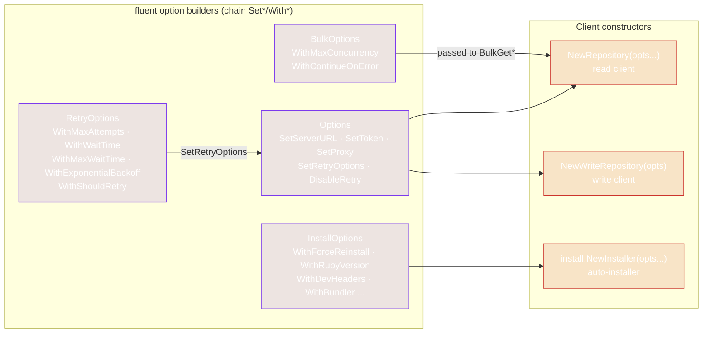

# Options & Builders

rubygems-skills uses a **fluent builder** pattern: construct an options struct with `New*()`, chain `Set*`/`With*` methods, and pass it to a constructor. Builders return the same pointer so you can chain, and the zero-value defaults are sane — you only set what you want to change.

## Options (Repository / WriteRepository)

`pkg/repository/options.go`. Controls server URL, auth token, proxy, and retry.

```go
func NewOptions() *Options
```

| Method | Effect |
|---|---|
| `SetServerURL(url)` | Point at a mirror or custom server. Default `https://rubygems.org`. |
| `SetToken(token)` | API token for authenticated reads & all writes. |
| `SetProxy(proxy)` | HTTP/HTTPS proxy URL. |
| `SetRetryOptions(r)` | Replace the retry config. Default: 3 attempts, exp backoff (1s → 30s cap), retries any error. |
| `DisableRetry()` | Set `RetryOptions` to nil — no retries. |

```go
opts := repository.NewOptions().
    SetServerURL("https://gems.ruby-china.com").
    SetToken(os.Getenv("RUBYGEMS_API_KEY")).
    SetProxy("http://127.0.0.1:7890")

repo := repository.NewRepository(opts)
writ := repository.NewWriteRepository(opts)
```

`NewRepository` is variadic (pass zero or one `*Options`); `NewWriteRepository` takes a single `*Options` because writes always need auth.

## RetryOptions

`pkg/repository/retry.go`. Tuned via `NewDefaultRetryOptions()`.

```go
func NewDefaultRetryOptions() *RetryOptions
```

| Method | Default | Effect |
|---|---|---|
| `WithMaxAttempts(n)` | 3 | Total attempts including the first. |
| `WithWaitTime(d)` | 1s | Base wait before first retry. |
| `WithMaxWaitTime(d)` | 30s | Cap on a single wait. |
| `WithExponentialBackoff(bool)` | true | Grow waits exponentially (`wait * 2^(attempt-1)`). |
| `WithShouldRetry(fn)` | `err != nil` (retries any error) | Custom retry predicate. |

```go
retry := repository.NewDefaultRetryOptions().
    WithMaxAttempts(6).
    WithWaitTime(200*time.Millisecond).
    WithMaxWaitTime(5*time.Second)
```

See [Retry & Backoff](../guide/retry).

## BulkOptions

`pkg/repository/bulk_operations.go`. Tuned via `NewBulkOptions()`.

```go
func NewBulkOptions() *BulkOptions
```

| Method | Default | Effect |
|---|---|---|
| `WithMaxConcurrency(n)` | 10 | In-flight workers. |
| `WithContinueOnError(bool)` | true | If false, stop on first error. |

```go
opts := repository.NewBulkOptions().
    WithMaxConcurrency(8).
    WithContinueOnError(true)
```

See [Bulk Operations](../guide/bulk-operations).

## InstallOptions

`pkg/install/installer.go`. Tuned via `NewInstallOptions()`.

```go
func NewInstallOptions() *InstallOptions
```

| Method | Effect |
|---|---|
| `WithForceReinstall(bool)` | Reinstall even if Ruby is present. |
| `WithRubyVersion(v)` | Target a specific Ruby version (where supported). |
| `WithDevHeaders(bool)` | Also install dev headers (for compiling native exts). |
| `WithBundler(bool)` | Also install Bundler. |
| `WithCustomPackageManager(pm)` | Override detected PM — pass `install.PMApt`, `PMYum`, `PMDnf`, `PMApk`, `PMPacman`, `PMBrew`, `PMChoco`, `PMScoop`, or `PMZypper`. |
| `WithUpdatePackageIndex(bool)` | Run `apt update` / equivalent first. |
| `WithTimeout(seconds)` | Per-command timeout. Default 600s. |
| `WithSudo(bool)` | Use `sudo` for privileged commands. |
| `WithExtraPackages(pkgs...)` | Install additional packages alongside Ruby. |

```go
opts := install.NewInstallOptions().
    WithDevHeaders(true).
    WithBundler(true).
    WithTimeout(900)

installer := install.NewInstaller(opts)
result, err := installer.Install(ctx)
```

See [Auto-Install Usage](../auto-install/usage).

## The four builders at a glance



`Options` is the central config (server, token, proxy, retry) — it feeds the repository constructors. `RetryOptions` plugs into `Options` via `SetRetryOptions`. `BulkOptions` and `InstallOptions` are passed directly to the methods/installer that consume them, not to `Options`.

## Design note: why `Set*` vs `With*`

The two prefixes are a deliberate convention:

- **`Set*`** on `Options` — there's a single `Options` per client; these set the one value.
- **`With*`** on `RetryOptions`, `BulkOptions`, `InstallOptions` — these are smaller, composable configs; "with" reads naturally in a chain (`WithMaxAttempts(6).WithWaitTime(...)`).

Both return the receiver for chaining. Either way, the pattern is the same: build, chain, pass in.

---

Next: [Errors](./errors).
