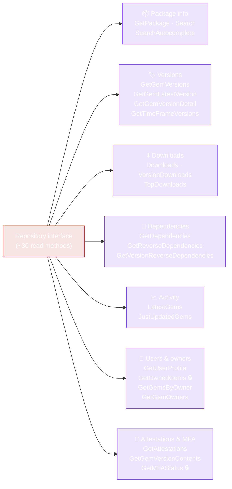

# Repository (Read API)

The `Repository` interface (`pkg/repository/repository.go`) is the read surface of the RubyGems.org API. All methods take a `context.Context` as the first argument and return typed results — no `interface{}`, no manual JSON parsing.

::: tip No auth needed for most reads
`repository.NewRepository()` (no options) is enough for everything except `GetOwnedGems` and `GetMFAStatus`, which require a token. See [Configuration](../guide/configuration).
:::

The `Repository` interface groups its ~30 methods into seven categories — every method is a 1:1 mapping to a RubyGems.org endpoint:



🔒 = requires a token. The same `RepositoryImpl` also serves as the embedded read side of `WriteRepositoryImpl`.

## Constructor

```go
func NewRepository(options ...*Options) *RepositoryImpl
```

Variadic options — pass none for the no-auth default, or one built with `NewOptions()`:

```go
repo := repository.NewRepository()                                   // default, no auth
repo := repository.NewRepository(repository.NewOptions().SetToken(t)) // authenticated
```

The returned `*RepositoryImpl` implements the `Repository` interface. The same instance also serves as the embedded read side of `WriteRepositoryImpl`.

## Package info queries

| Method | Signature | Endpoint |
|---|---|---|
| `GetPackage` | `(ctx, gemName string) (*models.PackageInformation, error)` | `GET /api/v1/gems/{gem}.json` |
| `Search` | `(ctx, query string, page int) ([]*models.PackageInformation, error)` | `GET /api/v1/search.json?query=&page=` |
| `SearchAutocomplete` | `(ctx, query string) ([]string, error)` | `GET /api/v1/search/autocomplete.json?query=` |

- `GetPackage` returns a `NotFound` error (test with `IsNotFound`) if the gem doesn't exist.
- `Search` returns an **empty slice** (not an error) when there are no matches.
- `page` is 1-based.

## Version queries

| Method | Signature | Endpoint |
|---|---|---|
| `GetGemVersions` | `(ctx, gemName string) ([]*models.Version, error)` | `GET /api/v1/versions/{gem}.json` |
| `GetGemLatestVersion` | `(ctx, gemName string) (*models.LatestVersion, error)` | `GET /api/v1/versions/{gem}/latest.json` |
| `GetGemVersionDetail` | `(ctx, gemName, version string) (*models.VersionDetail, error)` | `GET /api/v2/rubygems/{gem}/versions/{version}.json` |
| `GetTimeFrameVersions` | `(ctx, from, to time.Time) ([]*models.Version, error)` | `GET /api/v1/timeframe_versions.json` |

`GetGemVersions` is sorted by release time, latest first. `GetGemVersionDetail` (v2) returns richer data than v1 — includes `spec_sha`, yanked status, and full dependency info.

## Download statistics

| Method | Signature | Endpoint |
|---|---|---|
| `Downloads` | `(ctx) (*models.RepositoryDownloadCount, error)` | `GET /api/v1/downloads.json` |
| `VersionDownloads` | `(ctx, gemName, gemVersion string) (*models.VersionDownloadCount, error)` | `GET /api/v1/downloads/{gem}-{version}.json` |
| `TopDownloads` | `(ctx) ([]*models.TopDownloadedGem, error)` | `GET /api/v1/downloads/all.json` |

`TopDownloads` returns the top 50 most-downloaded gems.

## Dependencies

| Method | Signature | Endpoint |
|---|---|---|
| `GetDependencies` | `(ctx, gemsNames ...string) ([]*models.DependencyInfo, error)` | `GET /api/v1/dependencies?gems=` |
| `GetReverseDependencies` | `(ctx, gemName string) ([]string, error)` | `GET /api/v1/gems/{gem}/reverse_dependencies.json` |
| `GetVersionReverseDependencies` | `(ctx, fullName string) ([]string, error)` | `GET /api/v1/versions/{fullName}/reverse_dependencies.json` |

`GetDependencies` is variadic — pass multiple gem names in one call. `GetVersionReverseDependencies` takes a `fullName` like `"rails-7.0.5"`.

## Activity

| Method | Signature | Endpoint |
|---|---|---|
| `LatestGems` | `(ctx) ([]*models.PackageInformation, error)` | `GET /api/v1/activity/latest.json` |
| `JustUpdatedGems` | `(ctx) ([]*models.PackageInformation, error)` | `GET /api/v1/activity/just_updated.json` |

`JustUpdatedGems` returns the 50 most recently updated gems.

## Users and owners

| Method | Signature | Endpoint | Auth |
|---|---|---|---|
| `GetUserProfile` | `(ctx, handleOrID string) (*models.UserProfile, error)` | `GET /api/v1/profiles/{handle_or_id}.json` | none |
| `GetOwnedGems` | `(ctx) ([]*models.PackageInformation, error)` | `GET /api/v1/gems.json` | **token** |
| `GetGemsByOwner` | `(ctx, handleOrID string) ([]*models.PackageInformation, error)` | `GET /api/v1/owners/{handle_or_id}/gems.json` | none |
| `GetGemOwners` | `(ctx, gemName string) ([]*models.Owner, error)` | `GET /api/v1/gems/{gem}/owners.json` | none |

`GetOwnedGems` returns the gems owned by the **authenticated** user — set a token via `Options.SetToken`.

## Attestations & verification

| Method | Signature | Endpoint |
|---|---|---|
| `GetAttestations` | `(ctx, gemName, version string) ([]*models.Attestation, error)` | `GET /api/v1/attestations/{gem}-{version}.json` |
| `GetGemVersionContents` | `(ctx, gemName, version string) (*models.VersionContent, error)` | `GET /api/v2/rubygems/{gem}/versions/{version}/contents.json` |

`GetAttestations` returns sigstore attestations for a gem version. `GetGemVersionContents` returns the file checksums/manifest (v2).

## MFA status

| Method | Signature | Endpoint | Auth |
|---|---|---|---|
| `GetMFAStatus` | `(ctx) (*models.MFAStatus, error)` | `GET /api/v1/multifactor_auth` | **token** |

Returns the authenticated user's MFA configuration.

## Bulk operations

These fan out concurrently over a worker pool. See [Bulk Operations](../guide/bulk-operations).

| Method | Per-gem result |
|---|---|
| `BulkGetPackages(ctx, names, opts)` | `*models.PackageInformation` |
| `BulkGetVersions(ctx, names, opts)` | `[]*models.Version` |
| `BulkGetDependencies(ctx, names, opts)` | `[]*models.DependencyInfo` |
| `BulkGetReverseDependencies(ctx, names, opts)` | `[]string` |

All return `[]*BulkResult[T]` aligned to the input slice.

## Example

```go
ctx := context.Background()
repo := repository.NewRepository()

pkg, err := repo.GetPackage(ctx, "rails")
if repository.IsNotFound(err) {
    log.Fatal("no such gem")
} else if err != nil {
    log.Fatal(err)
}
fmt.Println(pkg.Name, pkg.Version, pkg.Downloads)

versions, _ := repo.GetGemVersions(ctx, "rails")
fmt.Println("latest:", versions[0].Number)

deps, _ := repo.GetDependencies(ctx, "rails", "puma")
for _, d := range deps {
    fmt.Printf("%s <- %s (%s)\n", d.Name, d.DependentName, d.Requirements)
}
```

---

Next: [WriteRepository (Write)](./write-repository).
