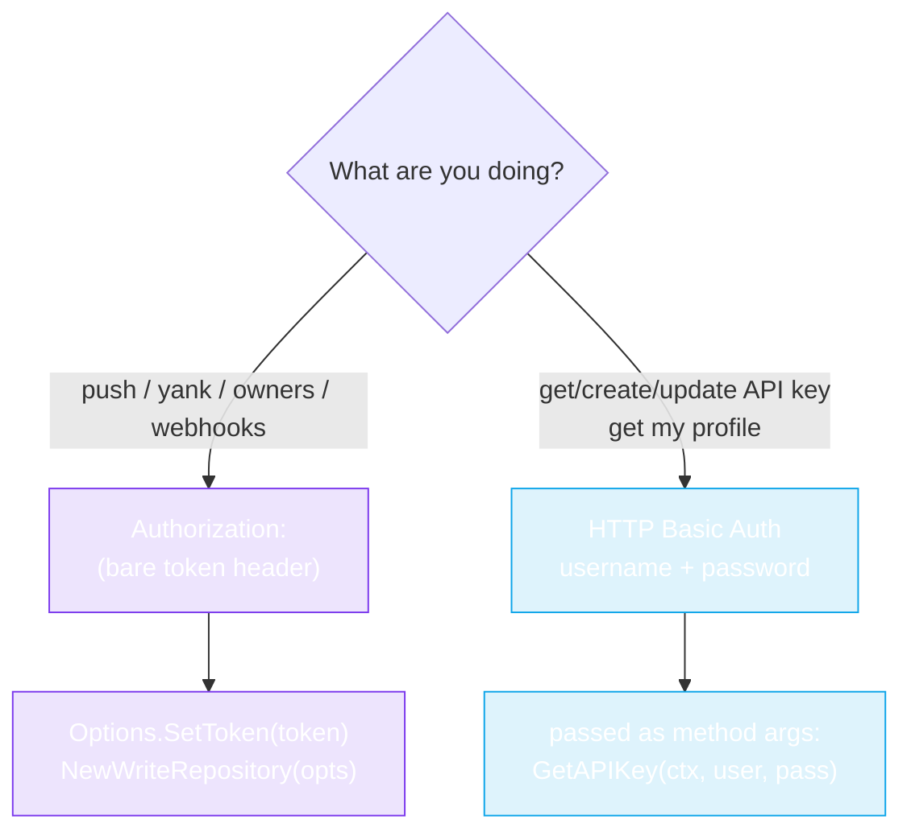

# WriteRepository (Write API)

The `WriteRepository` interface (`pkg/repository/write_repository.go`) covers the authenticated, mutating endpoints — publishing gems, managing owners, webhooks, and API keys. It **embeds** `Repository`, so a `WriteRepositoryImpl` can do every read *and* write.

::: warning Auth required
Write operations use **two different auth mechanisms** — pick by what you're doing:

- **Gem / owner / webhook operations** (`PushGem`, `YankGem`, `Add/RemoveGemOwner`, `*Webhook`) → `Authorization: <token>` header (your API key as a bare header value, *not* `Bearer` and *not* Basic-encoded). Set via `Options.SetToken`.
- **API-key & profile operations** (`GetAPIKey`, `CreateAPIKey`, `UpdateAPIKey`, `GetMyProfile`) → HTTP **Basic Auth** with your rubygems.org `username` + `password` (passed as method args, because these endpoints manage the token itself — you can't use a token to fetch a token).

Get an API key at [rubygems.org → Edit settings → API key](https://rubygems.org/profile/edit). Never hardcode it — read it from an environment variable.


:::

## Constructor

```go
func NewWriteRepository(options *Options) *WriteRepositoryImpl
```

Unlike `NewRepository` (variadic), this takes a **single** `*Options` — write ops always need auth, so you must build options with a token:

```go
opts := repository.NewOptions().SetToken(os.Getenv("RUBYGEMS_API_KEY"))
w := repository.NewWriteRepository(opts)
```

`w` implements both `WriteRepository` (writes below) and `Repository` (all reads from the [read API](./repository)), because `WriteRepositoryImpl` embeds `*RepositoryImpl`.

## Gem publishing & management

| Method | Signature | Endpoint |
|---|---|---|
| `PushGem` | `(ctx, gemFile []byte) (string, error)` | `POST /api/v1/gems` |
| `YankGem` | `(ctx, gemName, version string) (string, error)` | `DELETE /api/v1/gems/yank` |
| `YankGemWithPlatform` | `(ctx, gemName, version, platform string) (string, error)` | `DELETE /api/v1/gems/yank` |

`PushGem` takes the **raw bytes of a `.gem` file** and uploads it as `multipart/form-data`. Returns the API's response string (e.g. a success message with the published URL). `YankGem` removes a version from the index (the file remains downloadable, but it won't appear in new installs).

```go
gemBytes, _ := os.ReadFile("./mygem-0.1.0.gem")
resp, err := w.PushGem(ctx, gemBytes)
if repository.IsUnauthorized(err) {
    log.Fatal("bad token")
}
fmt.Println(resp)
```

## Owner management

| Method | Signature | Endpoint |
|---|---|---|
| `AddGemOwner` | `(ctx, gemName, email, role string) error` | `POST /api/v1/gems/{gem}/owners` |
| `RemoveGemOwner` | `(ctx, gemName, email string) error` | `DELETE /api/v1/gems/{gem}/owners` |
| `UpdateGemOwnerRole` | `(ctx, gemName, email, role string) error` | `PATCH /api/v1/gems/{gem}/owners` |

`role` is `"owner"` or `"maintainer"`.

## Webhook management

| Method | Signature | Endpoint |
|---|---|---|
| `ListWebhooks` | `(ctx) (map[string][]*models.Webhook, error)` | `GET /api/v1/web_hooks.json` |
| `CreateWebhook` | `(ctx, gemName, webhookURL string) error` | `POST /api/v1/web_hooks` |
| `DeleteWebhook` | `(ctx, gemName, webhookURL string) error` | `DELETE /api/v1/web_hooks/remove` |
| `FireWebhook` | `(ctx, gemName, webhookURL string) error` | `POST /api/v1/web_hooks/fire` |

`ListWebhooks` returns a map keyed by gem name → list of webhooks. `CreateWebhook` with `gemName == "*"` registers a **global** webhook (fires for all your gems). `FireWebhook` triggers a test fire.

```go
hooks, _ := w.ListWebhooks(ctx)
for gem, list := range hooks {
    for _, h := range list {
        fmt.Printf("%s -> %s\n", gem, h.URL)
    }
}

_ = w.CreateWebhook(ctx, "mygem", "https://example.com/hook")
_ = w.FireWebhook(ctx, "mygem", "https://example.com/hook")
_ = w.DeleteWebhook(ctx, "mygem", "https://example.com/hook")
```

## API Key management

These use **HTTP Basic Auth** (username + password), not the token — they're for bootstrapping/rotating keys themselves.

| Method | Signature | Endpoint |
|---|---|---|
| `GetAPIKey` | `(ctx, username, password string) (*models.APIKey, error)` | `GET /api/v1/api_key` |
| `CreateAPIKey` | `(ctx, username, password string, req *models.CreateAPIKeyRequest) (*models.APIKey, error)` | `POST /api/v1/api_key` |
| `UpdateAPIKey` | `(ctx, username, password string, req *models.UpdateAPIKeyRequest) (*models.APIKey, error)` | `PATCH /api/v1/api_key` |

```go
key, err := w.CreateAPIKey(ctx, "myuser", "mypass", &models.CreateAPIKeyRequest{
    Name:   "ci-deploy",
    Scopes: []string{"push_rubygem"},
})
```

## User profile (authenticated)

| Method | Signature | Endpoint |
|---|---|---|
| `GetMyProfile` | `(ctx, username, password string) (*models.UserProfile, error)` | `GET /api/v1/profiles/me.json` |

Returns the authenticated user's **full** profile (including private fields not in the public `GetUserProfile`).

## Error handling

All write methods can fail with the same typed errors as reads — `IsUnauthorized`, `IsRateLimited`, `IsNotFound`. See [Error Handling](../guide/error-handling).

---

Next: [Models](./models).
