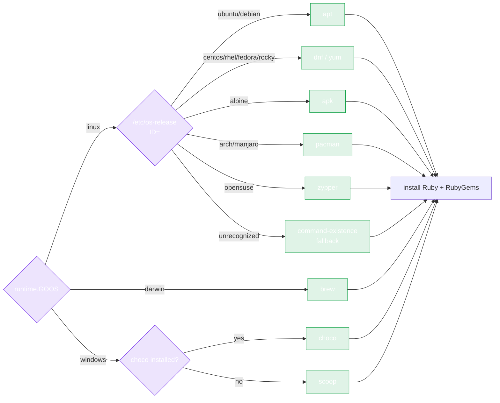

# Auto-Install Overview

The `pkg/install` package auto-installs Ruby and RubyGems on a fresh machine — detecting the OS, distribution, architecture, and package manager, then running the right install commands. It's what makes a fully autonomous AI-agent workflow possible: the agent can provision the toolchain it needs without human setup.

## Why it exists

Many workflows don't just *call* the RubyGems HTTP API — they also need to *run* `gem`, `bundle`, or `ruby`:

- Building a `.gem` file before publishing via `PushGem`.
- Resolving a local `Gemfile.lock`.
- Running a gem's tests in CI.

On a fresh CI runner, container, or sandbox, those binaries are absent. `pkg/install` fills the gap with one call:

```go
import "github.com/scagogogo/rubygems-skills/pkg/install"

installer := install.NewInstaller()
result, err := installer.Install(ctx)
```

## What it does

1. **Detects the platform** — OS (`linux`/`darwin`/`windows`), architecture (`amd64`/`arm64`/...), and (on Linux) the distribution via `/etc/os-release`.
2. **Picks a package manager** — `apt`, `yum`, `dnf`, `apk`, `pacman`, `brew`, `choco`, `scoop`, or `zypper`, with command-existence fallbacks.
3. **Checks if Ruby is already installed** — skips the install unless `WithForceReinstall(true)`.
4. **Runs the install** — package-index update (optional), Ruby, dev headers (optional), Bundler (optional), and any extra packages you specify.
5. **Returns an `InstallResult`** — what was installed, the Ruby/gem versions detected, the commands run.



## Tested platforms

Docker-based integration tests verify the installer on real distributions:

| Distro | Package manager | Status |
|---|---|---|
| Ubuntu | apt | ✅ |
| Debian | apt | ✅ |
| Alpine | apk | ✅ |
| Fedora | dnf | ✅ |
| Rocky Linux | dnf | ✅ |

See [Supported Platforms](./platforms) for the full matrix and [Usage](./usage) for code.

## When to use it

- **AI agent workflows** that need to run Ruby tooling on a sandboxed machine.
- **CI pipelines** that start from a minimal base image.
- **Setup scripts** that should work across distros without `if/else` on `/etc/os-release`.

## When NOT to use it

- You only call the **HTTP API** (read or write) — `pkg/repository` needs no Ruby on the host at all.
- You're on a developer workstation where Ruby is already managed by `rbenv`/`rvm`/`asdf` — let the version manager handle it; forcing `apt install ruby` can conflict.

---

Next: [Supported Platforms](./platforms).
