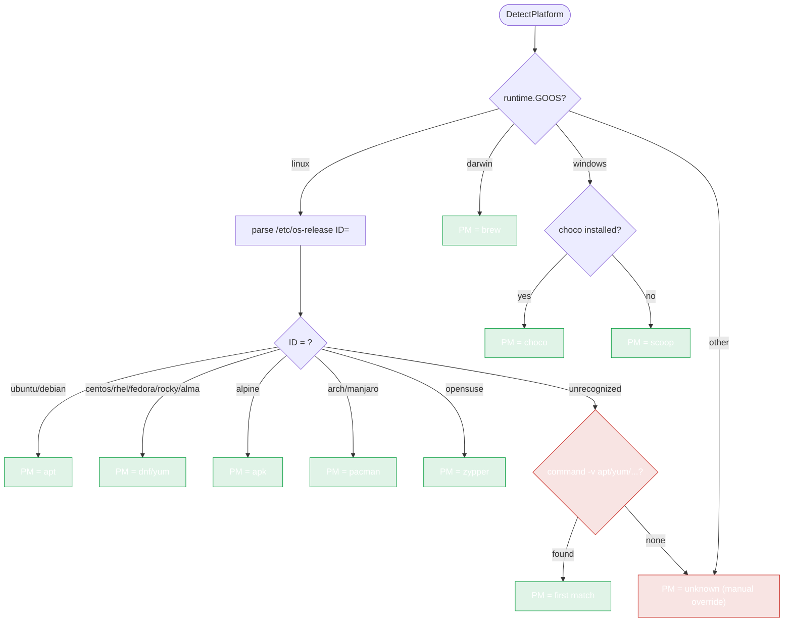

# Supported Platforms

`pkg/install` detects the OS and dispatches to the right package manager. This page lists what's supported and how detection works.

## Operating systems

| OS (`OperatingSystem`) | Detected via | Package managers |
|---|---|---|
| `linux` (`OSLinux`) | `runtime.GOOS` | apt, yum, dnf, apk, pacman, zypper |
| `darwin` (`OSDarwin`) | `runtime.GOOS` | brew |
| `windows` (`OSWindows`) | `runtime.GOOS` | choco, scoop |
| `unknown` (`OSUnknown`) | — | none (manual override only) |

## Linux distributions

Detected by parsing `/etc/os-release` (with file-existence fallbacks for distros that lack it). Constants in `pkg/install/installer.go`:

| Distro (`LinuxDistro`) | Const | PM |
|---|---|---|
| Ubuntu | `DistroUbuntu` | apt |
| Debian | `DistroDebian` | apt |
| CentOS | `DistroCentOS` | yum |
| RHEL | `DistroRHEL` | yum/dnf |
| Fedora | `DistroFedora` | dnf |
| Rocky | `DistroRocky` | dnf |
| Alma | `DistroAlma` | dnf |
| Alpine | `DistroAlpine` | apk |
| Arch | `DistroArch` | pacman |
| Manjaro | `DistroManjaro` | pacman |
| Amazon Linux | `DistroAmazon` | yum/dnf |
| openSUSE | `DistroOpenSUSE` | zypper |
| unknown | `DistroUnknown` | PM guessed by command existence |

## Architectures

| Arch (`Architecture`) | Const |
|---|---|
| amd64 | `ArchAMD64` |
| arm64 | `ArchARM64` |
| arm | `ArchARM` |
| 386 | `Arch386` |
| unknown | `ArchUnknown` |

Detected via `runtime.GOARCH`.

## Package managers

| PM (`PackageManager`) | Const | Install command |
|---|---|---|
| apt | `PMApt` | `apt-get install` |
| yum | `PMYum` | `yum install` |
| dnf | `PMDnf` | `dnf install` |
| apk | `PMApk` | `apk add` |
| pacman | `PMPacman` | `pacman -S` |
| brew | `PMBrew` | `brew install` |
| choco | `PMChoco` | `choco install` |
| scoop | `PMScoop` | `scoop install` |
| zypper | `PMZypper` | `zypper install` |
| unknown | `PMUnknown` | — |

## Detection decision tree



## Detection order

1. **OS** — `runtime.GOOS` (instant, always available).
2. **Arch** — `runtime.GOARCH`.
3. **Distro (Linux only)** — `detectLinuxDistro()`:
   - Parse `/etc/os-release` for `ID=`.
   - Fall back to distro-specific files (`/etc/debian_version`, `/etc/centos-release`, etc.).
   - Last resort: infer from which package-manager command exists.
4. **Package manager** — derived from the distro, with a command-existence fallback (`detectPackageManagerByCommand`).

If detection picks the wrong PM (rare, on unusual distros), override it:

```go
opts := install.NewInstallOptions().WithCustomPackageManager(install.PMApt)
installer := install.NewInstaller(opts)
```

## Docker-verified

The integration tests (`pkg/install/docker_test.go`, run with `TEST_DOCKER=1`) actually spin up containers and install Ruby on:

- `ubuntu:22.04` (apt) → Ruby 3.x
- `debian:12` (apt) → Ruby 3.x
- `alpine:3.19` (apk) → Ruby 3.x
- `fedora:40` (dnf) → Ruby 3.2.5
- `rockylinux:9` (dnf) → Ruby 3.x

Each test verifies with `command -v ruby` and `ruby -v` / `gem -v`.

---

Next: [Usage](./usage).
