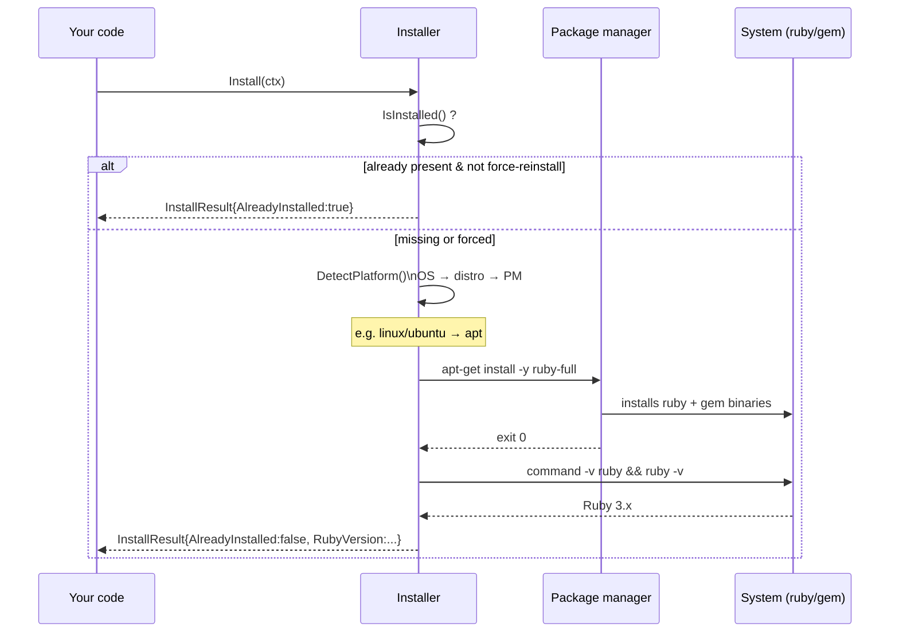

# Auto-Install Usage

Programmatic use of `pkg/install` — detect, install, and verify Ruby/RubyGems from Go.

## Minimal install

```go
package main

import (
    "context"
    "fmt"
    "log"

    "github.com/scagogogo/rubygems-skills/pkg/install"
)

func main() {
    ctx := context.Background()
    installer := install.NewInstaller()

    result, err := installer.Install(ctx)
    if err != nil {
        log.Fatalf("install failed: %v", err)
    }
    fmt.Printf("Installed: %s\n", result.RubyVersion)
}
```

`NewInstaller` is variadic — pass zero options for sensible defaults (auto-detect everything, install Ruby + RubyGems, 600s timeout, use sudo when needed).

Under the hood, `Install(ctx)` runs a detect → dispatch → install → verify pipeline:



## Check before installing

Avoid a redundant install if Ruby is already present:

```go
ok, info, err := installer.IsInstalled()
if err != nil {
    log.Fatal(err)
}
if ok {
    fmt.Printf("Ruby %s already installed\n", info.RubyVersion)
    return
}
// otherwise proceed to install
result, err := installer.Install(ctx)
```

`IsInstalled()` returns `(bool, *RubyInfo, error)`. `RubyInfo` fields: `RubyVersion`, `GemVersion`, `RubyPath`, `GemPath`.

## Inspect the detected platform

```go
platform, err := installer.DetectPlatform()
if err != nil {
    log.Fatal(err)
}
fmt.Println(platform.String())
// Linux:   "linux/ubuntu (amd64, apt)"
// macOS:   "darwin/arm64 (brew)"
// Windows: "windows/amd64 (choco)"
```

`PlatformInfo` fields: `OS`, `Arch`, `Distro`, `PackageMgr`, `PackageMgrCmd`. Useful for logging or conditional logic before you commit to an install.

## Options

```go
opts := install.NewInstallOptions().
    WithForceReinstall(true).     // reinstall even if present
    WithRubyVersion("3.3.0").     // target version (where supported)
    WithDevHeaders(true).         // for compiling native extensions
    WithBundler(true).            // also install Bundler
    WithUpdatePackageIndex(true). // run apt update / equivalent first
    WithTimeout(900).             // per-command timeout in seconds
    WithSudo(true).               // use sudo for privileged commands
    WithExtraPackages("build-essential", "libssl-dev")  // install alongside
    // .WithCustomPackageManager(install.PMApt)  // override detection

installer := install.NewInstaller(opts)
result, err := installer.Install(ctx)
```

| Method | Effect |
|---|---|
| `WithForceReinstall(bool)` | Reinstall even if Ruby is present. |
| `WithRubyVersion(string)` | Target a specific Ruby version (support depends on PM). |
| `WithDevHeaders(bool)` | Install dev headers (needed for native-ext gems). |
| `WithBundler(bool)` | Also install Bundler. |
| `WithCustomPackageManager(pm)` | Override the detected PM — pass an `install.PM*` constant. |
| `WithUpdatePackageIndex(bool)` | Run `apt update`/equivalent before installing. |
| `WithTimeout(seconds)` | Per-command timeout. Default 600s. |
| `WithSudo(bool)` | Prefix privileged commands with `sudo`. |
| `WithExtraPackages(pkgs...)` | Additional packages to install with Ruby. |

## The InstallResult

`Install(ctx)` returns a `*InstallResult` describing what happened — the commands run, the Ruby/gem versions detected post-install, and whether anything was skipped. See `pkg/install/installer.go` for the exact fields.

## CI / root usage

When running as root (typical in CI containers), pass `-no-sudo` (CLI) or `WithSudo(false)`:

```go
opts := install.NewInstallOptions().WithSudo(false)
installer := install.NewInstaller(opts)
_, err := installer.Install(ctx)
```

The installer auto-detects root via `isRunningAsRoot()` and skips `sudo` when already root, but being explicit avoids surprises.

## After install: use the SDK

Once Ruby is present, your agent can run `gem`/`ruby` directly, **and** the HTTP API (`pkg/repository`) was usable the whole time — it doesn't need Ruby on the host. Typical agent flow:

```go
// 1. (Optional) provision Ruby if the workflow needs to run gem/ruby
installer := install.NewInstaller()
if ok, _, _ := installer.IsInstalled(); !ok {
    installer.Install(ctx)
}

// 2. Use the HTTP API — no Ruby binary needed for this
repo := repository.NewRepository()
pkg, _ := repo.GetPackage(ctx, "rails")
```

---

← Back: [Supported Platforms](./platforms) · Up: [Auto-Install](./overview)
