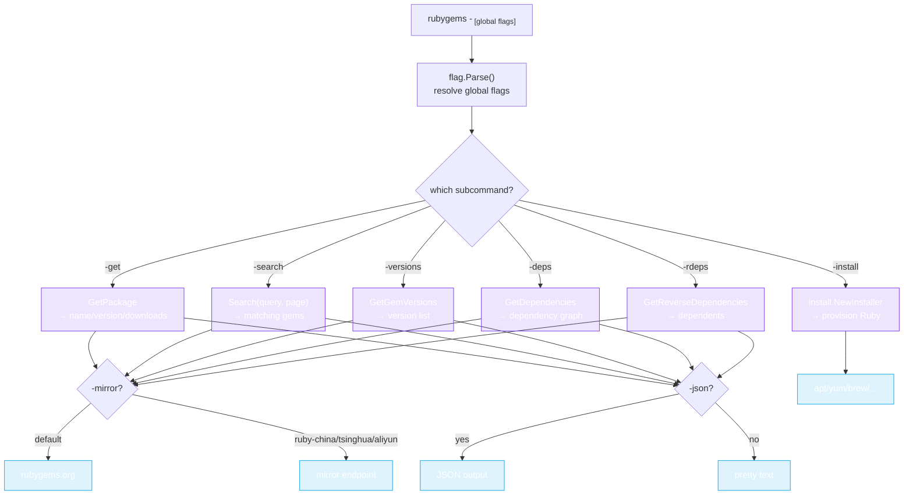

# CLI Commands

The `rubygems` CLI uses Go's `flag` package — pass one subcommand flag plus its arguments.



One subcommand flag selects the action; global flags (`-gem`, `-query`, `-mirror`, `-json`, `-cache`) shape the request and output.

## Global flags

| Flag | Default | Purpose |
|---|---|---|
| `-gem NAME` | `""` | Gem name (for `-get`, `-versions`, `-deps`, `-rdeps`). |
| `-query QUERY` | `""` | Search query (for `-search`). |
| `-limit N` | `10` | Cap on result rows. |
| `-mirror M` | `default` | Mirror: `default`, `ruby-china`, `tsinghua`, `aliyun`. |
| `-json` | `false` | Output as JSON. |
| `-cache` | `false` | Enable in-memory caching. |
| `-help` | `false` | Show usage. |

## Subcommands

### `-get` — package info

```bash
rubygems -get -gem rails
rubygems -get -gem rails -json
```

Prints the gem's name, version, authors, downloads, source URI, etc.

### `-search` — search packages

```bash
rubygems -search -query "http client" -limit 5
```

Lists matching gems (name + summary), capped at `-limit`.

### `-versions` — version list

```bash
rubygems -versions -gem rails -limit 5
```

Lists the most recent versions (number, platform, prerelease flag), latest first.

### `-deps` — dependencies

```bash
rubygems -deps -gem rails
```

Shows what `rails` depends on (and what depends on it), split into runtime/development.

### `-rdeps` — reverse dependencies

```bash
rubygems -rdeps -gem rails
```

Lists gems that depend on `rails`.

### `-install` — auto-install Ruby

```bash
rubygems -install
rubygems -install -force
rubygems -install -no-dev -no-bundler
```

Provisions Ruby + RubyGems on this machine via the detected package manager. Install-specific flags:

| Flag | Purpose |
|---|---|
| `-force` | Reinstall even if Ruby is already present. |
| `-no-dev` | Skip development headers. |
| `-no-bundler` | Skip installing Bundler. |
| `-no-update` | Skip the package-index update (`apt update`, etc.). |
| `-no-sudo` | Don't use `sudo`. |

See [Auto-Install](../auto-install/overview) for the programmatic equivalent.

## Mirrors

Use `-mirror` to switch endpoints without changing code:

```bash
rubygems -get -gem rails -mirror ruby-china
rubygems -search -query puma -mirror tsinghua
```

| Value | Endpoint |
|---|---|
| `default` | `https://rubygems.org` |
| `ruby-china` | `https://gems.ruby-china.com` |
| `tsinghua` | `https://mirrors.tuna.tsinghua.edu.cn/rubygems/api` |
| `aliyun` | `https://mirrors.aliyun.com/rubygems` |

## JSON output

Add `-json` to any read subcommand to get machine-readable output — handy for piping into `jq`:

```bash
rubygems -get -gem rails -json | jq '.downloads'
```

---

Next: [Examples](./examples).
