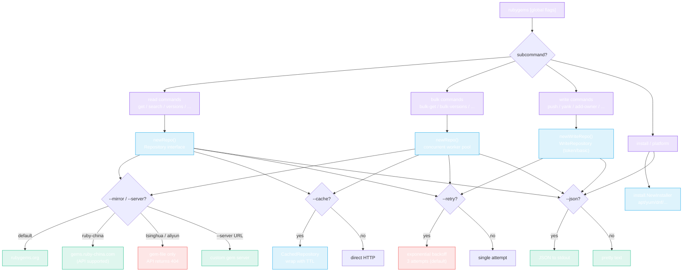
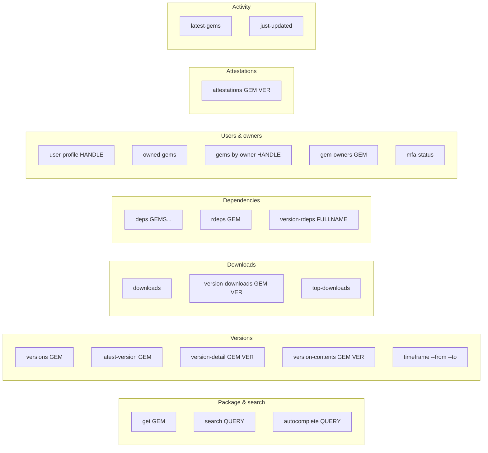

# CLI Commands

The `rubygems` CLI is built on [cobra](https://github.com/spf13/cobra). Each action is a subcommand; global flags apply to most commands.



## Global flags

These apply to most subcommands and shape the client, request, and output.

| Flag | Default | Purpose |
|---|---|---|
| `--mirror M` | `default` | Mirror: `default`, `ruby-china`, `tsinghua`, `aliyun`. |
| `--server URL` | `""` | Custom gem server URL (overrides `--mirror`). |
| `--token T` | `""` | API token (raises rate-limit quota; required for write/authed ops). |
| `--proxy URL` | `""` | HTTP proxy URL. |
| `--timeout S` | `30` | Request timeout in seconds. |
| `--json` | `false` | Output as JSON. |
| `--cache` | `false` | Enable in-memory cache. |
| `--cache-ttl M` | `5` | Cache TTL in minutes (only with `--cache`). |
| `--retry` | `false` | Enable retry with backoff. |
| `--retry-attempts N` | `3` | Max retry attempts (only with `--retry`). |
| `--retry-wait S` | `1` | Initial retry wait in seconds (only with `--retry`). |
| `--retry-backoff` | `true` | Use exponential backoff (only with `--retry`). |

## Read commands



### `get` — package info

```bash
rubygems get rails
rubygems get rails --json
rubygems get rails --mirror ruby-china
```

Prints the gem's name, version, authors, downloads, source URI, etc.

### `search` — search packages

```bash
rubygems search "http client" --limit 5 --page 2
```

Lists matching gems (name + summary), capped at `--limit`.

### `autocomplete` — autocomplete suggestions

```bash
rubygems autocomplete rail
```

Returns matching package-name suggestions.

### `versions` — version list

```bash
rubygems versions rails --limit 5
```

Lists the most recent versions (number, downloads, release date), latest first.

### `latest-version` — latest version

```bash
rubygems latest-version rails
```

### `version-detail` — V2 detailed version info

```bash
rubygems version-detail rails 8.1.3
rubygems version-detail rails 8.1.3 --json
```

API v2 — includes `spec_sha`, `yanked`, full dependency list, requirements.

### `version-contents` — V2 file checksums

```bash
rubygems version-contents rails 8.1.3
```

### `downloads` — total repository downloads

```bash
rubygems downloads
```

### `version-downloads` — version download count

```bash
rubygems version-downloads rails 8.1.3
```

### `top-downloads` — top 50 most downloaded

```bash
rubygems top-downloads --limit 10
```

### `deps` — dependencies (deprecated)

```bash
rubygems deps rails rack
```

> **Deprecated:** the `/api/v1/dependencies` endpoint was shut down by RubyGems.org on 2023-02-22 and now returns 404. Use `version-detail` (API v2) to inspect a version's dependencies instead.

### `rdeps` — reverse dependencies

```bash
rubygems rdeps rack --limit 50
```

Lists gems that depend on `rack`.

### `version-rdeps` — version-level reverse dependencies

```bash
rubygems version-rdeps rack-2.2.7
```

The `fullName` argument is `gemname-version` (e.g. `rack-2.2.7`).

### `latest-gems` / `just-updated` — activity

```bash
rubygems latest-gems --limit 10
rubygems just-updated --limit 10
```

### `user-profile` / `owned-gems` / `gems-by-owner` / `gem-owners`

```bash
rubygems user-profile qrush
rubygems owned-gems --token $TOKEN
rubygems gems-by-owner qrush
rubygems gem-owners rails
```

### `attestations` — sigstore attestations

```bash
rubygems attestations rails 8.1.3
```

### `mfa-status` — MFA status (requires `--token`)

```bash
rubygems mfa-status --token $TOKEN
```

### `timeframe` — versions in a time range

```bash
rubygems timeframe --from 2024-01-01T00:00:00Z --to 2024-12-31T23:59:59Z
```

## Bulk commands

```bash
rubygems bulk-get rails rack bundler --concurrency 5
rubygems bulk-versions rails,rack --concurrency 3
rubygems bulk-deps rails,rack
rubygems bulk-rdeps rails,rack
```

Arguments may be passed as multiple positional args or a single comma-separated list. Each runs a concurrent worker pool (see [Bulk Operations](../guide/bulk-operations)).

## Write commands (require `--token` or HTTP Basic auth)

```bash
rubygems push ./my-gem-1.0.0.gem
rubygems yank my-gem 1.0.0
rubygems yank my-gem 1.0.0 --platform x86_64-linux
rubygems add-owner my-gem user@example.com --role owner
rubygems remove-owner my-gem user@example.com
rubygems update-owner my-gem user@example.com --role owner
rubygems list-webhooks
rubygems create-webhook my-gem https://example.com/hook
rubygems delete-webhook my-gem https://example.com/hook
rubygems fire-webhook my-gem https://example.com/hook
rubygems get-api-key --user name
rubygems create-api-key --user name --name ci --scopes push_rubygem,yank_rubygem
rubygems update-api-key --user name --api-key KEY --scopes index_rubygems
rubygems my-profile --user name
```

## Mirrors

Use `--mirror` to switch endpoints without changing code:

```bash
rubygems get rails --mirror ruby-china
rubygems get rails --server https://gems.example.com
```

| Value | Endpoint | API? |
|---|---|---|
| `default` | `https://rubygems.org` | ✅ yes |
| `ruby-china` | `https://gems.ruby-china.com` | ✅ yes |
| `tsinghua` | `https://mirrors.tuna.tsinghua.edu.cn/rubygems` | ❌ gem files only (404 on API) |
| `aliyun` | `https://mirrors.aliyun.com/rubygems` | ❌ gem files only (404 on API) |

> Only the official source and `ruby-china` mirror the API. The `tsinghua` and `aliyun` mirrors serve gem files only.

## JSON output

Add `--json` to any read/bulk command to get machine-readable output — handy for piping into `jq`:

```bash
rubygems get rails --json | jq '.downloads'
rubygems bulk-get rails rack bundler --json | jq '.[] | select(.Error == null) | .Value.version'
```

---

Next: [Examples](./examples).
