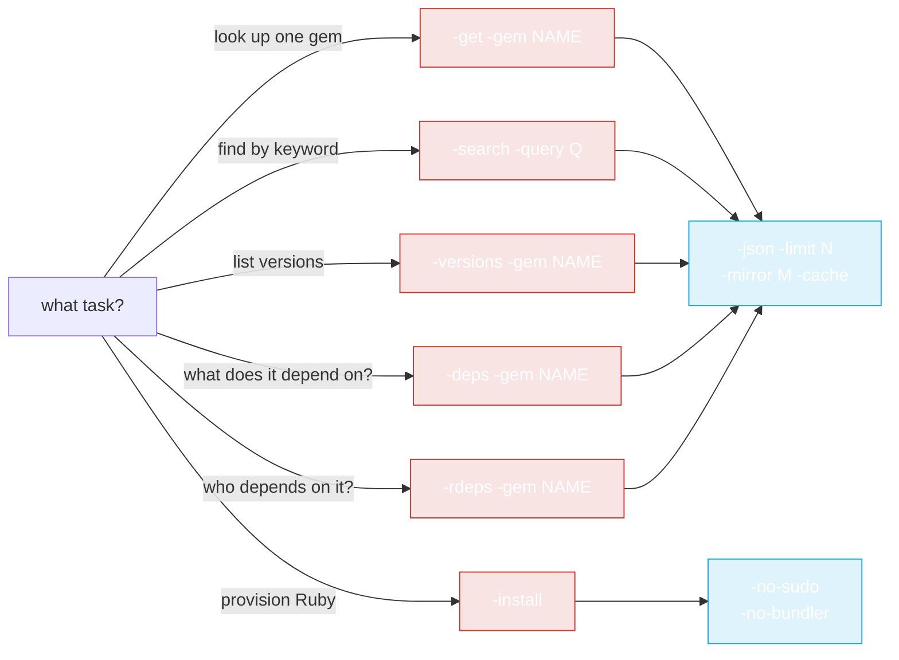

# CLI Examples

Real-world recipes using the `rubygems` CLI. See [Installation](./install) first if you haven't built/installed the binary.



Pick a subcommand based on what you're doing — the examples below show each in action.

## Quick lookup

```bash
# Latest version of a gem
rubygems -get -gem rails

# As JSON, grab just the version
rubygems -get -gem rails -json | jq -r '.version'

# Top 5 versions
rubygems -versions -gem rails -limit 5
```

## Search

```bash
# Find HTTP client gems
rubygems -search -query "http client" -limit 10

# JSON, names only
rubygems -search -query "http client" -json | jq -r '.[].name'
```

## Dependency audit

```bash
# What does rails depend on?
rubygems -deps -gem rails

# Who depends on rails?
rubygems -rdeps -gem rails -limit 20
```

## Mirror + cache (China)

```bash
# Fast lookups via Ruby China mirror, with caching
rubygems -get -gem rails -mirror ruby-china -cache
rubygems -search -query puma -mirror ruby-china -cache
```

## Scripting: check a gem exists

```bash
if rubygems -get -gem mygem -json | jq -e '.name' >/dev/null; then
    echo "mygem exists"
else
    echo "mygem not found"
fi
```

## Scripting: latest version of many gems

```bash
for g in rails puma sidekiq redis; do
    v=$(rubygems -get -gem "$g" -json | jq -r '.version')
    echo "$g $v"
done
```

## Auto-install Ruby in CI

In a fresh container that lacks Ruby:

```bash
# Detect OS, install Ruby + RubyGems, no sudo (running as root in CI)
rubygems -install -no-sudo -no-bundler

# Then verify
ruby -v
gem -v
```

For the programmatic (Go) version of auto-install, see [Auto-Install Usage](../auto-install/usage).

## Combine with the Go SDK

The CLI is great for ad-hoc queries; reach for the Go SDK when you need logic, bulk ops, or integration into a program. The [Quick Start](../guide/quick-start) shows the same `GetPackage` call in Go.

---

← Back: [Commands](./commands) · Up: [CLI](./install)
