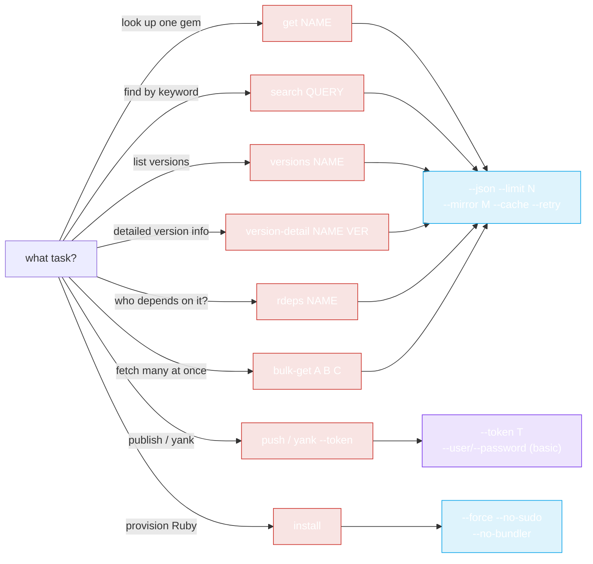

# CLI Examples

Real-world recipes using the `rubygems` CLI. See [Installation](./install) first if you haven't built/installed the binary.



Pick a subcommand based on what you're doing — the examples below show each in action.

## Quick lookup

```bash
# Latest version of a gem
rubygems get rails

# As JSON, grab just the version
rubygems get rails --json | jq -r '.version'

# Top 5 versions
rubygems versions rails --limit 5

# Detailed v2 info (spec_sha, yanked, full deps)
rubygems version-detail rails 8.1.3 --json
```

## Search

```bash
# Find HTTP client gems
rubygems search "http client" --limit 10

# JSON, names only
rubygems search "http client" --json | jq -r '.[].name'

# Autocomplete
rubygems autocomplete htt
```

## Dependency audit

```bash
# Who depends on rails?
rubygems rdeps rails --limit 20

# Version-level reverse deps
rubygems version-rdeps rack-2.2.7

# Detailed dependencies for a specific version (the supported way,
# since the /api/v1/dependencies endpoint was deprecated in 2023)
rubygems version-detail rails 8.1.3 --json | jq '.dependencies'
```

## Bulk fetch many gems

```bash
# Fetch several packages concurrently
rubygems bulk-get rails rack bundler puma sidekiq --concurrency 5

# JSON, extract name + version pairs
rubygems bulk-get rails rack bundler --json | jq -r '.[] | select(.Error == null) | "\(.Value.name) \(.Value.version)"'
```

## Mirror + cache + retry (China / flaky networks)

```bash
# Fast lookups via Ruby China mirror, with caching and retry
rubygems get rails --mirror ruby-china --cache --retry
rubygems search puma --mirror ruby-china --cache

# Note: tsinghua and aliyun mirrors do NOT serve the API — use ruby-china for API access.
```

## Scripting: check a gem exists

```bash
if rubygems get mygem --json | jq -e '.name' >/dev/null; then
    echo "mygem exists"
else
    echo "mygem not found"
fi
```

## Scripting: latest version of many gems

```bash
for g in rails puma sidekiq redis; do
    v=$(rubygems get "$g" --json | jq -r '.version')
    echo "$g $v"
done
```

Or do it in one concurrent call:

```bash
rubygems bulk-get rails puma sidekiq redis --json | jq -r '.[] | select(.Error == null) | "\(.Value.name) \(.Value.version)"'
```

## Publish & manage a gem (write commands)

```bash
# Publish a built .gem file
rubygems push ./mygem-1.0.0.gem --token $RUBYGEMS_TOKEN

# Yank a bad release
rubygems yank mygem 1.0.0 --token $RUBYGEMS_TOKEN

# Manage owners
rubygems add-owner mygem colleague@example.com --role owner --token $RUBYGEMS_TOKEN
rubygems gem-owners mygem

# Webhooks
rubygems create-webhook mygem https://example.com/hook --token $RUBYGEMS_TOKEN
rubygems list-webhooks --token $RUBYGEMS_TOKEN
```

## Auto-install Ruby in CI

In a fresh container that lacks Ruby:

```bash
# Detect OS, install Ruby + RubyGems, no sudo (running as root in CI)
rubygems install --no-sudo --no-bundler

# Detect platform only
rubygems platform

# Then verify
ruby -v
gem -v
```

For the programmatic (Go) version of auto-install, see [Auto-Install Usage](../auto-install/usage).

## Combine with the Go SDK

The CLI is great for ad-hoc queries; reach for the Go SDK when you need logic, custom pipelines, or integration into a program. The [Quick Start](../guide/quick-start) shows the same `GetPackage` call in Go.

---

← Back: [Commands](./commands) · Up: [CLI](./install)
