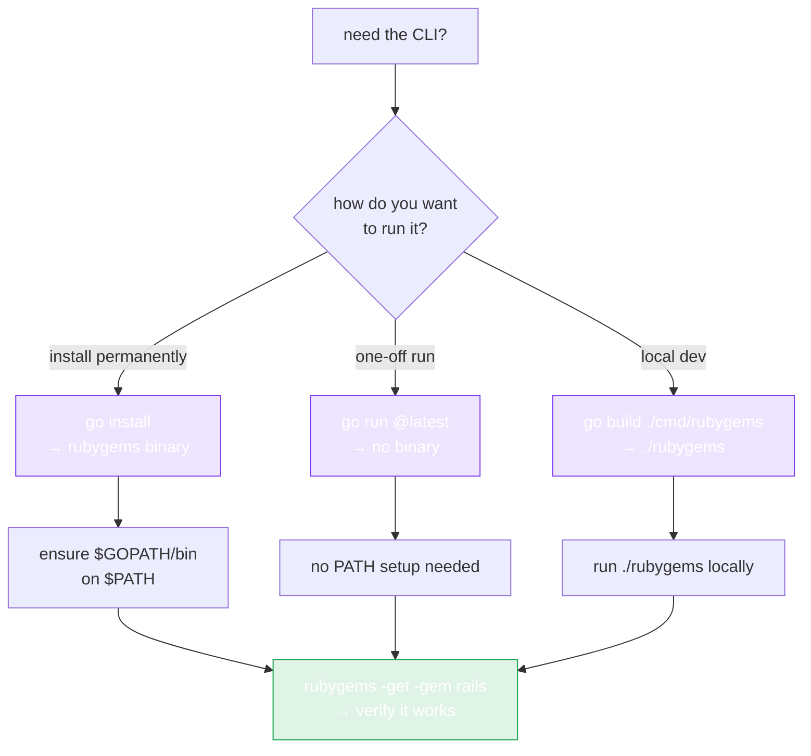

# CLI Installation

The repo ships a command-line tool under `cmd/rubygems` — query gems, list versions, search, and auto-install Ruby, all from the terminal. Useful for quick lookups, shell scripts, and CI.



## Install

```bash
go install github.com/scagogogo/rubygems-skills/cmd/rubygems@latest
```

This puts a `rubygems` binary on your `$GOPATH/bin` (or `$GOBIN`). Make sure that's on your `PATH`:

```bash
export PATH="$PATH:$(go env GOPATH)/bin"
rubygems -help
```

## Build from source

```bash
git clone https://github.com/scagogogo/rubygems-skills.git
cd rubygems-skills
go build -o rubygems ./cmd/rubygems
./rubygems -help
```

## Verify

```bash
rubygems -get -gem rails
```

You should see the rails gem's name, version, and download count.

## What it can do

| Subcommand (flag) | Action |
|---|---|
| `-get -gem NAME` | Get package info |
| `-search -query QUERY` | Search packages |
| `-versions -gem NAME` | List versions |
| `-deps -gem NAME` | Show dependencies |
| `-rdeps -gem NAME` | Show reverse dependencies |
| `-install` | Auto-install Ruby/RubyGems on this machine |

Plus output/format/mirror flags (`-json`, `-cache`, `-mirror`, `-limit`). See [Commands](./commands).

## No install? Use `go run`

You can skip the binary entirely and run it on the fly:

```bash
go run github.com/scagogogo/rubygems-skills/cmd/rubygems@latest -get -gem rails
```

---

Next: [Commands](./commands).
