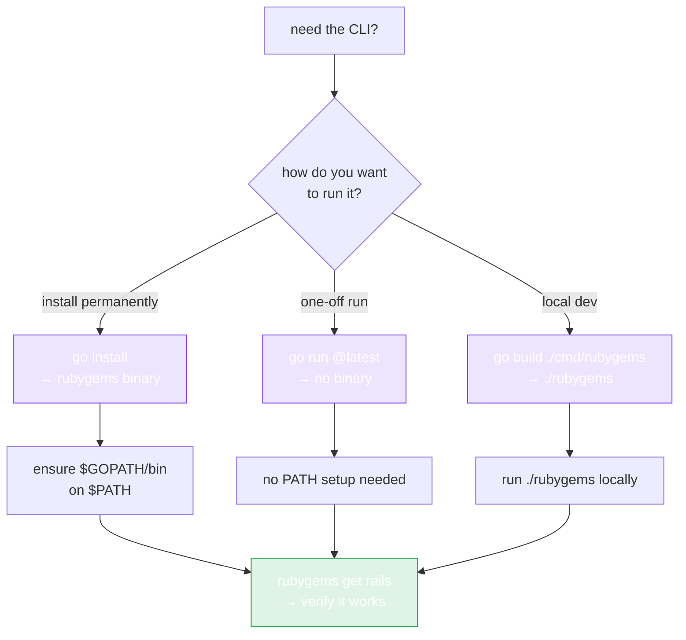

# CLI Installation

The repo ships a command-line tool under `cmd/rubygems` — built on [cobra](https://github.com/spf13/cobra), it exposes the entire SDK: read queries, bulk operations, write operations, and the Ruby/RubyGems auto-installer.



## Install

```bash
go install github.com/scagogogo/rubygems-skills/cmd/rubygems@latest
```

This puts a `rubygems` binary on your `$GOPATH/bin` (or `$GOBIN`). Make sure that's on your `PATH`:

```bash
export PATH="$PATH:$(go env GOPATH)/bin"
rubygems --help
```

## Build from source

```bash
git clone https://github.com/scagogogo/rubygems-skills.git
cd rubygems-skills
go build -o rubygems ./cmd/rubygems
./rubygems --help
```

## Verify

```bash
rubygems get rails
```

You should see the rails gem's name, version, and download count.

## Command groups

The CLI is organized into four groups of subcommands:

| Group | Commands | Auth |
|---|---|---|
| **Read** | `get`, `search`, `autocomplete`, `versions`, `latest-version`, `version-detail`, `version-contents`, `downloads`, `version-downloads`, `top-downloads`, `deps`, `rdeps`, `version-rdeps`, `latest-gems`, `just-updated`, `user-profile`, `owned-gems`, `gems-by-owner`, `gem-owners`, `attestations`, `mfa-status`, `timeframe` | optional `--token` |
| **Bulk** | `bulk-get`, `bulk-versions`, `bulk-deps`, `bulk-rdeps` | optional `--token` |
| **Write** | `push`, `yank`, `add-owner`, `remove-owner`, `update-owner`, `list-webhooks`, `create-webhook`, `delete-webhook`, `fire-webhook`, `get-api-key`, `create-api-key`, `update-api-key`, `my-profile` | `--token` or HTTP Basic |
| **Install** | `install`, `platform` | none |

Global flags (`--mirror`, `--server`, `--token`, `--proxy`, `--timeout`, `--json`, `--cache`, `--retry`) apply to most commands. See [Commands](./commands).

## No install? Use `go run`

You can skip the binary entirely and run it on the fly:

```bash
go run github.com/scagogogo/rubygems-skills/cmd/rubygems@latest get rails
```

---

Next: [Commands](./commands).
