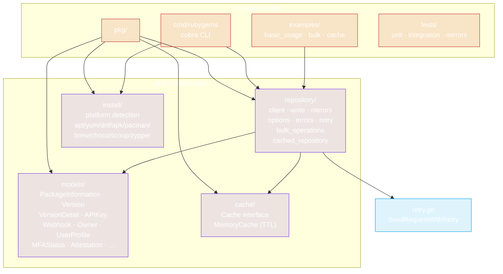
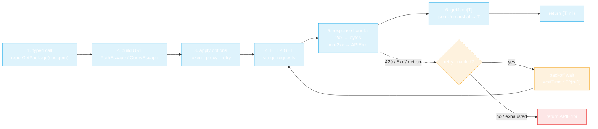
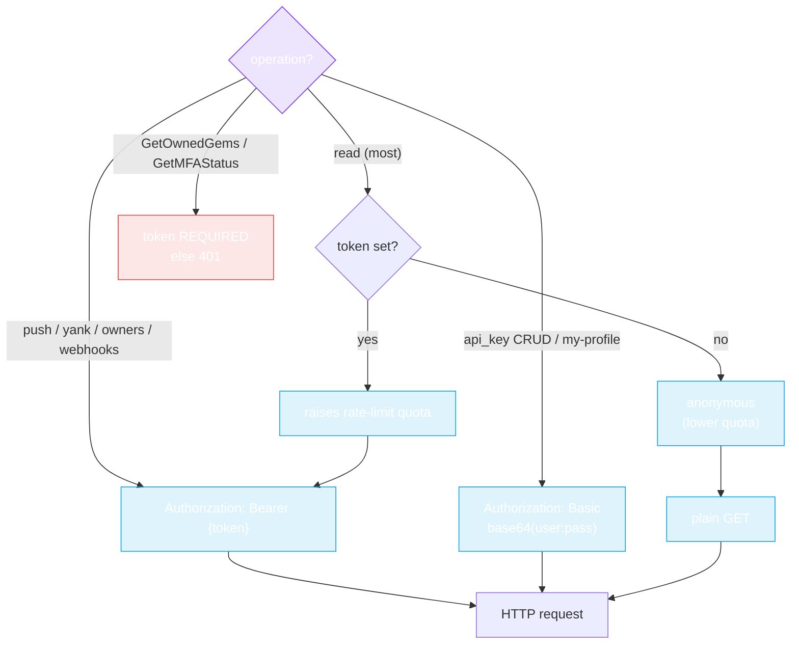
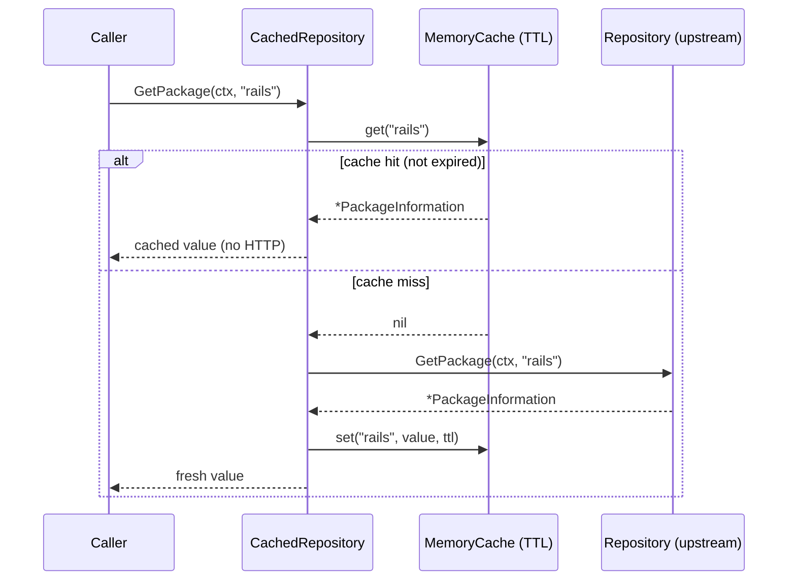
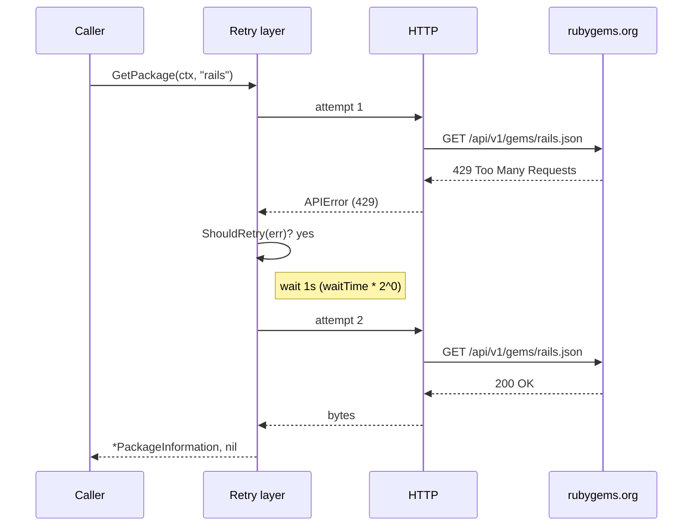
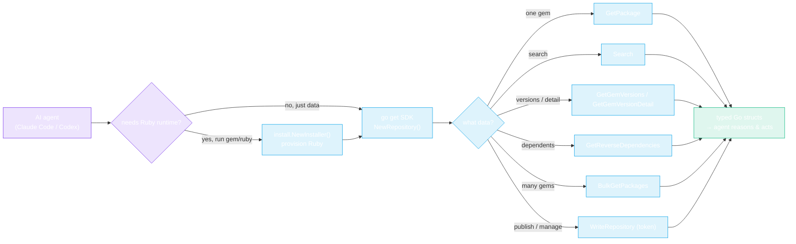

# Architecture

A deep dive into how rubygems-skills is structured end to end — the package layout, the request pipeline, the auth model, and the concurrency design. Read this once and you'll know where every feature lives.

## Package layout



Four packages, one responsibility each: `repository` is the HTTP client, `models` holds typed JSON structs, `cache` is the pluggable TTL store, `install` is the cross-platform Ruby provisioner. The CLI and examples are thin callers over `repository` (and `install`).

## The request pipeline

Every read call flows through the same five stages. Write calls add auth and form/multipart encoding but otherwise share the pipeline.



Two things to notice: (1) **URL encoding is centralized** — every path segment goes through `url.PathEscape`, every query value through `url.QueryEscape`, so special characters never break a request. (2) **Retry is opt-in per client**, configured once via `Options.SetRetryOptions` and applied to every request that client makes (GET, POST, DELETE, form, multipart).

## Authentication model

The SDK uses two auth strategies, chosen by endpoint. Read endpoints take an optional token to raise the rate-limit quota; write endpoints split between a bearer token and HTTP Basic.



**Why two strategies?** RubyGems.org exposes API-key management and the full authenticated profile behind HTTP Basic Auth (username + password), while gem publishing, yanking, owner, and webhook operations accept a bearer API token. The SDK mirrors this exactly: `WriteRepository` carries the bearer token in its options, and the `*APIKey*` / `GetMyProfile` methods take `username, password` arguments and apply Basic Auth per-request.

## Cache decorator

`CachedRepository` wraps any `Repository` and short-circuits repeat reads. Same interface, drop-in.



The cache is keyed by method + arguments, with a per-entry TTL and a background cleanup goroutine. Pass any `cache.Cache` implementation — `MemoryCache` is the in-process default; you can back it with Redis, filesystem, or anything else by implementing the interface.

## Retry & backoff

When `RetryOptions` is set, transient failures retry with exponential backoff before surfacing.



Defaults: 3 attempts, 1s initial wait, exponential backoff (`waitTime * 2^(attempt-1)`, capped at 30s), retry on any error. Tune with `NewDefaultRetryOptions().WithMaxAttempts(n).WithWaitTime(d)`. The same retry layer covers GET, POST, DELETE, form, and multipart requests — so `PushGem` retries too.

## Bulk concurrency

`BulkGet*` methods fan out over a fixed-size worker pool. Each worker owns a distinct result slot, so the pool is lock-free on the result slice.

```mermaid
flowchart TB
    Input["names[0..N-1]"] --> Dispatcher["dispatcher\nwrites indices 0..N-1\nto a buffered channel"]
    Dispatcher --> Ch(("index channel"))
    Ch --> W0["worker 0\n→ results[0]"])
    Ch --> W1["worker 1\n→ results[1]"])
    Ch --> W2["worker 2\n→ results[2]"])
    Ch --> WN["worker N-1\n→ results[N-1]"])
    W0 & W1 & W2 & WN --> Gather["pre-sized results[]\norder matches input"]

    W0 -.->|"429?"| Retry["per-request retry\n(if enabled)"]
    W0 -.->|"fail"| Slot["results[i].Error = err\n(others continue)"]

    classDef io fill:#0ea5e922,stroke:#0ea5e9,color:#fff
    classDef worker fill:#7c3aed22,stroke:#7c3aed,color:#fff
    classDef alt fill:#f59e0b22,stroke:#f59e0b,color:#fff
    class Input,Dispatcher,Ch,Gather io
    class W0,W1,W2,WN worker
    class Retry,Slot alt
```

Because the dispatcher hands out **indices** (not names) and each worker writes only to its own `results[i]`, there's no data race on the result slice — no mutex, no copy. `ContinueOnError(false)` stops dispatching after the first failure; the default `true` runs every item and collects per-slot errors. See [Bulk Operations](./bulk-operations).

## End-to-end from an AI agent's view



The agent never touches HTTP, JSON, or URL encoding — it calls typed methods and reasons over typed results. When it needs the actual `gem`/`ruby` binaries (e.g. to build a `.gem` before `PushGem`), the installer provisions them first.

---

← Back: [How it works](./how-it-works) · Next: [Installation](./installation)
