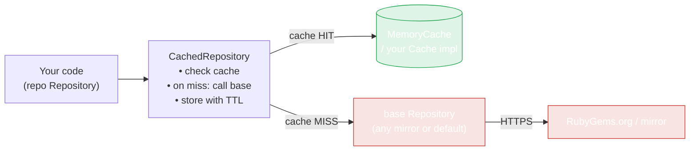
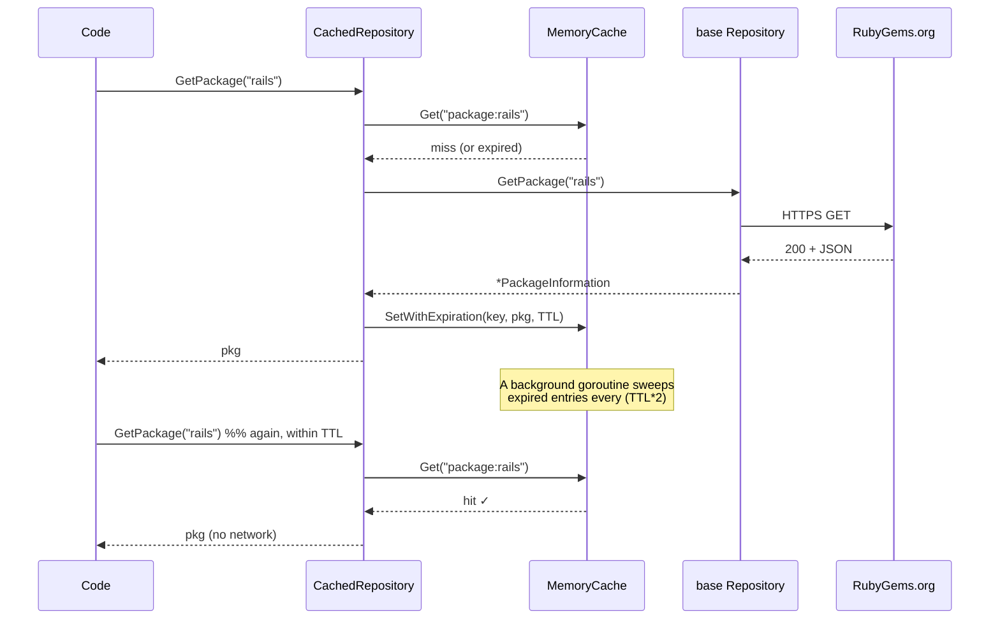

# Caching

RubyGems.org rate-limits unauthenticated traffic. Repeat queries for the same gem burn your quota and add latency. `CachedRepository` is a drop-in cache decorator that memoizes results with a TTL.

## Quick start

```go
import (
    "time"
    "github.com/scagogogo/rubygems-skills/pkg/repository"
)

base   := repository.NewRubyChinaRepository()
cached := repository.NewCachedRepository(base, 10*time.Minute, nil)

// First call hits the network; the second hits the cache.
pkg1, _ := cached.GetPackage(ctx, "rails")
pkg2, _ := cached.GetPackage(ctx, "rails")
```

`cached` is a full `Repository` — every read method is wrapped. You can pass it anywhere a `Repository` is expected; the rest of your code is unchanged.

## The decorator pattern

`CachedRepository` implements the same `Repository` interface as the thing it wraps. Your code talks to the interface, so swapping a raw repo for a cached one is a one-line change with no downstream edits:



The cache key is method-scoped and human-readable — `package:<gem>`, `search:<query>:<page>`, `versions:<gem>`, `dependencies:<comma-joined-names>`, etc. (see `pkg/repository/cached_repository.go`). Keys are namespaced per method, so a `GetPackage("rails")` and a `Search("rails", 1)` never collide.

## TTL & expiration



Two TTLs are in play:

- **Per-entry TTL** — passed to `NewCachedRepository`. Sets when each cached value expires.
- **Sweep interval** — the built-in `MemoryCache` launches a background goroutine that deletes expired entries every `TTL*2` (pass your own `cache.Cache` to control this independently).

Some read methods use a shorter TTL (`defaultTTL/2`) for data that changes more often — search results, downloads, version details — so you get freshness without losing the rate-limit benefit. Stale entries are also evicted lazily on `Get` (an expired entry returns a miss even before the sweeper runs).

`Close()` stops the sweeper goroutine — call it on shutdown to avoid leaking the timer.

## Constructor

```go
func NewCachedRepository(repo Repository, ttl time.Duration, cacheImpl cache.Cache) *CachedRepository
```

| Param | Meaning |
|---|---|
| `repo` | The underlying `Repository` to wrap (any mirror or the default). |
| `ttl` | How long each entry stays valid. |
| `cacheImpl` | Custom cache implementation, or `nil` for the built-in in-memory cache. |

## What gets cached

All read endpoints: `GetPackage`, `Search`, `GetGemVersions`, `GetDependencies`, `TopDownloads`, `GetUserProfile`, `GetGemOwners`, `GetAttestations`, and the rest of the `Repository` interface. Bulk operations pass through to the underlying repo (they're already concurrent).

## Cache control

```go
// Evict everything
cached.ClearCache()

// Inspect size
n := cached.GetCacheStats()

// Clean up timers on shutdown
cached.Close()
```

## A custom cache

Implement the `cache.Cache` interface to back the cache with Redis, memcached, or a file store:

```go
type Cache interface {
    Get(key string) (interface{}, bool)
    Set(key string, value interface{})
    SetWithExpiration(key string, value interface{}, d time.Duration)
    Delete(key string)
    Clear()
    Count() int
    Close()
}
```

`Set` uses the implementation's default expiration; `SetWithExpiration` lets you override it per entry (a negative duration means "never expire"). See `pkg/cache/cache.go` — the built-in `MemoryCache` is the reference implementation.

Pass your implementation as the third argument:

```go
cached := repository.NewCachedRepository(base, 10*time.Minute, myRedisCache)
```

## When NOT to cache

- **Write workflows** — `WriteRepository` operations bypass the cache and hit the live API directly (correct, since pushes/yanks must be live).
- **Very short TTLs** — if your TTL is below the typical request latency, the cache adds overhead for no benefit. Use the raw `Repository` instead.
- **Stale-sensitive reads** — if you need the absolute newest version right after a publish, call the underlying `repo` directly or `ClearCache()` first.

---

Next: [Retry & Backoff](./retry).
