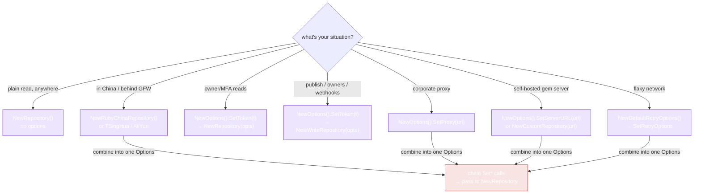

# Configuration

Everything is configured through the `Options` builder. Construct a `Repository` (or `WriteRepository`) with options only when you need to change defaults — no-auth, no-mirror reads need none.

## The Options builder

```go
opts := repository.NewOptions().
    SetServerURL("https://rubygems.org").
    SetToken("YOUR_API_TOKEN").
    SetProxy("http://127.0.0.1:7890").
    SetRetryOptions(retry)

repo := repository.NewRepository(opts)
```

| Method | Purpose | Default |
|---|---|---|
| `SetServerURL(url)` | Point at a mirror or self-hosted gem server | `https://rubygems.org` |
| `SetToken(token)` | API token — raises rate limits, enables owner/webhook reads | none |
| `SetProxy(proxy)` | HTTP/HTTPS proxy URL for corporate networks | none |
| `SetRetryOptions(r)` | Fine-tune retry/backoff | 3 attempts, exp backoff (1s → 30s), retries any error |
| `DisableRetry()` | Turn off retry entirely | retry on |

## Authenticated reads

Some read endpoints (`GetOwnedGems`, `GetMFAStatus`) require a token (sent as an `Authorization` header). Pass your token:

```go
opts := repository.NewOptions().SetToken("YOUR_API_TOKEN")
repo := repository.NewRepository(opts)
gems, err := repo.GetOwnedGems(ctx)
```

For `GetMyProfile` (which returns the authenticated user's full profile), use the `WriteRepository` method with username + password — see [WriteRepository](../api/write-repository).

Get a token from [rubygems.org → Edit settings → API key](https://rubygems.org/profile/edit).

## Custom gem server

Point at a self-hosted or Artifactory gem server:

```go
opts := repository.NewOptions().SetServerURL("https://gems.corp.internal")
repo := repository.NewRepository(opts)
```

Or use the mirror constructors — they set the URL and keep everything else default:

```go
repo := repository.NewRubyChinaRepository()
```

## Proxy

Behind a corporate proxy? Set it once:

```go
opts := repository.NewOptions().SetProxy("http://10.0.0.1:8080")
```

## Retry tuning

```go
retry := repository.NewDefaultRetryOptions().
    WithMaxAttempts(6).
    WithWaitTime(200 * time.Millisecond).
    WithMaxWaitTime(5 * time.Second).
    WithExponentialBackoff(true)

opts := repository.NewOptions().SetRetryOptions(retry)
```

See [Retry & Backoff](./retry) for the full picture.

## Picking the right options for your scenario



Every `Set*` returns the same `*Options`, so chain whichever apply and pass the result to the constructor — see the combined example below.

## Combining everything

```go
retry := repository.NewDefaultRetryOptions().WithMaxAttempts(6)
opts := repository.NewOptions().
    SetServerURL("https://gems.ruby-china.com").
    SetToken("YOUR_API_TOKEN").
    SetProxy("http://127.0.0.1:7890").
    SetRetryOptions(retry)

repo  := repository.NewRepository(opts)
write := repository.NewWriteRepository(opts)  // write needs *Options
```

`NewWriteRepository` takes a non-variadic `*Options` (write operations always need auth), so build the options first and pass them in.

---

Next: [Mirrors](./mirrors).
