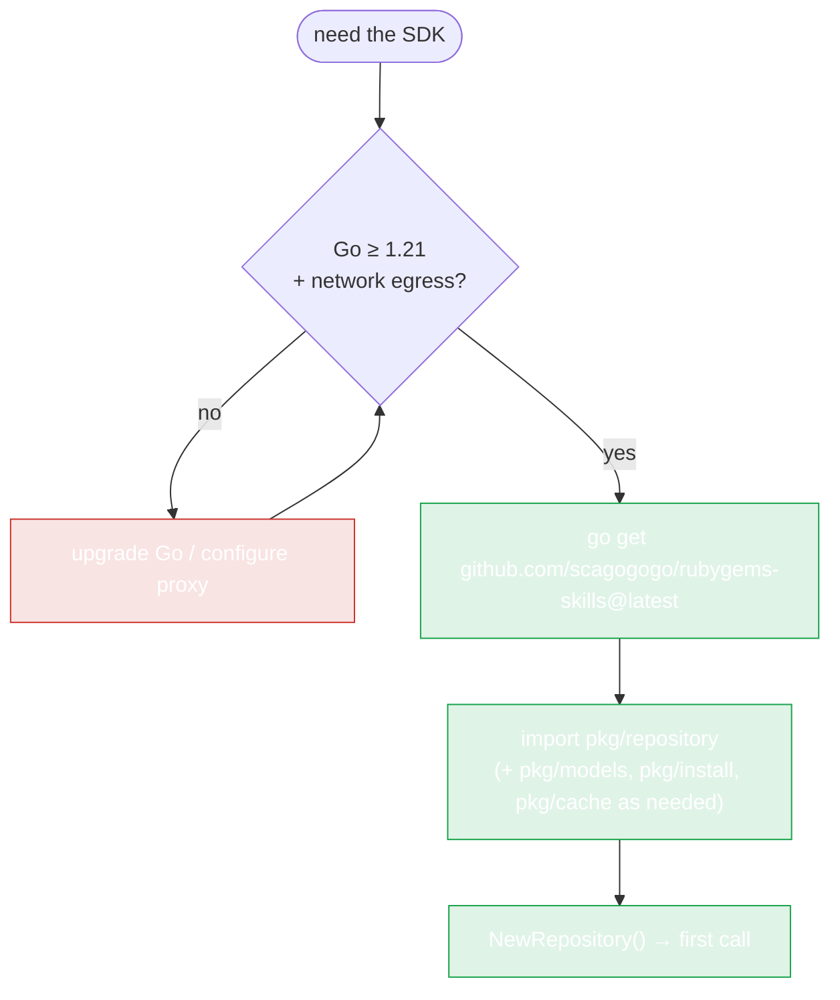

# Installation



No Ruby/RubyGems runtime is required to *use* the SDK — only if you call the `pkg/install` auto-installer or run `gem`/`ruby` yourself.

## Requirements

- **Go 1.21 or newer** (the SDK uses generics).
- Internet access to `rubygems.org` or a mirror (Ruby China, Tsinghua, Aliyun).

## Add the dependency

```bash
go get github.com/scagogogo/rubygems-skills@latest
```

This adds the module to your `go.mod`:

```
require github.com/scagogogo/rubygems-skills v0.x.x
```

## Import the packages you need

```go
import (
    "context"

    "github.com/scagogogo/rubygems-skills/pkg/repository"
    "github.com/scagogogo/rubygems-skills/pkg/models"
)
```

| Package | Use it for |
|---|---|
| `pkg/repository` | Reading and writing the API |
| `pkg/models` | The data structs returned by the API |
| `pkg/install` | Auto-installing Ruby/RubyGems on the host |
| `pkg/cache` | Custom cache implementations |

## Verify it works

```go
package main

import (
    "context"
    "fmt"
    "log"

    "github.com/scagogogo/rubygems-skills/pkg/repository"
)

func main() {
    repo := repository.NewRepository()
    pkg, err := repo.GetPackage(context.Background(), "rails")
    if err != nil {
        log.Fatal(err)
    }
    fmt.Printf("%s %s — %d downloads\n", pkg.Name, pkg.Version, pkg.Downloads)
}
```

Run it:

```bash
go run main.go
# rails 7.1.3.4 — 234567890 downloads
```

## CLI tool (optional)

The repo also ships a CLI under `cmd/rubygems`. Install it:

```bash
go install github.com/scagogogo/rubygems-skills/cmd/rubygems@latest
```

See [CLI Installation](../cli/install).

## Behind a proxy or in China?

If `rubygems.org` is slow or blocked, use a mirror — no code changes beyond the constructor:

```go
repo := repository.NewRubyChinaRepository()   // or NewTSingHuaRepository / NewAliYunRepository
```

See [Mirrors](./mirrors).

---

Next: [Quick Start](./quick-start).
