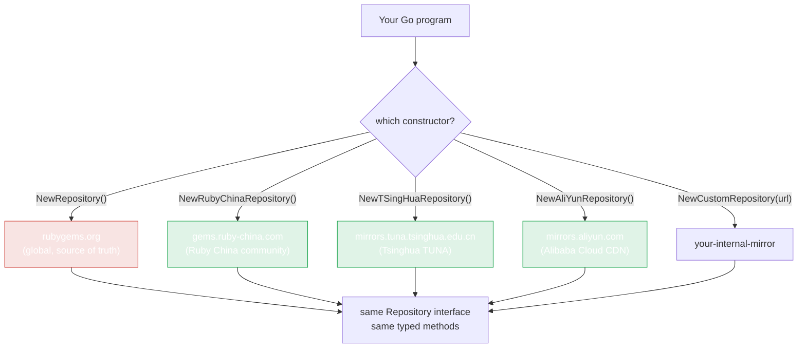

# Mirrors

In China, `rubygems.org` is slow or unreachable. rubygems-skills ships ready-made mirror constructors — same interface, fast endpoint, no other code changes.



All four are read-only mirrors of the same data. Pick by latency from your network — Alibaba Cloud's CDN is often fastest from commercial cloud regions; TUNA is reliable from campus/academic networks; Ruby China is the community default. **Mirrors are read-only**: write operations (`PushGem`, owners, webhooks) always go to the official `rubygems.org` endpoint via `NewWriteRepository`.

## Built-in mirrors

| Constructor | Server | Operator |
|---|---|---|
| `NewRubyChinaRepository()` | `https://gems.ruby-china.com` | Ruby China |
| `NewTSingHuaRepository()` | `https://mirrors.tuna.tsinghua.edu.cn/rubygems/api` | Tsinghua TUNA |
| `NewAliYunRepository()` | `https://mirrors.aliyun.com/rubygems` | Alibaba Cloud |

```go
import "github.com/scagogogo/rubygems-skills/pkg/repository"

// Pick the fastest for your network
repo := repository.NewRubyChinaRepository()

pkg, err := repo.GetPackage(ctx, "rails")  // identical call
```

All three return a `Repository`, so they're drop-in replacements for `NewRepository()`. They also work with `CachedRepository`:

```go
base   := repository.NewRubyChinaRepository()
cached := repository.NewCachedRepository(base, 10*time.Minute, nil)
```

## Custom mirror / self-hosted server

Have your own gem server (Artifactory, Nexus, private)? Use `NewCustomRepository`:

```go
repo := repository.NewCustomRepository("https://gems.corp.internal")
```

Or set the URL via options, which lets you also attach a token and proxy:

```go
opts := repository.NewOptions().
    SetServerURL("https://gems.corp.internal").
    SetToken("YOUR_TOKEN")
repo := repository.NewRepository(opts)
```

## How mirrors work

A mirror is just a `Repository` constructed with a different `ServerURL`. Every endpoint path (`/api/v1/gems/{name}.json`, etc.) stays identical — mirrors replicate the RubyGems.org API surface verbatim. So no method logic differs; only the host changes.

## Picking a mirror

A quick way to test latency from your machine:

```bash
for url in \
  https://rubygems.org/api/v1/gems/rails.json \
  https://gems.ruby-china.com/api/v1/gems/rails.json \
  https://mirrors.tuna.tsinghua.edu.cn/rubygems/api/v1/gems/rails.json \
  https://mirrors.aliyun.com/rubygems/api/v1/gems/rails.json ; do
  echo -n "$url: "; curl -s -o /dev/null -w "%{time_total}s\n" "$url"
done
```

Pick the constructor with the lowest number.

::: tip Mirrors are read-only
Mirrors replicate the public read API. For write operations (push, yank, owners, webhooks), use the official `rubygems.org` endpoint with auth — `NewWriteRepository(repository.NewOptions().SetToken(...))`.
:::

---

Next: [Caching](./caching).
