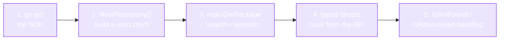

# Quick Start

Make your first RubyGems API call in under a minute.



Five steps, one module, no boilerplate. The rest of this page is each step as copy-paste-runnable code.

## 1. Initialize a project

```bash
mkdir myapp && cd myapp
go mod init myapp
go get github.com/scagogogo/rubygems-skills@latest
```

## 2. Query a gem

Create `main.go`:

```go
package main

import (
    "context"
    "fmt"
    "log"

    "github.com/scagogogo/rubygems-skills/pkg/repository"
)

func main() {
    ctx := context.Background()
    repo := repository.NewRepository()

    // Get a gem's metadata
    pkg, err := repo.GetPackage(ctx, "rails")
    if err != nil {
        log.Fatal(err)
    }
    fmt.Printf("📦 %s %s\n", pkg.Name, pkg.Version)
    fmt.Printf("   Downloads: %d\n", pkg.Downloads)
    fmt.Printf("   Source:     %s\n", pkg.SourceCodeURI)
}
```

```bash
go run main.go
# 📦 rails 7.1.3.4
#    Downloads: 234567890
#    Source:     https://github.com/rails/rails
```

## 3. List versions

```go
versions, err := repo.GetGemVersions(ctx, "rails")
if err != nil {
    log.Fatal(err)
}
fmt.Println("Latest 5 versions:")
for i, v := range versions {
    if i >= 5 { break }
    fmt.Printf("  - %s\n", v.Number)
}
```

## 4. Search

```go
results, err := repo.Search(ctx, "http client", 1)
if err != nil {
    log.Fatal(err)
}
for _, r := range results {
    fmt.Printf("  - %s: %s\n", r.Name, r.Info)
}
```

## 5. Dependencies

```go
deps, err := repo.GetDependencies(ctx, "rails")
if err != nil {
    log.Fatal(err)
}
for _, d := range deps {
    fmt.Printf("  %s is depended on by %s (%s)\n", d.Name, d.DependentName, d.Requirements)
}
```

The gem's own runtime/development dependencies are also available on the package struct:

```go
pkg, _ := repo.GetPackage(ctx, "rails")
for _, d := range pkg.Dependencies.Runtime {
    fmt.Printf("  runtime: %s %s\n", d.Name, d.Requirements)
}
```

## Putting it together

The complete runnable example lives in the repo at [`examples/basic_usage.go`](https://github.com/scagogogo/rubygems-skills/blob/main/examples/basic_usage.go).

## Error handling

Wrap calls with the typed error checks so your program degrades gracefully:

```go
pkg, err := repo.GetPackage(ctx, "nonexistent-gem-xyz")
switch {
case repository.IsNotFound(err):
    fmt.Println("gem not found")
case repository.IsRateLimited(err):
    fmt.Println("slow down — rate limited")
case repository.IsUnauthorized(err):
    fmt.Println("auth required")
case err != nil:
    log.Fatal(err)
}
```

See [Error Handling](./error-handling).

---

Next: [Configuration](./configuration).
