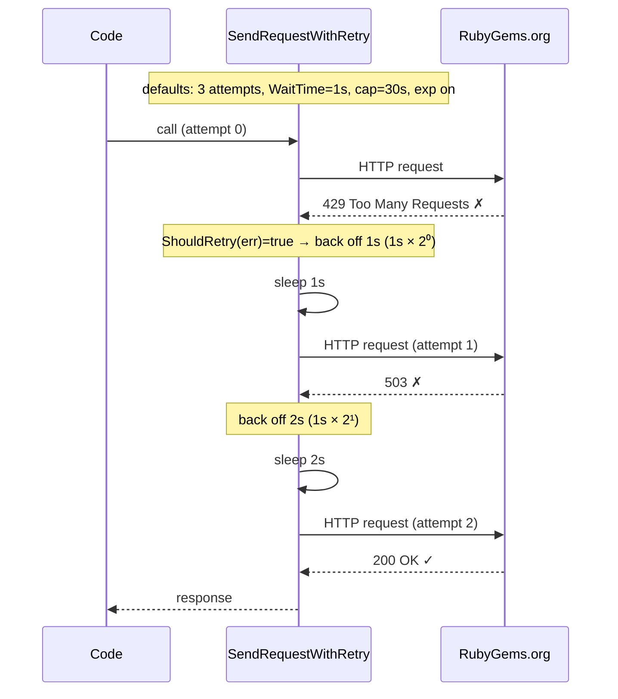

# Retry & Backoff

Transient failures are a fact of life with public APIs — 429 rate limits, momentary 503s, network blips. rubygems-skills retries every request with configurable exponential backoff.

## Defaults

Out of the box (no configuration):

| Setting | Value |
|---|---|
| Max attempts | 3 |
| Initial wait | 1s |
| Max wait (cap) | 30s |
| Exponential backoff | on |
| Retries on | any error (default `ShouldRetry` is `err != nil`) |

You usually don't need to change anything.

## Tuning

```go
import "time"

retry := repository.NewDefaultRetryOptions().
    WithMaxAttempts(6).                  // try up to 6 times
    WithWaitTime(200*time.Millisecond).  // start at 200ms
    WithMaxWaitTime(5*time.Second).      // cap a single wait at 5s
    WithExponentialBackoff(true).        // grow waits exponentially
    WithShouldRetry(func(err error) bool {
        // custom predicate — retry only on your definition of transient
        return repository.IsRateLimited(err)
    })

opts := repository.NewOptions().SetRetryOptions(retry)
repo := repository.NewRepository(opts)
```

| Method | Purpose |
|---|---|
| `WithMaxAttempts(n)` | Total attempts including the first. |
| `WithWaitTime(d)` | Base wait before the first retry. |
| `WithMaxWaitTime(d)` | Ceiling on a single wait (backoff never exceeds this). |
| `WithExponentialBackoff(bool)` | Grow waits exponentially (true) or keep them flat (false). |
| `WithShouldRetry(fn)` | Predicate deciding whether a given error is retryable. |
| `DisableRetry()` (on `Options`) | Turn retry off entirely. |

## How it works

The generic helper `SendRequestWithRetry[Request, Response]` (in `pkg/repository/retry.go`) wraps each HTTP call. On a retryable error it sleeps for the backoff duration and tries again, up to `MaxAttempts`. The wait between attempts grows as `WaitTime * 2^(attempt-1)` until it hits `MaxWaitTime`, then stays there. There is no jitter — the growth is purely exponential.



With defaults, a worst-case retry sequence waits `1s + 2s` between three attempts (the third attempt's wait would be `1s × 2² = 4s`, but it's the last attempt so no further wait occurs). The cap (`MaxWaitTime = 30s`) only bites on long retry chains with a high `MaxAttempts`.

The two type parameters are: `Request` (the request body type, used by the underlying `go-requests` `Options[Request, Response]`) and `Response` (the decoded response type). The retry loop itself only branches on `error`, so it is HTTP-agnostic — any non-2xx status is converted to an error by a response handler before the retry decision is made.

Retries are transparent — if all attempts fail, you receive the final error wrapped as `max retry attempts reached (N attempts): <last error>` (often a `*repository.APIError` you can inspect with `IsRateLimited` / `IsUnauthorized` / `IsNotFound`).

::: warning Default retries *everything* — including 404 and 401
The default `ShouldRetry` returns `true` for any non-nil error. That means a 404 (missing gem) or 401 (bad token) **will** be retried up to `MaxAttempts`, which wastes time and rate-limit quota on something that won't self-correct. If you call endpoints where 404/401 are expected outcomes, supply a tighter predicate:

```go
retry := repository.NewDefaultRetryOptions().WithShouldRetry(func(err error) bool {
    // retry rate limits and server errors, but not "not found" or "unauthorized"
    return !repository.IsNotFound(err) && !repository.IsUnauthorized(err)
})
```
:::

## Disabling retry

For a fire-and-forget script that should fail fast:

```go
opts := repository.NewOptions().DisableRetry()
repo := repository.NewRepository(opts)
```

## When retry helps (and when it doesn't)

- **Helps:** 429 rate limits, 502/503 gateway blips, transient DNS/TLS hiccups.
- **Doesn't help (by default):** 404 not found (a missing gem won't appear on retry) and 401 unauthorized (a bad token stays bad). The default `ShouldRetry` will still retry these — supply a predicate that excludes `IsNotFound` / `IsUnauthorized` (see the warning above) if you want fail-fast behavior on those.

---

Next: [Bulk Operations](./bulk-operations).
