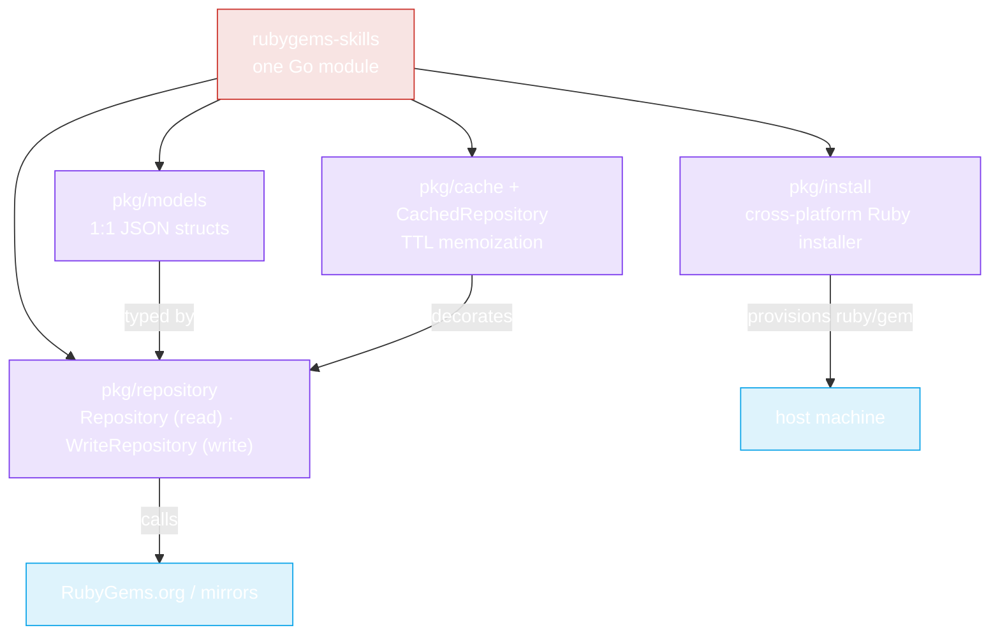

# What is rubygems-skills?

**rubygems-skills** is a production-ready Go SDK for the [RubyGems.org](https://rubygems.org) HTTP API. It wraps every read and write endpoint into a typed Go interface, so you — or your AI agent — can query, search, and publish gems without hand-rolling an HTTP client.

## At a glance



| Capability | Package | Interface |
|---|---|---|
| Read (no auth) | `pkg/repository` | `Repository` |
| Write (auth) | `pkg/repository` | `WriteRepository` |
| Cross-platform install | `pkg/install` | `Installer` |
| Data models | `pkg/models` | structs |
| Caching | `pkg/cache` / `pkg/repository` | `CachedRepository` |

```go
import "github.com/scagogogo/rubygems-skills/pkg/repository"

repo := repository.NewRepository()
pkg, err := repo.GetPackage(ctx, "rails")
```

## Why another SDK?

The RubyGems.org API has no official Go client. When you ask an AI agent to "use RubyGems", it improvises a fragile HTTP client — guessing JSON shapes, ignoring rate limits, failing on transient errors. **rubygems-skills replaces that improvisation with one typed, tested module.**

Read the full rationale in [Why use it?](./why).

## Who is it for?

- **AI coding agents** (Claude Code, Codex, Cursor) that need a reliable, self-documenting RubyGems API surface.
- **Go developers** building tooling around the Ruby ecosystem (dependency analysis, audit scripts, mirrors, CI bots).
- **Anyone in China** who needs mirror support (Ruby China, Tsinghua, Aliyun) for fast, GFW-friendly access.

## Module path

```
github.com/scagogogo/rubygems-skills
```

Requires **Go 1.21+** (uses generics for `getJson[T]` and `runWorkerPool[T]`).
