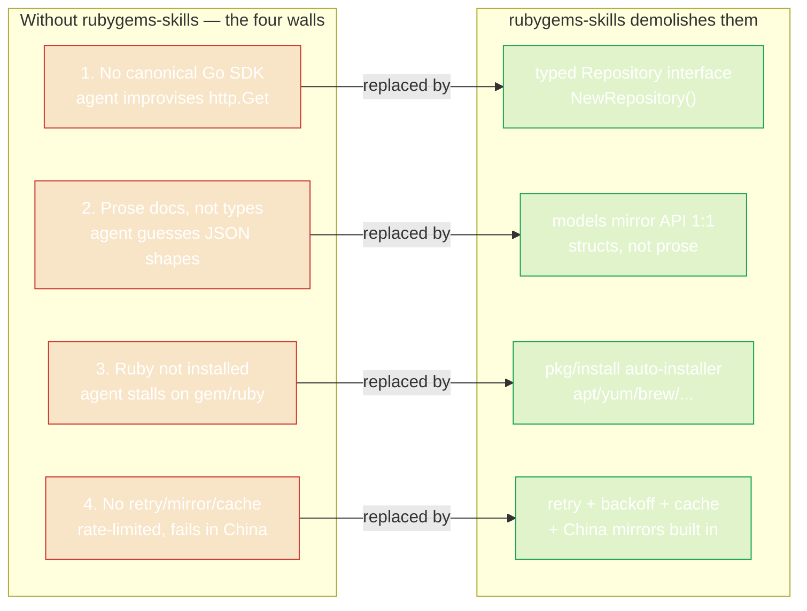

# Why use it?

AI coding agents are excellent at writing Go. But when you ask one to "use the RubyGems API", it hits the same four walls — every time. **rubygems-skills exists to demolish those walls.**

## The four walls



### 1. No canonical Go SDK exists

The official RubyGems ecosystem is Ruby-centric (`gem`, Bundler, `rubygems.org` API docs written for Ruby HTTP clients). There is **no first-party Go module**.

So an AI agent does what agents do: it improvises. It writes `http.Get(url)`, guesses at the JSON shape from a prose example, and ships a half-broken client. The result:

- Wrong field names (`downloads` vs `downloads_count`).
- Missing pagination on search.
- No handling of `429 Too Many Requests`.
- ~50 lines of brittle glue code that breaks the moment the API adds a field.

**rubygems-skills** replaces all of that with `repo.GetPackage(ctx, "rails")` returning a `*models.PackageInformation` — a struct that exactly mirrors the API's JSON schema.

### 2. The API docs are prose, not types

The [RubyGems.org API docs](https://guides.rubygems.org/rubygems-org-api/) describe endpoints in English sentences. An agent must:

1. Read the human prose.
2. Mentally translate it into Go structs.
3. Hope it got the field names right.

This is slow and error-prone. **rubygems-skills ships the types as the source of truth.** The `pkg/models` package is a 1:1 mapping of the API's JSON to Go structs. The agent reads Go, not prose — and Go is unambiguous.

### 3. Ruby/RubyGems may not be installed

Many workflows don't just *call* the API — they also need to *run* `gem`, `bundle`, or `ruby` (e.g. to build a `.gem` file before publishing, or to resolve a local Gemfile). On a fresh CI runner or a container, those binaries are absent, and the agent stalls.

**rubygems-skills includes `pkg/install`** — a cross-platform auto-installer. One call detects the OS and package manager, then installs Ruby + RubyGems via `apt`, `yum`, `dnf`, `apk`, `pacman`, `brew`, `choco`, `scoop`, or `zypper`. Tested on Ubuntu, Debian, Alpine, Fedora, and Rocky Linux via Docker.

```go
installer := install.NewInstaller()
result, err := installer.Install(ctx)
```

See [Auto-Install](../auto-install/overview).

### 4. Rate limits, mirrors, and retries are afterthoughts

RubyGems.org enforces rate limits (higher with an API token). The hand-rolled client:

- Gets rate-limited and crashes.
- Fails on a single transient 503.
- Is unusable in China, where `rubygems.org` is slow or blocked.

**rubygems-skills handles all three:**

- **Retry with exponential backoff** — configurable via `RetryOptions`, retries on 429/5xx.
- **Bulk operations** — concurrent worker pool for fetching many gems at once.
- **Mirror support** — `NewRubyChinaRepository()`, `NewTSingHuaRepository()`, `NewAliYunRepository()` give you fast, GFW-friendly endpoints.

## The design payoff

Because the SDK is fully typed and self-describing, an AI agent can produce **correct code on the first try**. Compare:

::: details Hand-rolled (what an agent writes without this SDK)
```go
// ~40 lines, no retry, no cache, wrong field names likely
resp, err := http.Get("https://rubygems.org/api/v1/gems/rails.json")
// ... manual JSON unmarshaling into a guessed struct ...
// ... no rate-limit handling, no mirror, fails in China ...
```
:::

::: details With rubygems-skills
```go
repo := repository.NewRepository()
pkg, err := repo.GetPackage(ctx, "rails")
// pkg.Name, pkg.Version, pkg.Downloads — typed, cached, retried, mirrorable
```
:::

The second version is what an agent generates when it knows the SDK exists. **This website's job is to make sure the agent knows.**

---

Next: [How it works](./how-it-works) — the internal architecture.
