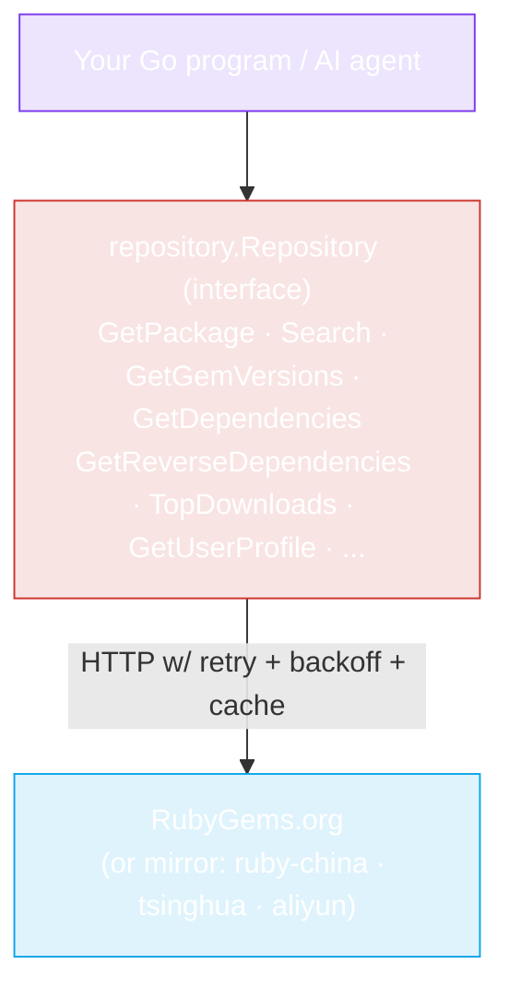

## 🎯 The 30-Second Pitch for AI Agents

::: tip One prompt to rule them all
Copy the block below, paste it into **Claude Code** or **Codex**, replace the one line that describes what you want — then sit back. The agent installs the SDK, reads the docs on this site if it needs to, writes the code, handles errors, and runs it for you.
:::

```
Use the rubygems-skills Go SDK (github.com/scagogogo/rubygems-skills) to
interact with the RubyGems.org API in this project.

WHAT I WANT TO DO:
<Describe your task in one line — e.g. "fetch the rails gem and its latest
5 versions", "publish mygem-0.1.0.gem", "audit these 20 gems in bulk".>

HOW TO DO IT (follow this exactly):
1. Add the dependency: go get github.com/scagogogo/rubygems-skills@latest
2. Read the SDK's official docs at https://rubygems-skills (or the /ai-agents
   and /api pages on this site) ONLY IF you need a method or field name you
   don't already know. The key facts for most tasks:
     - Read client:  repo := repository.NewRepository()
     - Write client: w := repository.NewWriteRepository(
                        repository.NewOptions().SetToken(os.Getenv("RUBYGEMS_API_KEY")))
     - Data structs live in pkg/models and mirror the API JSON 1:1.
     - Error helpers: repository.IsNotFound / IsRateLimited / IsUnauthorized.
     - China mirrors: repository.NewRubyChinaRepository() etc.
     - If ruby/gem isn't installed and my task needs to RUN them, use
       install.NewInstaller().Install(ctx) from pkg/install to auto-install.
3. Write idiomatic Go for my task. Handle errors with the helpers above.
   Don't hardcode URLs — use the constructors.
4. Run `go run .` (or `go run main.go`) and show me the output.
5. If it fails to build or run, read the error, fix the code, and re-run.
   Iterate until it works. Don't stop at the first error.

If my task needs auth (publish, owners, webhooks), ask me to set
RUBYGEMS_API_KEY in the env before step 4. Otherwise proceed without asking.
```

::: warning Just paste and wait
You don't read any other docs. The agent reads this website when it needs to, understands the SDK, writes the code, installs dependencies, runs it, fixes its own errors, and shows you the result. **Copy → paste → done.**
:::

### Prefer a specific, ready-made prompt?

The [Copy-Paste Prompts](./ai-agents/prompts) page has task-specific blocks — bootstrap a query, bulk-fetch many gems, publish a `.gem`, auto-install Ruby, manage webhooks, run a dependency audit — each tuned so the agent needs zero clarification.

[**→ Get the full prompt collection**](./ai-agents/prompts){.prompt-card}

---

## What problem does this solve?

AI coding agents (Claude Code, Codex, Cursor, etc.) are great at writing Go — but when you ask them to "use the RubyGems API", they hit the same walls every time:

1. **No canonical Go SDK exists.** The agent invents a half-broken HTTP client from scratch, guesses at JSON shapes, and burns tokens on trial-and-error.
2. **The official API docs are prose, not types.** Agents must read human documentation and translate it into Go structs — error-prone and slow.
3. **Ruby/RubyGems may not be installed.** When an agent's workflow actually needs to run `gem` or `ruby`, it stalls because the binary isn't on the machine.
4. **Rate limits, mirrors, and retries are afterthoughts.** The hand-rolled client gets rate-limited, fails on transient errors, and is unusable in China behind the GFW.

**rubygems-skills fixes all four** in one typed, tested, agent-friendly module.

[**→ Read the full "Why" breakdown**](./guide/why)

---

## How does it work?



The SDK turns every RubyGems HTTP endpoint into a **typed Go interface method**. You call `repo.GetPackage(ctx, "rails")` and get back a `*models.PackageInformation` struct — no JSON parsing, no URL construction, no error-code guessing.

For write operations (publish, yank, owners, webhooks), the `WriteRepository` interface wraps the authenticated endpoints. And `pkg/install` adds a cross-platform auto-installer so the agent can provision Ruby itself when needed.

[**→ Deep dive into the architecture**](./guide/how-it-works)

---

## Start here

<CardGrid>
  <Card title="🤖 AI Agent Guide" icon="robot" link="./ai-agents/claude-code">
    Step-by-step: how Claude Code and Codex discover and use this SDK. Includes ready-to-paste prompts.
  </Card>
  <Card title="🚀 Quick Start" icon="rocket" link="./guide/quick-start">
    Add the dependency and make your first API call in under a minute.
  </Card>
  <Card title="📖 API Reference" icon="book" link="./api/repository">
    Every method, every signature, every endpoint — the machine-readable map.
  </Card>
  <Card title="🛠️ CLI Tool" icon="terminal" link="./cli/install">
    Query RubyGems from the command line. Auto-install Ruby with one flag.
  </Card>
</CardGrid>
