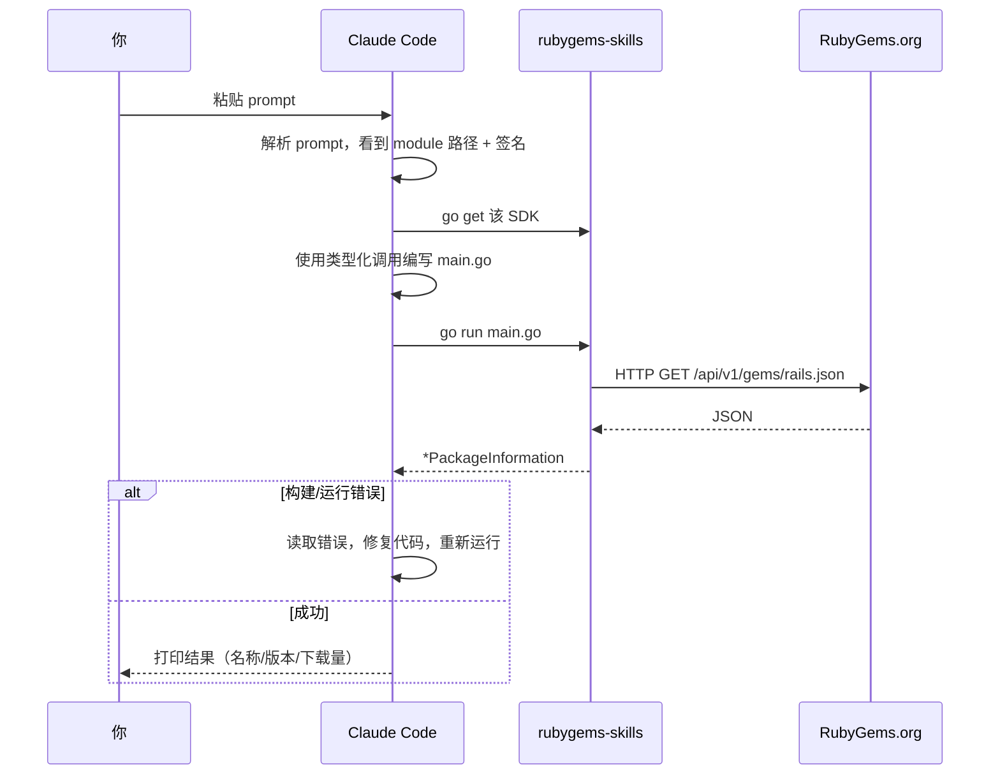

# Claude Code 集成

[Claude Code](https://claude.com/claude-code) 是 Anthropic 的基于终端的编程 agent。它阅读文档，编写 Go，运行 `go` 命令，并根据编译器/运行时错误迭代 —— 正好是使用本 SDK 所需的循环。

## 一次粘贴完成设置

在项目目录中打开 Claude Code，粘贴以下内容：

::: details 📋 复制粘贴 prompt — 完整引导
```
I want to use the rubygems-skills Go SDK (github.com/scagogogo/rubygems-skills)
to interact with the RubyGems.org API in this project.

The SDK's documentation site is the source of truth for its API. The key facts:
- Module: github.com/scagogogo/rubygems-skills
- Read API: pkg/repository — repository.NewRepository() returns a Repository.
  Method signatures are explicit and typed, e.g.:
    GetPackage(ctx context.Context, gemName string) (*models.PackageInformation, error)
    Search(ctx context.Context, query string, page int) ([]*models.PackageInformation, error)
    GetGemVersions(ctx context.Context, gemName string) ([]*models.Version, error)
    GetDependencies(ctx context.Context, gemNames ...string) ([]*models.DependencyInfo, error)
- Write API: repository.NewWriteRepository(repository.NewOptions().SetToken("API_KEY"))
- Data structs live in pkg/models and mirror the API JSON 1:1.
- Error helpers: repository.IsNotFound(err), IsRateLimited(err), IsUnauthorized(err).
- If ruby/gem isn't installed and I need to run them, use pkg/install:
    installer := install.NewInstaller(); installer.Install(ctx)
- China mirrors: repository.NewRubyChinaRepository() / NewTSingHuaRepository() / NewAliYunRepository().

Please:
1. Run: go get github.com/scagogogo/rubygems-skills@latest
2. Write a main.go that queries the "rails" gem, prints name/version/downloads,
   lists its latest 5 versions, and prints its runtime dependencies.
3. Use repository.NewRepository() (no auth needed for these reads).
4. Handle errors with the IsNotFound/IsRateLimited/IsUnauthorized helpers.
5. Run `go run main.go` and show me the output. Fix any errors and re-run.
```
:::

Claude Code 会：

1. `go get` 依赖。
2. 使用上面的确切签名编写 `main.go`。
3. 运行 `go run main.go`。
4. 如果构建或运行失败，读取错误，修复代码，重新运行 —— 自主完成。
5. 打印最终输出（gem 名称、版本、下载量、依赖列表）。

你只需观看。



## 为什么它有效

Claude Code 可以阅读本网站的 [API 参考](../api/repository)。但上面的 prompt **前置加载了关键签名**，所以 agent 甚至不需要先获取文档 —— 它有足够的信息立即编写正确的代码。结果是更少的往返和更少的幻觉字段名。

## 需要写操作时

对于推送 gem、管理所有者或 webhook，agent 需要 API token。告诉它：

::: details 📋 复制粘贴 prompt — 发布 gem
```
Use rubygems-skills (github.com/scagogogo/rubygems-skills) to publish a .gem file
to RubyGems.org. My API key is in the env var RUBYGEMS_API_KEY.

Steps:
1. go get github.com/scagogogo/rubygems-skills@latest
2. Build a *Repository with auth:
     opts := repository.NewOptions().SetToken(os.Getenv("RUBYGEMS_API_KEY"))
     w := repository.NewWriteRepository(opts)
3. Read the .gem file bytes and call w.PushGem(ctx, gemBytes).
4. Print the response. If repository.IsUnauthorized(err), tell me the token is bad.
5. After publishing, fetch the published version with a read Repository to verify.
```
:::

## Ruby 未安装时

如果工作流需要实际运行 `gem`/`ruby`（构建 gem、解析 Gemfile），告诉 agent 先配置它：

::: details 📋 复制粘贴 prompt — 自动安装 Ruby
```
I need Ruby/RubyGems available on this machine. Use rubygems-skills' pkg/install
package to auto-install it for my OS:
  installer := install.NewInstaller()
  result, err := installer.Install(ctx)
Then verify with `ruby -v` and `gem -v`. If detection picks the wrong package
manager, you can override with install.NewInstallOptions().WithCustomPackageManager(install.PMApt)
(replace PMApt with PMYum/PMDnf/PMApk/etc. as needed).
```
:::

## 获得最佳结果的技巧

- **具体说明哪个包。** "查询 rails gem" 比 "给我看一些 gem" 更好。
- **明确提及认证。** 如果读取需要 token（如 `GetOwnedGems`），说明需要 token 以及它在哪里（`RUBYGEMS_API_KEY` 环境变量）。
- **要求运行。** "运行 `go run main.go` 并展示输出" 确保 agent 实际执行，而不仅仅是编写代码。
- **不确定时指向文档。** "如果需要其他方法，查看网站的 API 参考" 让 agent 自助获取。

## 下一步

- [复制粘贴 Prompt](./prompts) — 完整集合，每个任务一个。
- [Codex 指南](./codex) — 相同的 prompt 在 OpenAI Codex 中也能工作。

---

← 上一篇：[概览](./overview) · 下一篇：[Codex](./codex)
