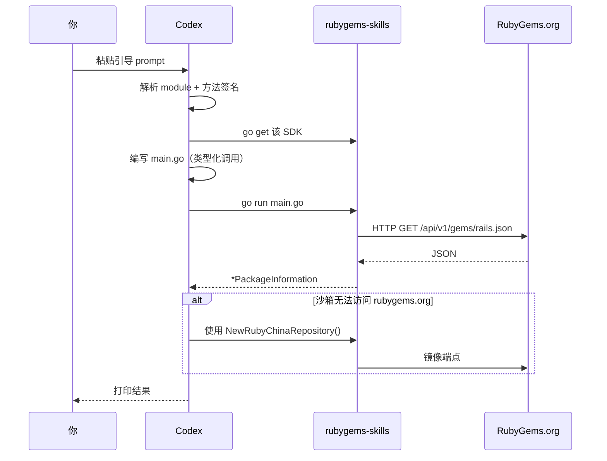

# Codex (OpenAI) 集成

[OpenAI Codex](https://openai.com/codex) 是一个云端/终端编程 agent。和 Claude Code 一样，它阅读文档，编写 Go，运行命令，并迭代。**与 rubygems-skills 的集成是相同的** —— SDK 的类型化表面就是集成；prompt 只是指引 agent 去使用它。

## 一次粘贴完成设置

在你的 Codex 会话中，粘贴与 Claude Code 相同的引导 prompt：

::: details 📋 复制粘贴 prompt — 完整引导
```
I want to use the rubygems-skills Go SDK (github.com/scagogogo/rubygems-skills)
to interact with the RubyGems.org API in this project.

Key facts about the SDK:
- Module: github.com/scagogogo/rubygems-skills
- Read API: pkg/repository — repository.NewRepository() returns a Repository.
  Typed signatures, e.g.:
    GetPackage(ctx context.Context, gemName string) (*models.PackageInformation, error)
    Search(ctx context.Context, query string, page int) ([]*models.PackageInformation, error)
    GetGemVersions(ctx context.Context, gemName string) ([]*models.Version, error)
    GetDependencies(ctx context.Context, gemNames ...string) ([]*models.DependencyInfo, error)
- Write API: repository.NewWriteRepository(repository.NewOptions().SetToken("API_KEY"))
- Data structs: pkg/models, 1:1 with the API JSON.
- Error helpers: repository.IsNotFound(err), IsRateLimited(err), IsUnauthorized(err).
- Auto-install Ruby if missing: install.NewInstaller().Install(ctx)  (pkg/install)
- China mirrors: repository.NewRubyChinaRepository() / NewTSingHuaRepository() / NewAliYunRepository().

Please:
1. go get github.com/scagogogo/rubygems-skills@latest
2. Write main.go: query "rails", print name/version/downloads, list latest 5
   versions, print runtime dependencies.
3. Use repository.NewRepository() (no auth for these reads).
4. Handle errors with IsNotFound/IsRateLimited/IsUnauthorized.
5. Run `go run main.go`, show output, fix errors and re-run.
```
:::

Codex 会安装依赖，编写代码，运行它，并迭代到可工作的结果。



## 与 Claude Code 的区别

功能上，没有 —— 两个 agent 都编写调用相同类型化函数的 Go 代码。唯一实际的区别是：

| 方面 | Claude Code | Codex |
|---|---|---|
| 环境 | 你的本地终端 | 云沙箱或本地 CLI |
| 文件访问 | 直接 | 通过其沙箱 |
| 网络 | 你机器的网络 | 沙箱的（如果地理位置受限，镜像有帮助） |

如果 Codex 的沙箱无法访问 `rubygems.org`，告诉它使用镜像：

```
Use repository.NewRubyChinaRepository() instead of NewRepository() — the default endpoint is unreachable from here.
```

## 认证与密钥

对于写操作，通过环境变量传递 token，而不是在 prompt 中硬编码：

```
My RubyGems API key is in the env var RUBYGEMS_API_KEY.
Use repository.NewOptions().SetToken(os.Getenv("RUBYGEMS_API_KEY")).
```

这可以保持密钥不出现在你的 prompt 历史中。

## 沙箱中自动安装

Codex 的沙箱可能是一个没有 Ruby 的新鲜 Linux 镜像。如果任务需要*运行* `gem`/`ruby`，让 Codex 配置它：

```
If `ruby -v` fails, use pkg/install to install Ruby for this OS:
  installer := install.NewInstaller()
  result, err := installer.Install(ctx)
The installer detects the distro and picks apt/yum/dnf/apk/etc. automatically.
```

## 技巧

- Codex 倾向于彻底 —— 给它一个具体的验收标准（"打印 rails 的下载计数"），这样它知道何时停止。
- 让它验证："编写后，运行 `go vet ./...` 和 `go build ./...`。"
- 对于多文件任务，命名文件："创建 `internal/gemstats/reporter.go`。"

## 下一步

- [复制粘贴 Prompt](./prompts) — 适用于 Claude Code 和 Codex 的任务特定 prompt。
- [Claude Code 指南](./claude-code) — Anthropic 端。

---

← 上一篇：[Claude Code](./claude-code) · 下一篇：[复制粘贴 Prompt](./prompts)
