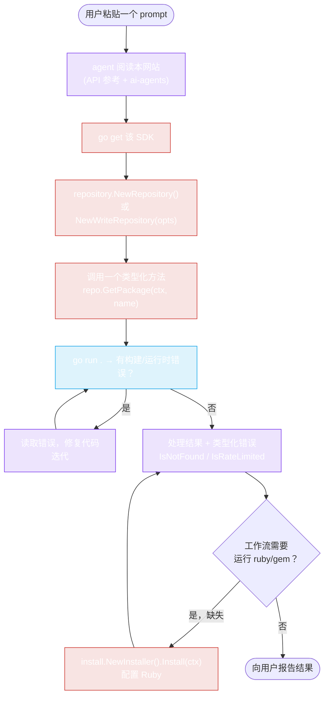

# AI Agent 集成 — 概览

rubygems-skills **优先为 AI 编程 agent 设计**。整个 API 表面暴露为显式、类型化的 Go 接口，具有稳定的签名 —— 所以 Claude Code、Codex、Cursor 等可以读取 SDK 的函数签名，第一次就生成正确的代码，无需试错或翻阅文档。

## 为什么 agent 喜欢这个 SDK

1. **显式签名。** 每个方法接收 `context.Context` 并返回 `(typedResult, error)`。没有反射，没有 `interface{}` 团块，没有字符串化的 JSON。一个 agent 读取 `GetPackage(ctx context.Context, gemName string) (*models.PackageInformation, error)` 就确切知道该写什么。

2. **类型即真理来源。** `pkg/models` 结构体是 API JSON 的 1:1 镜像。agent 不是将散文翻译成 Go —— 它读取 Go。

3. **一个 module 路径，四个包。** `pkg/repository`（读/写）、`pkg/models`（数据）、`pkg/install`（自动安装 Ruby）、`pkg/cache`（缓存）。agent 知道一切在哪里。

4. **类型化错误。** `IsNotFound` / `IsRateLimited` / `IsUnauthorized` 让 agent 编写健壮的错误处理，无需猜测状态码。

5. **Ruby 不存在时自动安装。** 如果 agent 的工作流需要*运行* `gem`/`ruby`（构建 `.gem`、解析 Gemfile），`pkg/install` 会提供它 —— 无需人工干预。

## Agent 如何发现和使用它

一个有能力的 agent（Claude Code、Codex）遵循这个流程：

```
1. 阅读本网站（特别是 API 参考 + 本节）。
2. go get github.com/scagogogo/rubygems-skills@latest
3. 构造一个 Repository: repository.NewRepository()
4. 调用一个类型化方法: repo.GetPackage(ctx, "rails")
5. 使用返回的 *models.PackageInformation 结构体。
6. 用 repository.IsNotFound / IsRateLimited / IsUnauthorized 处理错误。
7. （如果需要 Ruby 且缺失）install.NewInstaller().Install(ctx)。
```



## 两种集成

| Agent | 指南 | 优势 |
|---|---|---|
| **Claude Code** (Anthropic) | [Claude Code 指南](./claude-code) | 阅读本网站，编写 Go，运行 `go run`，根据错误迭代。 |
| **Codex** (OpenAI) | [Codex 指南](./codex) | 相同 —— 基于终端，运行命令，编辑文件。 |

两者对这个 SDK 的工作方式相同，因为集成**就是"编写调用我们函数的 Go 代码"** —— 不需要特定于 agent 的协议、MCP server 或插件。下几页的 prompt 只是*告诉 agent SDK 存在以及如何使用它*。

## Prompt

核心要点：**用户复制一个 prompt，粘贴到 Claude Code 或 Codex，然后等待。** agent 阅读本站，设置项目，编写代码，安装依赖，运行它，并报告结果。

→ [**复制粘贴 Prompt**](./prompts) — 即拿即用的 prompt 集合。

::: tip 为什么用 prompt 而不是 MCP server？
MCP server 会把这个 SDK 耦合到特定的 agent 运行时，并增加一个长期运行的进程。一个 *prompt* 是 agent 无关的、零依赖的、可移植的 —— 它在 Claude Code、Codex、Cursor、Copilot Chat 或任何能阅读文档和编写 Go 的 agent 中都能工作。SDK 的类型化表面*就是*集成；prompt 只是指引 agent 去使用它。
:::

## 一般应该告诉 agent 什么

如果你在编写自己的 prompt，覆盖这些要点：

1. Module 路径：`github.com/scagogogo/rubygems-skills`
2. 读入口点：`repository.NewRepository()` → `repo.GetPackage(ctx, name)`
3. 写入口点：`repository.NewWriteRepository(repository.NewOptions().SetToken(...))`
4. 错误辅助函数：`repository.IsNotFound`、`IsRateLimited`、`IsUnauthorized`
5. （可选）自动安装：如果 Ruby 缺失，使用 `install.NewInstaller().Install(ctx)`
6. 指引 agent 到本网站查看完整 API 参考

---

下一篇：[Claude Code](./claude-code)。
