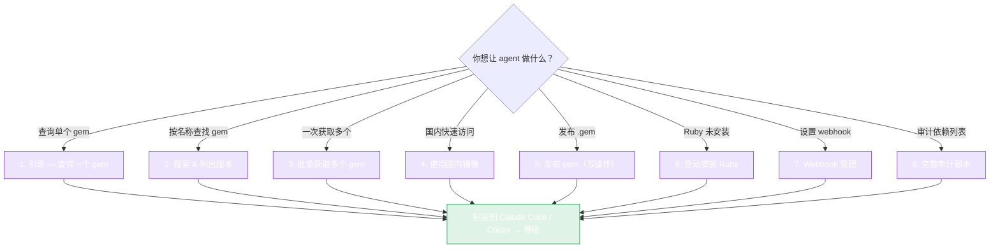

# 复制粘贴 Prompt

下面的每个 prompt 都是自包含的 —— 复制代码块，粘贴到 **Claude Code** 或 **Codex**，然后等待。agent 会根据需要阅读本网站，编写代码，安装依赖，运行它，并报告结果。

::: tip 如何使用
点击卡片上的展开箭头展开 prompt。选择代码围栏内的文本。粘贴到你的 agent。按说明替换占位符如 `YOUR_GEM_NAME` 或 `$RUBYGEMS_API_KEY`。
:::

不确定需要哪个 prompt？根据你想做的事情选择：



---

## 1. 引导 — 查询一个 gem

入门任务。安装 SDK 并进行第一次成功的 API 调用。

::: details 📋 Prompt
```
Use the rubygems-skills Go SDK (github.com/scagogogo/rubygems-skills) to query
the RubyGems.org API.

1. go get github.com/scagogogo/rubygems-skills@latest
2. Write main.go that:
   - Calls repo := repository.NewRepository()
   - Gets the gem "rails" via repo.GetPackage(ctx, "rails")
   - Prints Name, Version, Downloads, and SourceCodeURI
3. Handle errors with repository.IsNotFound / IsRateLimited / IsUnauthorized.
4. Run `go run main.go` and show me the output. Fix errors and re-run.
```
:::

---

## 2. 搜索 & 列出版本

::: details 📋 Prompt
```
Using rubygems-skills (github.com/scagogogo/rubygems-skills), write a Go program
that:
1. Searches RubyGems for the query "http client" (page 1) via repo.Search and
   prints each result's Name and Info.
2. Lists the versions of "rails" via repo.GetGemVersions and prints the 5 most
   recent version Numbers.
3. Prints the runtime dependencies of "rails" — from pkg.Dependencies.Runtime
   on the PackageInformation returned by repo.GetPackage.
Use repository.NewRepository(). Run it with `go run .` and show output.
```
:::

---

## 3. 批量获取多个 gem

::: details 📋 Prompt
```
Using rubygems-skills (github.com/scagogogo/rubygems-skills), fetch metadata for
these gems in parallel: rails, puma, sidekiq, redis, rake, bundler, rack,
faraday, httparty, nokogiri.

Use repo.BulkGetPackages(ctx, names, repository.NewBulkOptions().WithMaxConcurrency(5)).
Print each gem's Name, Version, Downloads. If a result's Error is non-nil, print
the error instead. Use repository.NewRepository(). Run and show output.
```
:::

---

## 4. 使用国内镜像（GFW 内快速访问）

::: details 📋 Prompt
```
Use rubygems-skills (github.com/scagogogo/rubygems-skills) with the Ruby China
mirror for fast access:
  repo := repository.NewRubyChinaRepository()
Query the "rails" gem and print Name, Version, Downloads. Also wrap it in a
cache with a 10-minute TTL:
  cached := repository.NewCachedRepository(repo, 10*time.Minute, nil)
Call GetPackage twice and confirm the second call is served from cache (you can
time both with time.Since). Run and show output.
```
:::

---

## 5. 发布 gem（写操作）

::: details 📋 Prompt
```
Use rubygems-skills (github.com/scagogogo/rubygems-skills) to publish a .gem file
to RubyGems.org. My API key is in the env var RUBYGEMS_API_KEY.

1. go get github.com/scagogogo/rubygems-skills@latest
2. Build a write client:
     opts := repository.NewOptions().SetToken(os.Getenv("RUBYGEMS_API_KEY"))
     w := repository.NewWriteRepository(opts)
3. Read the file ./mygem-0.1.0.gem into bytes and call w.PushGem(ctx, bytes).
4. Print the response string. If repository.IsUnauthorized(err), tell me the
   token is invalid; if IsRateLimited, tell me to wait.
5. Verify by querying the published version with a read Repository.
```
:::

---

## 6. Ruby 缺失时自动安装

::: details 📋 Prompt
```
Check whether Ruby is installed (ruby -v). If not, use rubygems-skills' pkg/install
to auto-install it for this OS:
  installer := install.NewInstaller()
  result, err := installer.Install(ctx)
Print the InstallResult. Then verify with `ruby -v` and `gem -v`.
If detection picks the wrong package manager, override with
install.NewInstallOptions().WithCustomPackageManager(install.PMApt).
```
:::

---

## 7. Webhook 管理

::: details 📋 Prompt
```
Using rubygems-skills (github.com/scagogogo/rubygems-skills), manage webhooks for
my "mygem" gem. My RubyGems credentials: username in $RUBYGEMS_USER, password in
$RUBYGEMS_PASS.

1. repo := repository.NewWriteRepository(repository.NewOptions().SetToken(os.Getenv("RUBYGEMS_API_KEY")))
   (or use Basic Auth via the username/password where the SDK requires it)
2. List existing webhooks: w.ListWebhooks(ctx)
3. Create one: w.CreateWebhook(ctx, "mygem", "https://example.com/hook")
4. Fire it: w.FireWebhook(ctx, "mygem", "https://example.com/hook")
5. Delete it: w.DeleteWebhook(ctx, "mygem", "https://example.com/hook")
Print the result of each step. Handle IsUnauthorized explicitly.
```
:::

---

## 8. 完整审计脚本 — 你的依赖

::: details 📋 Prompt
```
Using rubygems-skills (github.com/scagogogo/rubygems-skills), write an audit tool.
Given a list of gem names in a text file (one per line), for each gem:
1. Fetch the package via repo.GetPackage.
2. Fetch its versions via repo.GetGemVersions.
3. Report: latest version number, total downloads, whether it's yanked, its
   licenses, and its source_code_uri.
Use BulkGetPackages with MaxConcurrency(4) for the package fetches. Write
results to a CSV file ./audit_report.csv. Use repository.NewRepository() with
a 15-minute CachedRepository wrapper. Run it on the file ./gems.txt and show
the first few CSV rows.
```
:::

---

## 编写自己的 prompt

如果以上都不适合，用这些构建块自己组装：

1. **说明 module：** `github.com/scagogogo/rubygems-skills`
2. **说明入口点：** `repository.NewRepository()`（读）或 `repository.NewWriteRepository(repository.NewOptions().SetToken(...))`（写）
3. **命名方法：** 从 [API 参考](../api/repository) —— 给出确切签名，让 agent 不用猜。
4. **命名模型字段：** 从 [`pkg/models`](../api/models) —— 如 `pkg.Dependencies.Runtime`、`pkg.SourceCodeURI`。
5. **指定错误处理：** `repository.IsNotFound / IsRateLimited / IsUnauthorized`。
6. **要求运行：** `运行 \`go run main.go\` 并展示输出。修复错误并重新运行。`
7. **指向文档：** `SDK 的网站有完整的 API 参考，如果需要更多方法可以查看。`

签名提示越清晰，往返越少 —— 但即使是一个模糊的 prompt 也能工作，因为 agent 总是可以阅读本网站来填补空白。

---

← 上一篇：[Codex](./codex) · 返回：[AI Agent 集成](./overview)
