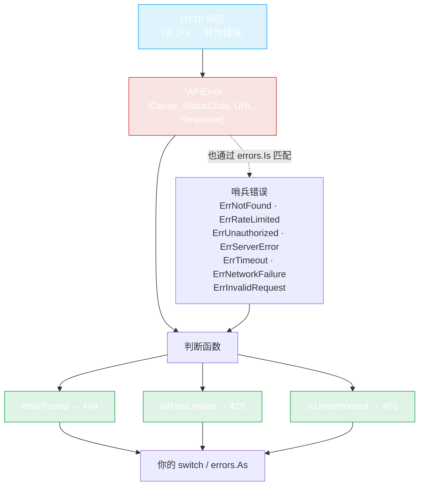

# Errors

`pkg/repository/errors.go`。错误是类型化的 —— 你通过判断函数分支处理失败原因，需要时可以查看完整的 HTTP 响应。



失败的 HTTP 响应被包装在 `*APIError` 中，携带状态码、URL 和响应体。然后你可以调用判断函数（`IsNotFound` 等）或对哨兵使用 `errors.Is`。两条路径得到相同结果。

## 判断函数

```go
func IsNotFound(err error) bool       // HTTP 404
func IsRateLimited(err error) bool    // HTTP 429
func IsUnauthorized(err error) bool   // HTTP 401
```

这些函数解包错误并检查底层 `*APIError` 的状态码。它们是推荐的错误处理方式 —— 无需字符串匹配，代码中无状态码字面量。

```go
pkg, err := repo.GetPackage(ctx, "some-gem")
switch {
case repository.IsNotFound(err):
    fmt.Println("gem not found")
case repository.IsRateLimited(err):
    fmt.Println("slow down")
case repository.IsUnauthorized(err):
    fmt.Println("need a token")
case err != nil:
    log.Fatal(err)
}
```

## APIError 类型

当请求在 HTTP 层失败时，SDK 将失败包装在 `*APIError` 中：

```go
type APIError struct {
    Cause      error  // 底层错误（如有）
    StatusCode int    // HTTP 状态码（404, 429, 500, ...）
    URL        string // 失败的请求 URL
    Response   string // 原始响应体（字符串形式）
}

func (e *APIError) Error() string
func NewAPIError(resp *http.Response, body []byte, cause error) *APIError
```

`Error()` 返回 `API error (status: <code>, url: <url>): <cause>`。`URL` 是请求 URL（取自 `resp.Request.URL`）；`Response` 是响应体字节转为字符串。

## 哨兵错误

该包还导出一组用于分类的哨兵 `error` 值。它们支撑判断函数，也可与 `errors.Is` 配合使用：

```go
var (
    ErrInvalidRequest  = errors.New("invalid request parameters")
    ErrNotFound        = errors.New("resource not found")
    ErrServerError     = errors.New("server error")
    ErrRateLimited     = errors.New("request rate limited")
    ErrUnauthorized    = errors.New("unauthorized")
    ErrTimeout         = errors.New("request timeout")
    ErrNetworkFailure  = errors.New("network failure")
)
```

判断函数首先检查 `*APIError` 状态码（因此即使没有包装哨兵，来自实时 API 的 HTTP 404 也会被检测到），然后回退到对哨兵的 `errors.Is` —— 所以 `errors.Is(err, repository.ErrNotFound)` 和 `repository.IsNotFound(err)` 在相应情况下都能工作。

## 检查详情

获取完整响应体（例如 API 自己的错误消息）：

```go
var apiErr *repository.APIError
if errors.As(err, &apiErr) {
    fmt.Println("status:", apiErr.StatusCode)
    fmt.Println("url:", apiErr.URL)
    fmt.Println("body:", apiErr.Response)
    if apiErr.Cause != nil {
        fmt.Println("cause:", apiErr.Cause)
    }
}
```

## 状态码参考

| Status | Predicate | 含义 | 默认重试？ |
|---|---|---|---|
| 404 | `IsNotFound` | gem/version/用户不存在 | **是**（默认重试任何错误 —— 提供判断函数来排除） |
| 401 | `IsUnauthorized` | 缺失/无效 token | **是**（同样注意） |
| 403 | — | 禁止访问（token 缺少 scope） | **是** |
| 429 | `IsRateLimited` | 触发速率限制 | **是** |
| 5xx | — | 服务器错误 | **是** |
| network | — | DNS/TLS/连接 | **是** |

参见[重试与 Backoff](../guide/retry) 了解重试层如何与这些交互。默认 `ShouldRetry` 是 `err != nil`，所以**每个**错误都会重试直到 `MaxAttempts`；为避免在 404/401 上浪费尝试，提供一个对 `IsNotFound` / `IsUnauthorized` 返回 `false` 的判断函数。

## 网络错误

非 HTTP 失败（DNS、TLS、连接被拒绝）作为包装了原因的普通 `error` 出现。三个判断函数都不匹配它 —— 将其视为瞬态错误，通常可重试：

```go
if err != nil && !repository.IsNotFound(err) && !repository.IsUnauthorized(err) {
    // 瞬态错误：重试后的速率限制、重试后的 5xx、或网络问题
    log.Printf("transient failure: %v", err)
}
```

## 辅助函数：NewAPIError

通常你不会直接调用 `NewAPIError` —— SDK 在 `getJson`/`getBytes` 内部构造 `*APIError`。导出它是为了高级场景（例如将自己获取的原始 HTTP 响应包装成相同的类型化错误）。

---

← 上一篇：[Options](./options) · 返回：[API Reference](./repository)
