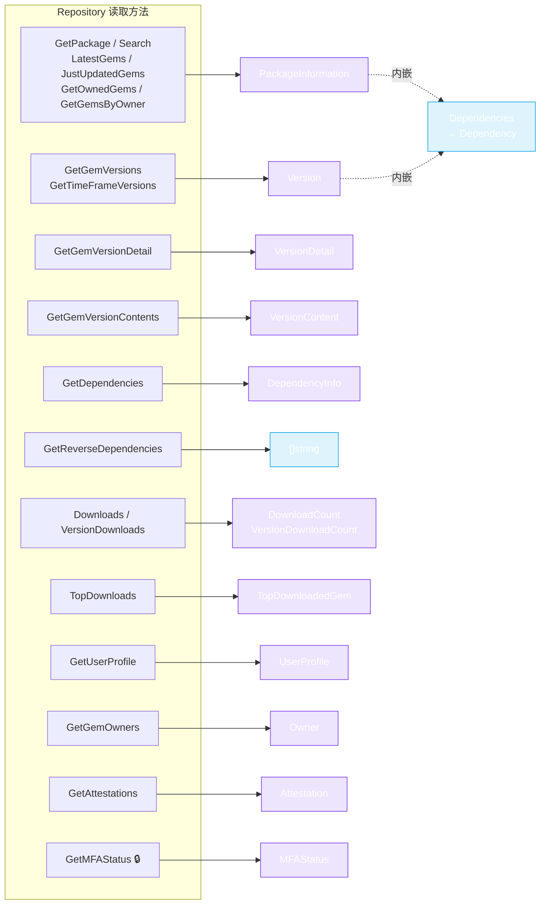

# Models

`pkg/models` 包包含与 RubyGems.org API JSON 一一对应的 Go struct。每个 `Repository`/`WriteRepository` 方法都返回其中之一 —— 你无需自己解析 JSON。



🔒 = 需要 token。`PackageInformation` 和 `Version` 都内嵌了 `Dependencies` struct（runtime 和 development 的 `Dependency` 列表）—— 参见下方 struct 定义。

## PackageInformation

由 `GetPackage`、`Search`、`LatestGems`、`JustUpdatedGems`、`GetOwnedGems`、`GetGemsByOwner` 返回。（`pkg/models/package_information.go`）

```go
type PackageInformation struct {
    Name             string
    Downloads        int
    Version          string
    VersionCreatedAt time.Time
    VersionDownloads int
    Platform         string
    Authors          string
    Info             string
    Licenses         []string
    Metadata         Metadata
    Yanked           bool
    Sha              string
    ProjectURI       string
    GemURI           string
    HomepageURI      string
    WikiURI          string
    DocumentationURI string
    MailingListURI   string
    SourceCodeURI    string
    BugTrackerURI    string
    ChangelogURI     string
    FundingURI       interface{}
    Dependencies     Dependencies  // 见下文
}

type Dependencies struct {
    Development []*Dependency
    Runtime     []*Dependency
}

type Dependency struct {
    Name         string  // 例如 "railties"
    Requirements string  // 例如 "= 7.0.5"
}
```

`Dependencies` 子 struct 提供 gem 自身声明的开发/运行时依赖。注意这与 `DependencyInfo`（`/api/v1/dependencies` 端点结果）**不同**—— 见下文。

## Version

由 `GetGemVersions`、`GetTimeFrameVersions` 返回。（`pkg/models/version.go`）

```go
type Version struct {
    Authors         string
    BuiltAt         time.Time
    CreatedAt       time.Time
    Description     string
    DownloadsCount  int
    Metadata        *Metadata
    Number          string   // 版本字符串，例如 "7.0.5"
    Summary         string
    Platform        string
    RubygemsVersion string
    RubyVersion     string
    Prerelease      bool
    Licenses        []string
    Requirements    []string  // 例如 [">= 2.5.0", "< 3.0"]
    Sha             string
}

type LatestVersion struct {
    Version string
}
```

`Number` 是你会传给 `GetGemVersionDetail` 或 `VersionDownloads` 的版本字符串。

## VersionDetail 与 VersionContent（v2）

`GetGemVersionDetail` 和 `GetGemVersionContents`。（`pkg/models/version_detail.go`）

```go
type VersionDetail struct {
    // 比 v1 Version 更丰富：包含 spec_sha、yanked 状态
    // 和完整依赖信息。详见源码。
}

type VersionContent struct {
    // gem 版本的文件校验和/清单
}

type Attestation struct {
    // sigstore 认证数据
}
```

精确字段参见源文件 —— 它们与 v2 API JSON 完全对应。

## DependencyInfo

由 `GetDependencies` 返回。（`pkg/models/dependency.go`）

```go
type DependencyInfo struct {
    Name          string  // 依赖项（例如 "rails"）
    DependentName string  // 依赖它的 gem（例如 "railties"）
    Requirements  string  // 例如 ">= 1.0.0"
    DependentType string  // "runtime" 或 "development"
}
```

这是**反向**视图 —— "哪些 gem 依赖 X"。与 `PackageInformation.Dependencies`（"X 依赖什么"）不同。

## 下载计数

`Downloads` 和 `VersionDownloads`。（`pkg/models/download_count.go`）

```go
type RepositoryDownloadCount struct {
    // 仓库总下载量
}

type VersionDownloadCount struct {
    // 特定 gem 版本的下载量
}
```

## TopDownloadedGem

由 `TopDownloads` 返回。（`pkg/models/webhook.go` —— 放在同一文件）

```go
type TopDownloadedGem struct {
    // 前 50 gem 的名称 + 下载量
}
```

## User 与 Owner

`GetUserProfile`/`GetMyProfile` 和 `GetGemOwners`。（`pkg/models/user.go`）

```go
type UserProfile struct {
    // 公开字段（或 GetMyProfile 返回的完整字段）
}

type Owner struct {
    // gem 所有者：handle、email 等
}

type OwnerRole struct {
    // 角色分配结构
}
```

## Webhook

`ListWebhooks`。（`pkg/models/webhook.go`）

```go
type Webhook struct {
    // URL、gem 过滤器、失败次数等
}
```

## APIKey 与 MFAStatus

`CreateAPIKey`/`UpdateAPIKey`/`GetAPIKey` 和 `GetMFAStatus`。（`pkg/models/api_key.go`）

```go
type APIKey struct {
    // key id、name、scopes、created_at 等
}
type CreateAPIKeyRequest struct {
    Name   string
    Scopes []string
    // ...
}
type UpdateAPIKeyRequest struct {
    // 要更新的字段
}
type MFAStatus struct {
    // 已认证用户的 MFA 配置
}
```

## Metadata

内嵌于 `PackageInformation` 和 `Version`。（`pkg/models/meta.go`）

```go
type Metadata struct {
    // gem 作者声明的任意键值元数据
}
```

---

精确字段名和 JSON tag 请参见 [`pkg/models/`](https://github.com/scagogogo/rubygems-skills/tree/main/pkg/models) 下的源文件 —— 它们很短，并附有示例 JSON 注释。

下一篇：[Options](./options)。
