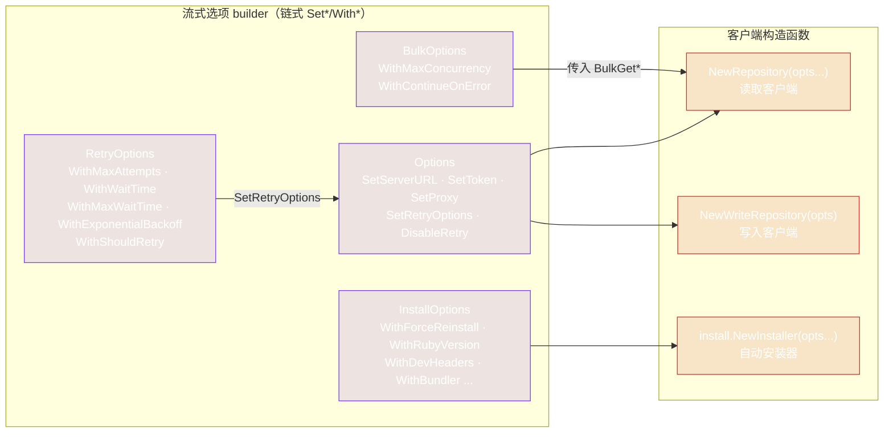

# Options 与 Builders

rubygems-skills 使用**流式 builder** 模式：用 `New*()` 构建选项 struct，链式调用 `Set*`/`With*` 方法，然后传给构造函数。Builder 返回相同的指针以便链式调用，零值默认值也是合理的 —— 你只需设置想改的。

## Options（Repository / WriteRepository）

`pkg/repository/options.go`。控制服务器 URL、认证 token、代理和重试。

```go
func NewOptions() *Options
```

| Method | Effect |
|---|---|
| `SetServerURL(url)` | 指向 mirror 或自定义服务器。默认 `https://rubygems.org`。 |
| `SetToken(token)` | 用于认证读取和所有写入的 API token。 |
| `SetProxy(proxy)` | HTTP/HTTPS 代理 URL。 |
| `SetRetryOptions(r)` | 替换重试配置。默认：3 次尝试、指数 backoff（1s → 30s 上限）、重试任何错误。 |
| `DisableRetry()` | 将 `RetryOptions` 设为 nil —— 不重试。 |

```go
opts := repository.NewOptions().
    SetServerURL("https://gems.ruby-china.com").
    SetToken(os.Getenv("RUBYGEMS_API_KEY")).
    SetProxy("http://127.0.0.1:7890")

repo := repository.NewRepository(opts)
writ := repository.NewWriteRepository(opts)
```

`NewRepository` 是可变参数（传入零个或一个 `*Options`）；`NewWriteRepository` 接受单个 `*Options`，因为写操作始终需要认证。

## RetryOptions

`pkg/repository/retry.go`。通过 `NewDefaultRetryOptions()` 调整。

```go
func NewDefaultRetryOptions() *RetryOptions
```

| Method | Default | Effect |
|---|---|---|
| `WithMaxAttempts(n)` | 3 | 包括首次在内的总尝试次数。 |
| `WithWaitTime(d)` | 1s | 首次重试前的基准等待时间。 |
| `WithMaxWaitTime(d)` | 30s | 单次等待时间上限。 |
| `WithExponentialBackoff(bool)` | true | 指数增长等待时间（`wait * 2^(attempt-1)`）。 |
| `WithShouldRetry(fn)` | `err != nil`（重试任何错误） | 自定义重试判断函数。 |

```go
retry := repository.NewDefaultRetryOptions().
    WithMaxAttempts(6).
    WithWaitTime(200*time.Millisecond).
    WithMaxWaitTime(5*time.Second)
```

参见[重试与 Backoff](../guide/retry)。

## BulkOptions

`pkg/repository/bulk_operations.go`。通过 `NewBulkOptions()` 调整。

```go
func NewBulkOptions() *BulkOptions
```

| Method | Default | Effect |
|---|---|---|
| `WithMaxConcurrency(n)` | 10 | 并发工作数。 |
| `WithContinueOnError(bool)` | true | 为 false 时，遇到首个错误即停止。 |

```go
opts := repository.NewBulkOptions().
    WithMaxConcurrency(8).
    WithContinueOnError(true)
```

参见[批量操作](../guide/bulk-operations)。

## InstallOptions

`pkg/install/installer.go`。通过 `NewInstallOptions()` 调整。

```go
func NewInstallOptions() *InstallOptions
```

| Method | Effect |
|---|---|
| `WithForceReinstall(bool)` | 即使 Ruby 已存在也重新安装。 |
| `WithRubyVersion(v)` | 指定目标 Ruby 版本（支持时）。 |
| `WithDevHeaders(bool)` | 同时安装开发头文件（用于编译原生扩展）。 |
| `WithBundler(bool)` | 同时安装 Bundler。 |
| `WithCustomPackageManager(pm)` | 覆盖检测到的包管理器 —— 传入 `install.PMApt`、`PMYum`、`PMDnf`、`PMApk`、`PMPacman`、`PMBrew`、`PMChoco`、`PMScoop` 或 `PMZypper`。 |
| `WithUpdatePackageIndex(bool)` | 先运行 `apt update` 或等效命令。 |
| `WithTimeout(seconds)` | 每条命令的超时时间。默认 600s。 |
| `WithSudo(bool)` | 对需要权限的命令使用 `sudo`。 |
| `WithExtraPackages(pkgs...)` | 与 Ruby 一起安装额外的包。 |

```go
opts := install.NewInstallOptions().
    WithDevHeaders(true).
    WithBundler(true).
    WithTimeout(900)

installer := install.NewInstaller(opts)
result, err := installer.Install(ctx)
```

参见[自动安装使用](../auto-install/usage)。

## 四个 builder 一览



`Options` 是核心配置（服务器、token、代理、重试）—— 它传递给 repository 构造函数。`RetryOptions` 通过 `SetRetryOptions` 插入 `Options`。`BulkOptions` 和 `InstallOptions` 直接传给使用它们的 method/installer，而非传给 `Options`。

## 设计说明：为什么用 `Set*` 与 `With*`

这两个前缀是有意的设计约定：

- **`Set*`** 在 `Options` 上 —— 每个客户端只有一个 `Options`；这些设置唯一的值。
- **`With*`** 在 `RetryOptions`、`BulkOptions`、`InstallOptions` 上 —— 这些是较小的可组合配置；"with" 在链式调用中读起来更自然（`WithMaxAttempts(6).WithWaitTime(...)`）。

两者都返回 receiver 以便链式调用。无论哪种，模式相同：构建、链式调用、传入。

---

下一篇：[Errors](./errors)。
