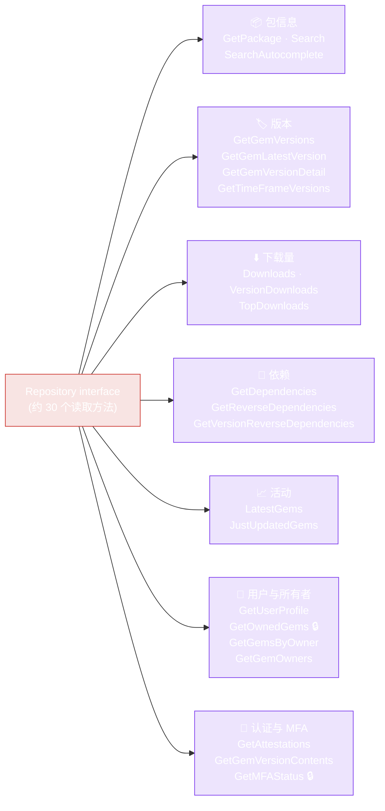

# Repository（读 API）

`Repository` 接口（`pkg/repository/repository.go`）是 RubyGems.org API 的读取表面。所有方法都以 `context.Context` 作为第一个参数，并返回类型化结果 —— 没有 `interface{}`，无需手动解析 JSON。

::: tip 大多数读取操作无需认证
`repository.NewRepository()`（无选项）足以完成除 `GetOwnedGems` 和 `GetMFAStatus` 外的所有操作，这两个方法需要 token。参见[配置](../guide/configuration)。
:::

`Repository` 接口将其约 30 个方法分为七个类别 —— 每个方法都与 RubyGems.org endpoint 一一对应：



🔒 = 需要 token。同一个 `RepositoryImpl` 也作为 `WriteRepositoryImpl` 内嵌的读取端。

## 构造函数

```go
func NewRepository(options ...*Options) *RepositoryImpl
```

可变选项 —— 不传参则使用无认证默认值，或传入用 `NewOptions()` 构建的选项：

```go
repo := repository.NewRepository()                                   // 默认，无认证
repo := repository.NewRepository(repository.NewOptions().SetToken(t)) // 已认证
```

返回的 `*RepositoryImpl` 实现了 `Repository` 接口。同一个实例也作为 `WriteRepositoryImpl` 内嵌的读取端。

## 包信息查询

| Method | Signature | Endpoint |
|---|---|---|
| `GetPackage` | `(ctx, gemName string) (*models.PackageInformation, error)` | `GET /api/v1/gems/{gem}.json` |
| `Search` | `(ctx, query string, page int) ([]*models.PackageInformation, error)` | `GET /api/v1/search.json?query=&page=` |
| `SearchAutocomplete` | `(ctx, query string) ([]string, error)` | `GET /api/v1/search/autocomplete.json?query=` |

- `GetPackage` 在 gem 不存在时返回 `NotFound` 错误（用 `IsNotFound` 测试）。
- `Search` 在没有匹配结果时返回**空切片**（而非错误）。
- `page` 从 1 开始计数。

## 版本查询

| Method | Signature | Endpoint |
|---|---|---|
| `GetGemVersions` | `(ctx, gemName string) ([]*models.Version, error)` | `GET /api/v1/versions/{gem}.json` |
| `GetGemLatestVersion` | `(ctx, gemName string) (*models.LatestVersion, error)` | `GET /api/v1/versions/{gem}/latest.json` |
| `GetGemVersionDetail` | `(ctx, gemName, version string) (*models.VersionDetail, error)` | `GET /api/v2/rubygems/{gem}/versions/{version}.json` |
| `GetTimeFrameVersions` | `(ctx, from, to time.Time) ([]*models.Version, error)` | `GET /api/v1/timeframe_versions.json` |

`GetGemVersions` 按发布时间排序，最新在前。`GetGemVersionDetail`（v2）返回比 v1 更丰富的数据 —— 包含 `spec_sha`、yanked 状态和完整依赖信息。

## 下载统计

| Method | Signature | Endpoint |
|---|---|---|
| `Downloads` | `(ctx) (*models.RepositoryDownloadCount, error)` | `GET /api/v1/downloads.json` |
| `VersionDownloads` | `(ctx, gemName, gemVersion string) (*models.VersionDownloadCount, error)` | `GET /api/v1/downloads/{gem}-{version}.json` |
| `TopDownloads` | `(ctx) ([]*models.TopDownloadedGem, error)` | `GET /api/v1/downloads/all.json` |

`TopDownloads` 返回下载量前 50 的 gem。

## 依赖

| Method | Signature | Endpoint |
|---|---|---|
| `GetDependencies` | `(ctx, gemsNames ...string) ([]*models.DependencyInfo, error)` | `GET /api/v1/dependencies?gems=` |
| `GetReverseDependencies` | `(ctx, gemName string) ([]string, error)` | `GET /api/v1/gems/{gem}/reverse_dependencies.json` |
| `GetVersionReverseDependencies` | `(ctx, fullName string) ([]string, error)` | `GET /api/v1/versions/{fullName}/reverse_dependencies.json` |

`GetDependencies` 是可变参数 —— 一次调用可传入多个 gem 名称。`GetVersionReverseDependencies` 接受 `fullName`，如 `"rails-7.0.5"`。

## 活动

| Method | Signature | Endpoint |
|---|---|---|
| `LatestGems` | `(ctx) ([]*models.PackageInformation, error)` | `GET /api/v1/activity/latest.json` |
| `JustUpdatedGems` | `(ctx) ([]*models.PackageInformation, error)` | `GET /api/v1/activity/just_updated.json` |

`JustUpdatedGems` 返回最近更新的 50 个 gem。

## 用户与所有者

| Method | Signature | Endpoint | Auth |
|---|---|---|---|
| `GetUserProfile` | `(ctx, handleOrID string) (*models.UserProfile, error)` | `GET /api/v1/profiles/{handle_or_id}.json` | 无 |
| `GetOwnedGems` | `(ctx) ([]*models.PackageInformation, error)` | `GET /api/v1/gems.json` | **token** |
| `GetGemsByOwner` | `(ctx, handleOrID string) ([]*models.PackageInformation, error)` | `GET /api/v1/owners/{handle_or_id}/gems.json` | 无 |
| `GetGemOwners` | `(ctx, gemName string) ([]*models.Owner, error)` | `GET /api/v1/gems/{gem}/owners.json` | 无 |

`GetOwnedGems` 返回**已认证**用户拥有的 gem —— 通过 `Options.SetToken` 设置 token。

## 认证与验证

| Method | Signature | Endpoint |
|---|---|---|
| `GetAttestations` | `(ctx, gemName, version string) ([]*models.Attestation, error)` | `GET /api/v1/attestations/{gem}-{version}.json` |
| `GetGemVersionContents` | `(ctx, gemName, version string) (*models.VersionContent, error)` | `GET /api/v2/rubygems/{gem}/versions/{version}/contents.json` |

`GetAttestations` 返回 gem 版本的 sigstore 认证信息。`GetGemVersionContents` 返回文件校验和/清单（v2）。

## MFA 状态

| Method | Signature | Endpoint | Auth |
|---|---|---|---|
| `GetMFAStatus` | `(ctx) (*models.MFAStatus, error)` | `GET /api/v1/multifactor_auth` | **token** |

返回已认证用户的 MFA 配置。

## 批量操作

这些方法通过工作池并发执行。参见[批量操作](../guide/bulk-operations)。

| Method | 每个 gem 的结果 |
|---|---|
| `BulkGetPackages(ctx, names, opts)` | `*models.PackageInformation` |
| `BulkGetVersions(ctx, names, opts)` | `[]*models.Version` |
| `BulkGetDependencies(ctx, names, opts)` | `[]*models.DependencyInfo` |
| `BulkGetReverseDependencies(ctx, names, opts)` | `[]string` |

所有方法返回与输入切片对齐的 `[]*BulkResult[T]`。

## 示例

```go
ctx := context.Background()
repo := repository.NewRepository()

pkg, err := repo.GetPackage(ctx, "rails")
if repository.IsNotFound(err) {
    log.Fatal("no such gem")
} else if err != nil {
    log.Fatal(err)
}
fmt.Println(pkg.Name, pkg.Version, pkg.Downloads)

versions, _ := repo.GetGemVersions(ctx, "rails")
fmt.Println("latest:", versions[0].Number)

deps, _ := repo.GetDependencies(ctx, "rails", "puma")
for _, d := range deps {
    fmt.Printf("%s <- %s (%s)\n", d.Name, d.DependentName, d.Requirements)
}
```

---

下一篇：[WriteRepository（写操作）](./write-repository)。
