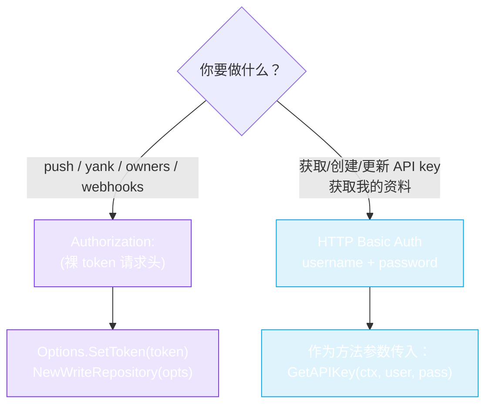

# WriteRepository（写 API）

`WriteRepository` 接口（`pkg/repository/write_repository.go`）覆盖需要认证的变更端点 —— 发布 gem、管理所有者、webhook 和 API key。它**内嵌**了 `Repository`，因此 `WriteRepositoryImpl` 可以执行所有读取和写入操作。

::: warning 需要认证
写操作使用**两种不同的认证机制** —— 根据你的操作选择：

- **gem / 所有者 / webhook 操作**（`PushGem`、`YankGem`、`Add/RemoveGemOwner`、`*Webhook`）→ `Authorization: <token>` 请求头（你的 API key 作为裸请求头值，*不是* `Bearer`，也*不是* Basic 编码）。通过 `Options.SetToken` 设置。
- **API key 与个人资料操作**（`GetAPIKey`、`CreateAPIKey`、`UpdateAPIKey`、`GetMyProfile`）→ HTTP **Basic Auth**，使用你的 rubygems.org `username` + `password`（作为方法参数传入，因为这些端点用于管理 token 本身 —— 你无法用 token 获取 token）。

在 [rubygems.org → Edit settings → API key](https://rubygems.org/profile/edit) 获取 API key。切勿硬编码 —— 从环境变量读取。


:::

## 构造函数

```go
func NewWriteRepository(options *Options) *WriteRepositoryImpl
```

与 `NewRepository`（可变参数）不同，这里接受**单个** `*Options` —— 写操作始终需要认证，因此必须构建带有 token 的选项：

```go
opts := repository.NewOptions().SetToken(os.Getenv("RUBYGEMS_API_KEY"))
w := repository.NewWriteRepository(opts)
```

`w` 同时实现了 `WriteRepository`（以下写入方法）和 `Repository`（[读 API](./repository) 的所有读取方法），因为 `WriteRepositoryImpl` 内嵌了 `*RepositoryImpl`。

## gem 发布与管理

| Method | Signature | Endpoint |
|---|---|---|
| `PushGem` | `(ctx, gemFile []byte) (string, error)` | `POST /api/v1/gems` |
| `YankGem` | `(ctx, gemName, version string) (string, error)` | `DELETE /api/v1/gems/yank` |
| `YankGemWithPlatform` | `(ctx, gemName, version, platform string) (string, error)` | `DELETE /api/v1/gems/yank` |

`PushGem` 接受 `.gem` 文件的**原始字节**并以 `multipart/form-data` 上传。返回 API 的响应字符串（例如包含发布 URL 的成功消息）。`YankGem` 从索引中移除某个版本（文件仍可下载，但不会出现在新安装中）。

```go
gemBytes, _ := os.ReadFile("./mygem-0.1.0.gem")
resp, err := w.PushGem(ctx, gemBytes)
if repository.IsUnauthorized(err) {
    log.Fatal("bad token")
}
fmt.Println(resp)
```

## 所有者管理

| Method | Signature | Endpoint |
|---|---|---|
| `AddGemOwner` | `(ctx, gemName, email, role string) error` | `POST /api/v1/gems/{gem}/owners` |
| `RemoveGemOwner` | `(ctx, gemName, email string) error` | `DELETE /api/v1/gems/{gem}/owners` |
| `UpdateGemOwnerRole` | `(ctx, gemName, email, role string) error` | `PATCH /api/v1/gems/{gem}/owners` |

`role` 为 `"owner"` 或 `"maintainer"`。

## Webhook 管理

| Method | Signature | Endpoint |
|---|---|---|
| `ListWebhooks` | `(ctx) (map[string][]*models.Webhook, error)` | `GET /api/v1/web_hooks.json` |
| `CreateWebhook` | `(ctx, gemName, webhookURL string) error` | `POST /api/v1/web_hooks` |
| `DeleteWebhook` | `(ctx, gemName, webhookURL string) error` | `DELETE /api/v1/web_hooks/remove` |
| `FireWebhook` | `(ctx, gemName, webhookURL string) error` | `POST /api/v1/web_hooks/fire` |

`ListWebhooks` 返回以 gem 名称为键的 map → webhook 列表。`gemName == "*"` 时 `CreateWebhook` 注册**全局** webhook（对所有 gem 触发）。`FireWebhook` 触发测试调用。

```go
hooks, _ := w.ListWebhooks(ctx)
for gem, list := range hooks {
    for _, h := range list {
        fmt.Printf("%s -> %s\n", gem, h.URL)
    }
}

_ = w.CreateWebhook(ctx, "mygem", "https://example.com/hook")
_ = w.FireWebhook(ctx, "mygem", "https://example.com/hook")
_ = w.DeleteWebhook(ctx, "mygem", "https://example.com/hook")
```

## API Key 管理

这些方法使用 **HTTP Basic Auth**（用户名 + 密码），而非 token —— 它们用于引导/轮换密钥本身。

| Method | Signature | Endpoint |
|---|---|---|
| `GetAPIKey` | `(ctx, username, password string) (*models.APIKey, error)` | `GET /api/v1/api_key` |
| `CreateAPIKey` | `(ctx, username, password string, req *models.CreateAPIKeyRequest) (*models.APIKey, error)` | `POST /api/v1/api_key` |
| `UpdateAPIKey` | `(ctx, username, password string, req *models.UpdateAPIKeyRequest) (*models.APIKey, error)` | `PATCH /api/v1/api_key` |

```go
key, err := w.CreateAPIKey(ctx, "myuser", "mypass", &models.CreateAPIKeyRequest{
    Name:   "ci-deploy",
    Scopes: []string{"push_rubygem"},
})
```

## 用户资料（已认证）

| Method | Signature | Endpoint |
|---|---|---|
| `GetMyProfile` | `(ctx, username, password string) (*models.UserProfile, error)` | `GET /api/v1/profiles/me.json` |

返回已认证用户的**完整**资料（包含公共 `GetUserProfile` 中没有的私有字段）。

## 错误处理

所有写方法可能失败，返回与读取相同的类型化错误 —— `IsUnauthorized`、`IsRateLimited`、`IsNotFound`。参见[错误处理](../guide/error-handling)。

---

下一篇：[Models](./models)。
