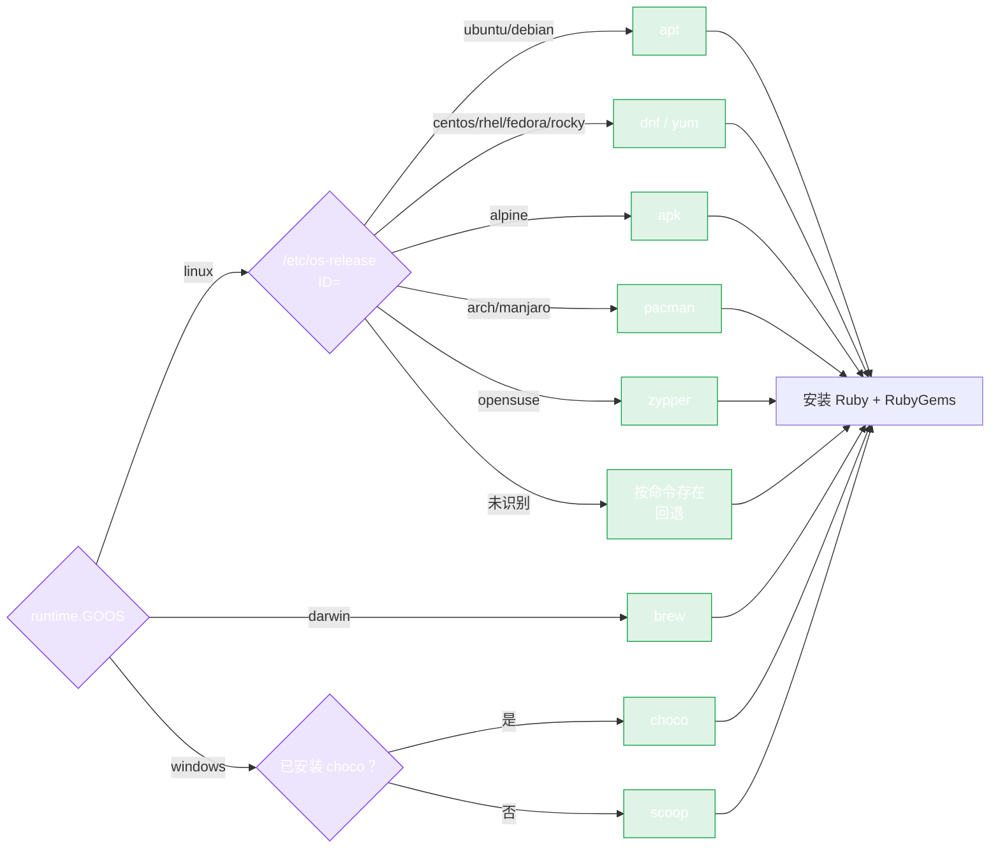

# Auto-Install 概览

`pkg/install` 包可以在一台全新的机器上自动安装 Ruby 和 RubyGems —— 它会检测 OS、发行版、架构和 package manager，然后运行正确的安装命令。正是它让全自动 AI agent 工作流成为可能：agent 可以无需人工配置就能准备好自己需要的工具链。

## 它为什么存在

许多工作流不只是 *调用* RubyGems HTTP API —— 它们还需要 *运行* `gem`、`bundle` 或 `ruby`：

- 在通过 `PushGem` 发布之前构建 `.gem` 文件。
- 解析本地的 `Gemfile.lock`。
- 在 CI 中运行某个 gem 的测试。

在一台全新的 CI runner、容器或沙箱里，这些二进制是不存在的。`pkg/install` 用一次调用填补了这个缺口：

```go
import "github.com/scagogogo/rubygems-skills/pkg/install"

installer := install.NewInstaller()
result, err := installer.Install(ctx)
```

## 它做了什么

1. **检测平台** —— OS（`linux`/`darwin`/`windows`）、架构（`amd64`/`arm64`/...），以及（在 Linux 上）通过 `/etc/os-release` 检测发行版。
2. **选择 package manager** —— `apt`、`yum`、`dnf`、`apk`、`pacman`、`brew`、`choco`、`scoop` 或 `zypper`，并带有按命令是否存在的回退机制。
3. **检查 Ruby 是否已安装** —— 除非设置了 `WithForceReinstall(true)`，否则跳过安装。
4. **执行安装** —— 包索引更新（可选）、Ruby、开发头文件（可选）、Bundler（可选），以及你指定的任何额外包。
5. **返回 `InstallResult`** —— 安装了什么、检测到的 Ruby/gem 版本、运行的命令。



## 已测试的平台

基于 Docker 的集成测试在真实发行版上验证了安装器：

| 发行版 | Package manager | 状态 |
|---|---|---|
| Ubuntu | apt | ✅ |
| Debian | apt | ✅ |
| Alpine | apk | ✅ |
| Fedora | dnf | ✅ |
| Rocky Linux | dnf | ✅ |

完整矩阵见 [支持的平台](./platforms)，代码见 [用法](./usage)。

## 何时使用

- **AI agent 工作流**，需要在沙箱化的机器上运行 Ruby 工具。
- **CI 流水线**，从一个最小基础镜像启动。
- **配置脚本**，需要跨发行版工作，而不用对 `/etc/os-release` 写一堆 `if/else`。

## 何时不要使用

- 你只是调用 **HTTP API**（读或写）—— `pkg/repository` 完全不需要主机上装 Ruby。
- 你在开发者工作站上，Ruby 已经由 `rbenv`/`rvm`/`asdf` 管理 —— 让版本管理器来处理；强制 `apt install ruby` 可能产生冲突。

---

下一篇：[支持的平台](./platforms)。
