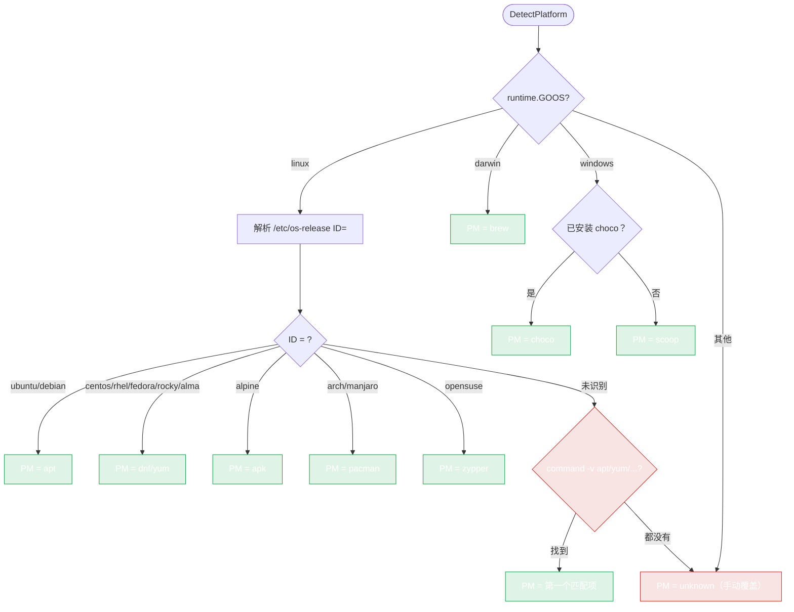

# 支持的平台

`pkg/install` 会检测 OS 并分派到正确的 package manager。本页列出支持的内容以及检测的工作方式。

## 操作系统

| OS（`OperatingSystem`） | 检测方式 | Package manager |
|---|---|---|
| `linux`（`OSLinux`） | `runtime.GOOS` | apt、yum、dnf、apk、pacman、zypper |
| `darwin`（`OSDarwin`） | `runtime.GOOS` | brew |
| `windows`（`OSWindows`） | `runtime.GOOS` | choco、scoop |
| `unknown`（`OSUnknown`） | — | 无（仅手动覆盖） |

## Linux 发行版

通过解析 `/etc/os-release` 检测（对于缺少该文件的发行版，有按文件是否存在的回退机制）。常量定义在 `pkg/install/installer.go`：

| 发行版（`LinuxDistro`） | 常量 | PM |
|---|---|---|
| Ubuntu | `DistroUbuntu` | apt |
| Debian | `DistroDebian` | apt |
| CentOS | `DistroCentOS` | yum |
| RHEL | `DistroRHEL` | yum/dnf |
| Fedora | `DistroFedora` | dnf |
| Rocky | `DistroRocky` | dnf |
| Alma | `DistroAlma` | dnf |
| Alpine | `DistroAlpine` | apk |
| Arch | `DistroArch` | pacman |
| Manjaro | `DistroManjaro` | pacman |
| Amazon Linux | `DistroAmazon` | yum/dnf |
| openSUSE | `DistroOpenSUSE` | zypper |
| 未知 | `DistroUnknown` | 按命令存在猜测 PM |

## 架构

| 架构（`Architecture`） | 常量 |
|---|---|
| amd64 | `ArchAMD64` |
| arm64 | `ArchARM64` |
| arm | `ArchARM` |
| 386 | `Arch386` |
| 未知 | `ArchUnknown` |

通过 `runtime.GOARCH` 检测。

## Package manager

| PM（`PackageManager`） | 常量 | 安装命令 |
|---|---|---|
| apt | `PMApt` | `apt-get install` |
| yum | `PMYum` | `yum install` |
| dnf | `PMDnf` | `dnf install` |
| apk | `PMApk` | `apk add` |
| pacman | `PMPacman` | `pacman -S` |
| brew | `PMBrew` | `brew install` |
| choco | `PMChoco` | `choco install` |
| scoop | `PMScoop` | `scoop install` |
| zypper | `PMZypper` | `zypper install` |
| 未知 | `PMUnknown` | — |

## 检测决策树



## 检测顺序

1. **OS** —— `runtime.GOOS`（即时，始终可用）。
2. **架构** —— `runtime.GOARCH`。
3. **发行版（仅 Linux）** —— `detectLinuxDistro()`：
   - 解析 `/etc/os-release` 中的 `ID=`。
   - 回退到发行版专属文件（`/etc/debian_version`、`/etc/centos-release` 等）。
   - 最后手段：根据哪个 package manager 命令存在来推断。
4. **Package manager** —— 由发行版推导，带有按命令是否存在的回退（`detectPackageManagerByCommand`）。

如果检测选错了 PM（罕见，发生在不寻常的发行版上），可以这样覆盖：

```go
opts := install.NewInstallOptions().WithCustomPackageManager(install.PMApt)
installer := install.NewInstaller(opts)
```

## Docker 验证

集成测试（`pkg/install/docker_test.go`，以 `TEST_DOCKER=1` 运行）会真正启动容器并在其上安装 Ruby：

- `ubuntu:22.04`（apt）→ Ruby 3.x
- `debian:12`（apt）→ Ruby 3.x
- `alpine:3.19`（apk）→ Ruby 3.x
- `fedora:40`（dnf）→ Ruby 3.2.5
- `rockylinux:9`（dnf）→ Ruby 3.x

每个测试用 `command -v ruby` 以及 `ruby -v` / `gem -v` 来验证。

---

下一篇：[用法](./usage)。
