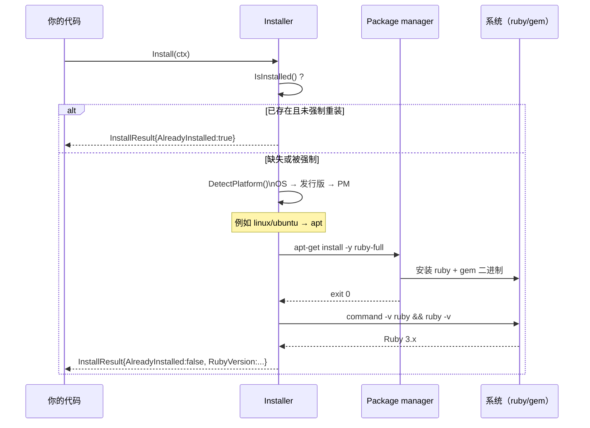

# Auto-Install 用法

`pkg/install` 的编程式用法 —— 从 Go 中检测、安装并验证 Ruby/RubyGems。

## 最小安装

```go
package main

import (
    "context"
    "fmt"
    "log"

    "github.com/scagogogo/rubygems-skills/pkg/install"
)

func main() {
    ctx := context.Background()
    installer := install.NewInstaller()

    result, err := installer.Install(ctx)
    if err != nil {
        log.Fatalf("install failed: %v", err)
    }
    fmt.Printf("Installed: %s\n", result.RubyVersion)
}
```

`NewInstaller` 是可变参数的 —— 传入零个 option 即采用合理的默认值（自动检测一切，安装 Ruby + RubyGems，600 秒超时，需要时使用 sudo）。

在内部，`Install(ctx)` 运行一条 检测 → 分派 → 安装 → 验证 的流水线：



## 安装前先检查

如果 Ruby 已经存在，可以避免一次冗余的安装：

```go
ok, info, err := installer.IsInstalled()
if err != nil {
    log.Fatal(err)
}
if ok {
    fmt.Printf("Ruby %s already installed\n", info.RubyVersion)
    return
}
// 否则继续安装
result, err := installer.Install(ctx)
```

`IsInstalled()` 返回 `(bool, *RubyInfo, error)`。`RubyInfo` 的字段：`RubyVersion`、`GemVersion`、`RubyPath`、`GemPath`。

## 查看检测到的平台

```go
platform, err := installer.DetectPlatform()
if err != nil {
    log.Fatal(err)
}
fmt.Println(platform.String())
// Linux:   "linux/ubuntu (amd64, apt)"
// macOS:   "darwin/arm64 (brew)"
// Windows: "windows/amd64 (choco)"
```

`PlatformInfo` 的字段：`OS`、`Arch`、`Distro`、`PackageMgr`、`PackageMgrCmd`。适合在真正提交安装之前用于日志或条件逻辑。

## Options

```go
opts := install.NewInstallOptions().
    WithForceReinstall(true).     // 即使已存在也重装
    WithRubyVersion("3.3.0").     // 目标版本（在支持的 PM 上）
    WithDevHeaders(true).         // 用于编译 native 扩展
    WithBundler(true).            // 同时安装 Bundler
    WithUpdatePackageIndex(true). // 先运行 apt update 或等价命令
    WithTimeout(900).             // 每条命令的超时（秒）
    WithSudo(true).               // 对特权命令使用 sudo
    WithExtraPackages("build-essential", "libssl-dev")  // 一并安装
    // .WithCustomPackageManager(install.PMApt)  // 覆盖检测

installer := install.NewInstaller(opts)
result, err := installer.Install(ctx)
```

| 方法 | 效果 |
|---|---|
| `WithForceReinstall(bool)` | 即使 Ruby 已存在也重新安装。 |
| `WithRubyVersion(string)` | 指定目标 Ruby 版本（是否支持取决于 PM）。 |
| `WithDevHeaders(bool)` | 安装开发头文件（native-ext gem 需要）。 |
| `WithBundler(bool)` | 同时安装 Bundler。 |
| `WithCustomPackageManager(pm)` | 覆盖检测到的 PM —— 传入一个 `install.PM*` 常量。 |
| `WithUpdatePackageIndex(bool)` | 安装前运行 `apt update` 或等价命令。 |
| `WithTimeout(seconds)` | 每条命令的超时。默认 600 秒。 |
| `WithSudo(bool)` | 给特权命令加上 `sudo` 前缀。 |
| `WithExtraPackages(pkgs...)` | 随 Ruby 一起安装的额外包。 |

## InstallResult

`Install(ctx)` 返回一个 `*InstallResult`，描述发生了什么 —— 运行的命令、安装后检测到的 Ruby/gem 版本，以及是否跳过了什么。完整字段见 `pkg/install/installer.go`。

## CI / root 用法

当以 root 运行时（CI 容器中的典型场景），传 `-no-sudo`（CLI）或 `WithSudo(false)`：

```go
opts := install.NewInstallOptions().WithSudo(false)
installer := install.NewInstaller(opts)
_, err := installer.Install(ctx)
```

安装器会通过 `isRunningAsRoot()` 自动检测 root，并在已经是 root 时跳过 `sudo`，但显式设置可以避免意外。

## 安装之后：使用 SDK

一旦 Ruby 就绪，你的 agent 就可以直接运行 `gem`/`ruby`，**而且** HTTP API（`pkg/repository`）全程可用 —— 它不需要主机上有 Ruby。典型的 agent 流程：

```go
// 1.（可选）如果工作流需要运行 gem/ruby，则安装 Ruby
installer := install.NewInstaller()
if ok, _, _ := installer.IsInstalled(); !ok {
    installer.Install(ctx)
}

// 2. 使用 HTTP API —— 这一步不需要 Ruby 二进制
repo := repository.NewRepository()
pkg, _ := repo.GetPackage(ctx, "rails")
```

---

← 返回：[支持的平台](./platforms) · 上级：[Auto-Install](./overview)
