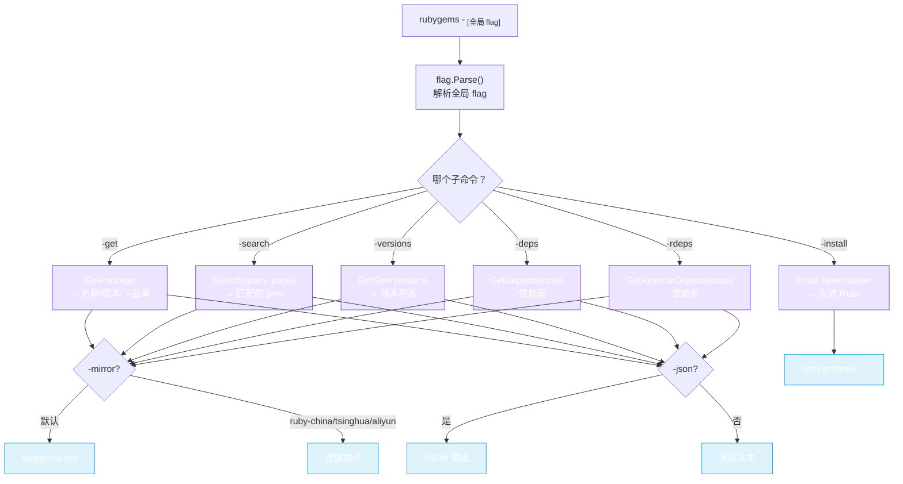

# CLI 命令

`rubygems` CLI 使用 Go 的 `flag` 包 —— 传入一个子命令 flag 及其参数即可。



一个子命令 flag 决定要执行的动作；全局 flag（`-gem`、`-query`、`-mirror`、`-json`、`-cache`）控制请求和输出。

## 全局 flag

| Flag | 默认值 | 用途 |
|---|---|---|
| `-gem NAME` | `""` | gem 名称（用于 `-get`、`-versions`、`-deps`、`-rdeps`）。 |
| `-query QUERY` | `""` | 搜索查询（用于 `-search`）。 |
| `-limit N` | `10` | 结果行数上限。 |
| `-mirror M` | `default` | 镜像：`default`、`ruby-china`、`tsinghua`、`aliyun`。 |
| `-json` | `false` | 以 JSON 输出。 |
| `-cache` | `false` | 启用内存缓存。 |
| `-help` | `false` | 显示用法。 |

## 子命令

### `-get` —— 包信息

```bash
rubygems -get -gem rails
rubygems -get -gem rails -json
```

打印 gem 的名称、版本、作者、下载量、源 URI 等信息。

### `-search` —— 搜索包

```bash
rubygems -search -query "http client" -limit 5
```

列出匹配的 gem（名称 + 摘要），上限为 `-limit`。

### `-versions` —— 版本列表

```bash
rubygems -versions -gem rails -limit 5
```

列出最近的版本（版本号、平台、是否预发布），最新的排在最前。

### `-deps` —— 依赖

```bash
rubygems -deps -gem rails
```

显示 `rails` 依赖什么（以及什么依赖它），分为运行时/开发两类。

### `-rdeps` —— 反向依赖

```bash
rubygems -rdeps -gem rails
```

列出依赖 `rails` 的 gem。

### `-install` —— 自动安装 Ruby

```bash
rubygems -install
rubygems -install -force
rubygems -install -no-dev -no-bundler
```

通过检测到的 package manager 在本机安装 Ruby + RubyGems。安装相关的 flag：

| Flag | 用途 |
|---|---|
| `-force` | 即使 Ruby 已存在也重新安装。 |
| `-no-dev` | 跳过开发头文件。 |
| `-no-bundler` | 跳过安装 Bundler。 |
| `-no-update` | 跳过包索引更新（`apt update` 等）。 |
| `-no-sudo` | 不使用 `sudo`。 |

编程式用法见 [Auto-Install](../auto-install/overview)。

## 镜像

用 `-mirror` 切换端点，无需改动代码：

```bash
rubygems -get -gem rails -mirror ruby-china
rubygems -search -query puma -mirror tsinghua
```

| 值 | 端点 |
|---|---|
| `default` | `https://rubygems.org` |
| `ruby-china` | `https://gems.ruby-china.com` |
| `tsinghua` | `https://mirrors.tuna.tsinghua.edu.cn/rubygems/api` |
| `aliyun` | `https://mirrors.aliyun.com/rubygems` |

## JSON 输出

给任意读子命令加上 `-json` 即可获得机器可读的输出 —— 方便管道传给 `jq`：

```bash
rubygems -get -gem rails -json | jq '.downloads'
```

---

下一篇：[示例](./examples)。
