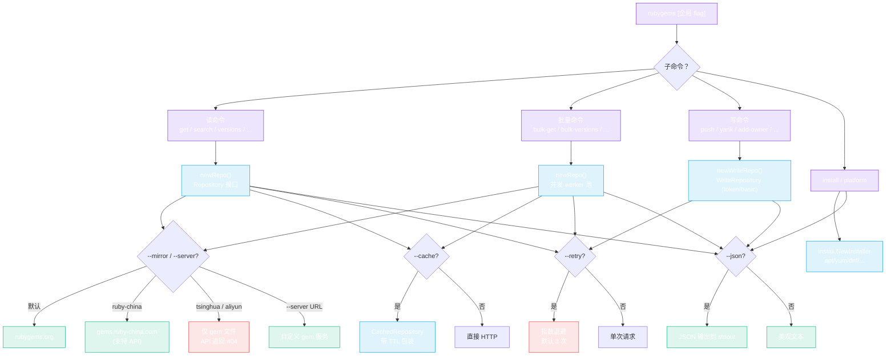
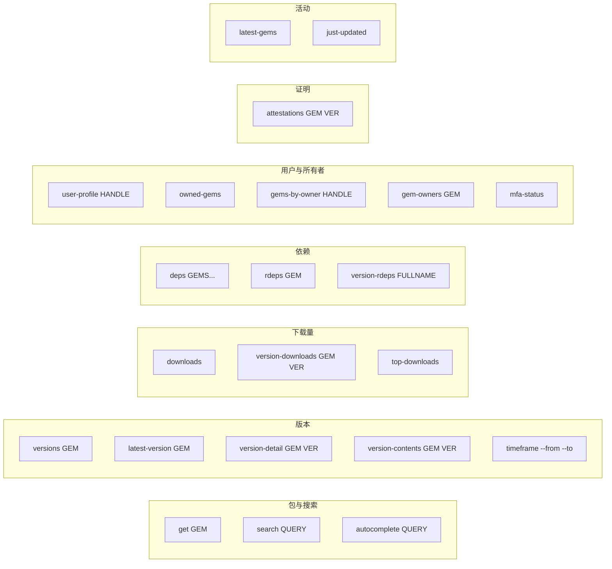

# CLI 命令

`rubygems` CLI 基于 [cobra](https://github.com/spf13/cobra) 构建。每个动作是一个子命令；全局 flag 适用于绝大多数命令。



## 全局 flag

这些 flag 适用于绝大多数子命令，用于塑造客户端、请求与输出。

| Flag | 默认值 | 用途 |
|---|---|---|
| `--mirror M` | `default` | 镜像：`default`、`ruby-china`、`tsinghua`、`aliyun`。 |
| `--server URL` | `""` | 自定义 gem 服务 URL（覆盖 `--mirror`）。 |
| `--token T` | `""` | API token（提升限流配额；写操作与认证操作必填）。 |
| `--proxy URL` | `""` | HTTP 代理 URL。 |
| `--timeout S` | `30` | 请求超时（秒）。 |
| `--json` | `false` | 以 JSON 输出。 |
| `--cache` | `false` | 启用内存缓存。 |
| `--cache-ttl M` | `5` | 缓存 TTL（分钟，仅与 `--cache` 配合）。 |
| `--retry` | `false` | 启用带退避的重试。 |
| `--retry-attempts N` | `3` | 最大重试次数（仅与 `--retry` 配合）。 |
| `--retry-wait S` | `1` | 初始重试等待（秒，仅与 `--retry` 配合）。 |
| `--retry-backoff` | `true` | 使用指数退避（仅与 `--retry` 配合）。 |

## 读命令



### `get` —— 包信息

```bash
rubygems get rails
rubygems get rails --json
rubygems get rails --mirror ruby-china
```

打印 gem 的名称、版本、作者、下载量、源 URI 等信息。

### `search` —— 搜索包

```bash
rubygems search "http client" --limit 5 --page 2
```

列出匹配的 gem（名称 + 摘要），上限为 `--limit`。

### `autocomplete` —— 自动补全建议

```bash
rubygems autocomplete rail
```

返回匹配的包名建议。

### `versions` —— 版本列表

```bash
rubygems versions rails --limit 5
```

列出最近的版本（版本号、下载量、发布日期），最新的排在最前。

### `latest-version` —— 最新版本

```bash
rubygems latest-version rails
```

### `version-detail` —— V2 详细版本信息

```bash
rubygems version-detail rails 8.1.3
rubygems version-detail rails 8.1.3 --json
```

API v2 —— 含 `spec_sha`、`yanked`、完整依赖列表、requirements。

### `version-contents` —— V2 文件校验和

```bash
rubygems version-contents rails 8.1.3
```

### `downloads` —— 仓库总下载量

```bash
rubygems downloads
```

### `version-downloads` —— 版本下载量

```bash
rubygems version-downloads rails 8.1.3
```

### `top-downloads` —— 下载量前 50

```bash
rubygems top-downloads --limit 10
```

### `deps` —— 依赖（已废弃）

```bash
rubygems deps rails rack
```

> **已废弃：** `/api/v1/dependencies` 端点已于 2023-02-22 被 RubyGems.org 下线，现在返回 404。请改用 `version-detail`（API v2）查看某版本的依赖。

### `rdeps` —— 反向依赖

```bash
rubygems rdeps rack --limit 50
```

列出依赖 `rack` 的 gem。

### `version-rdeps` —— 版本级反向依赖

```bash
rubygems version-rdeps rack-2.2.7
```

`fullName` 参数为 `gemname-version`（如 `rack-2.2.7`）。

### `latest-gems` / `just-updated` —— 活动

```bash
rubygems latest-gems --limit 10
rubygems just-updated --limit 10
```

### `user-profile` / `owned-gems` / `gems-by-owner` / `gem-owners`

```bash
rubygems user-profile qrush
rubygems owned-gems --token $TOKEN
rubygems gems-by-owner qrush
rubygems gem-owners rails
```

### `attestations` —— sigstore 证明

```bash
rubygems attestations rails 8.1.3
```

### `mfa-status` —— MFA 状态（需要 `--token`）

```bash
rubygems mfa-status --token $TOKEN
```

### `timeframe` —— 时间范围内的版本

```bash
rubygems timeframe --from 2024-01-01T00:00:00Z --to 2024-12-31T23:59:59Z
```

## 批量命令

```bash
rubygems bulk-get rails rack bundler --concurrency 5
rubygems bulk-versions rails,rack --concurrency 3
rubygems bulk-deps rails,rack
rubygems bulk-rdeps rails,rack
```

参数可作为多个位置参数传入，也可作为单个逗号分隔列表。每条命令运行一个并发 worker 池（见[批量操作](../guide/bulk-operations)）。

## 写命令（需要 `--token` 或 HTTP Basic 认证）

```bash
rubygems push ./my-gem-1.0.0.gem
rubygems yank my-gem 1.0.0
rubygems yank my-gem 1.0.0 --platform x86_64-linux
rubygems add-owner my-gem user@example.com --role owner
rubygems remove-owner my-gem user@example.com
rubygems update-owner my-gem user@example.com --role owner
rubygems list-webhooks
rubygems create-webhook my-gem https://example.com/hook
rubygems delete-webhook my-gem https://example.com/hook
rubygems fire-webhook my-gem https://example.com/hook
rubygems get-api-key --user name
rubygems create-api-key --user name --name ci --scopes push_rubygem,yank_rubygem
rubygems update-api-key --user name --api-key KEY --scopes index_rubygems
rubygems my-profile --user name
```

## 镜像

用 `--mirror` 切换端点，无需改动代码：

```bash
rubygems get rails --mirror ruby-china
rubygems get rails --server https://gems.example.com
```

| 值 | 端点 | 支持 API？ |
|---|---|---|
| `default` | `https://rubygems.org` | ✅ 是 |
| `ruby-china` | `https://gems.ruby-china.com` | ✅ 是 |
| `tsinghua` | `https://mirrors.tuna.tsinghua.edu.cn/rubygems` | ❌ 仅 gem 文件（API 返回 404） |
| `aliyun` | `https://mirrors.aliyun.com/rubygems` | ❌ 仅 gem 文件（API 返回 404） |

> 只有官方源和 `ruby-china` 镜像了 API。`tsinghua` 与 `aliyun` 镜像仅提供 gem 文件。

## JSON 输出

给任意读/批量命令加上 `--json` 即可获得机器可读的输出 —— 方便管道传给 `jq`：

```bash
rubygems get rails --json | jq '.downloads'
rubygems bulk-get rails rack bundler --json | jq '.[] | select(.Error == null) | .Value.version'
```

---

下一篇：[示例](./examples)。
