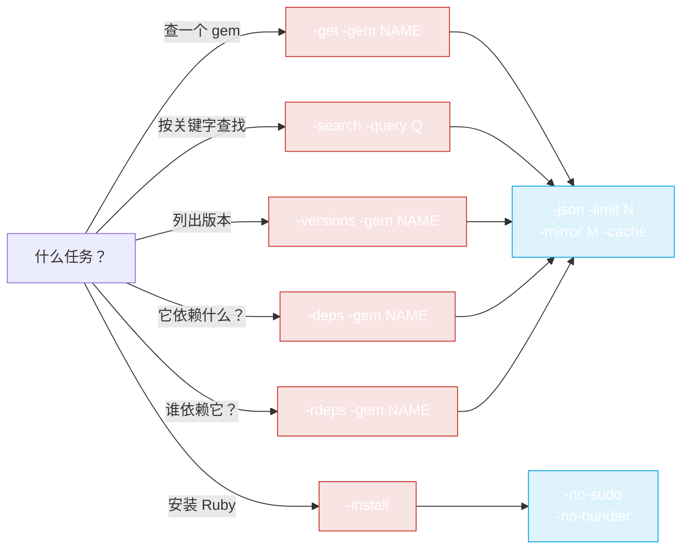

# CLI 示例

使用 `rubygems` CLI 的实战配方。如果你还没构建/安装二进制，请先看 [安装](./install)。



根据你正在做的事情选择一个子命令 —— 下面的示例展示了每种命令的实际用法。

## 快速查询

```bash
# 某个 gem 的最新版本
rubygems -get -gem rails

# 以 JSON 输出，只取版本号
rubygems -get -gem rails -json | jq -r '.version'

# 前 5 个版本
rubygems -versions -gem rails -limit 5
```

## 搜索

```bash
# 查找 HTTP client gem
rubygems -search -query "http client" -limit 10

# JSON，只要名称
rubygems -search -query "http client" -json | jq -r '.[].name'
```

## 依赖审计

```bash
# rails 依赖什么？
rubygems -deps -gem rails

# 谁依赖 rails？
rubygems -rdeps -gem rails -limit 20
```

## 镜像 + 缓存（中国）

```bash
# 通过 Ruby China 镜像快速查询，并启用缓存
rubygems -get -gem rails -mirror ruby-china -cache
rubygems -search -query puma -mirror ruby-china -cache
```

## 脚本：检查 gem 是否存在

```bash
if rubygems -get -gem mygem -json | jq -e '.name' >/dev/null; then
    echo "mygem exists"
else
    echo "mygem not found"
fi
```

## 脚本：批量获取多个 gem 的最新版本

```bash
for g in rails puma sidekiq redis; do
    v=$(rubygems -get -gem "$g" -json | jq -r '.version')
    echo "$g $v"
done
```

## 在 CI 中自动安装 Ruby

在一个没有 Ruby 的全新容器中：

```bash
# 检测 OS，安装 Ruby + RubyGems，不使用 sudo（CI 中以 root 运行）
rubygems -install -no-sudo -no-bundler

# 然后验证
ruby -v
gem -v
```

自动安装的编程式（Go）版本见 [Auto-Install 用法](../auto-install/usage)。

## 与 Go SDK 配合使用

CLI 适合临时查询；当你需要逻辑、批量操作或集成进程序时，就该用 Go SDK。[快速开始](../guide/quick-start) 展示了同样的 `GetPackage` 调用在 Go 中的写法。

---

← 返回：[命令](./commands) · 上级：[CLI](./install)
