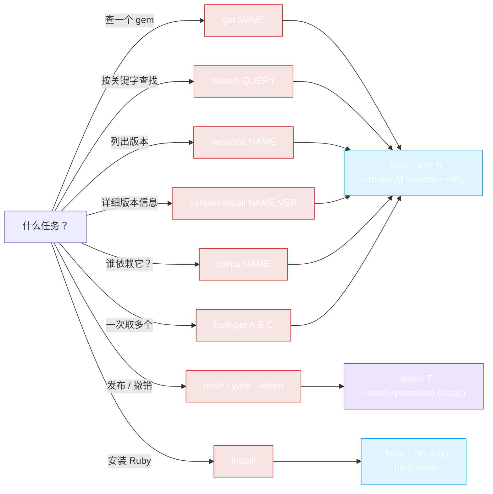

# CLI 示例

使用 `rubygems` CLI 的实战配方。如果你还没构建/安装二进制，请先看 [安装](./install)。



根据你正在做的事情选择一个子命令 —— 下面的示例展示了每种命令的实际用法。

## 快速查询

```bash
# 某个 gem 的最新版本
rubygems get rails

# 以 JSON 输出，只取版本号
rubygems get rails --json | jq -r '.version'

# 前 5 个版本
rubygems versions rails --limit 5

# V2 详细信息（spec_sha、yanked、完整依赖）
rubygems version-detail rails 8.1.3 --json
```

## 搜索

```bash
# 查找 HTTP client gem
rubygems search "http client" --limit 10

# JSON，只要名称
rubygems search "http client" --json | jq -r '.[].name'

# 自动补全
rubygems autocomplete htt
```

## 依赖审计

```bash
# 谁依赖 rails？
rubygems rdeps rails --limit 20

# 版本级反向依赖
rubygems version-rdeps rack-2.2.7

# 某个具体版本的详细依赖（推荐做法，
# 因为 /api/v1/dependencies 端点已于 2023 年废弃）
rubygems version-detail rails 8.1.3 --json | jq '.dependencies'
```

## 批量获取多个 gem

```bash
# 并发获取多个包
rubygems bulk-get rails rack bundler puma sidekiq --concurrency 5

# JSON，提取名称 + 版本对
rubygems bulk-get rails rack bundler --json | jq -r '.[] | select(.Error == null) | "\(.Value.name) \(.Value.version)"'
```

## 镜像 + 缓存 + 重试（中国 / 不稳定网络）

```bash
# 通过 Ruby China 镜像快速查询，并启用缓存与重试
rubygems get rails --mirror ruby-china --cache --retry
rubygems search puma --mirror ruby-china --cache

# 注意：tsinghua 和 aliyun 镜像不提供 API —— 访问 API 请用 ruby-china。
```

## 脚本：检查 gem 是否存在

```bash
if rubygems get mygem --json | jq -e '.name' >/dev/null; then
    echo "mygem exists"
else
    echo "mygem not found"
fi
```

## 脚本：批量获取多个 gem 的最新版本

```bash
for g in rails puma sidekiq redis; do
    v=$(rubygems get "$g" --json | jq -r '.version')
    echo "$g $v"
done
```

或用一次并发调用搞定：

```bash
rubygems bulk-get rails puma sidekiq redis --json | jq -r '.[] | select(.Error == null) | "\(.Value.name) \(.Value.version)"'
```

## 发布与管理 gem（写命令）

```bash
# 发布已构建的 .gem 文件
rubygems push ./mygem-1.0.0.gem --token $RUBYGEMS_TOKEN

# 撤销一个有问题的发布
rubygems yank mygem 1.0.0 --token $RUBYGEMS_TOKEN

# 管理所有者
rubygems add-owner mygem colleague@example.com --role owner --token $RUBYGEMS_TOKEN
rubygems gem-owners mygem

# Webhooks
rubygems create-webhook mygem https://example.com/hook --token $RUBYGEMS_TOKEN
rubygems list-webhooks --token $RUBYGEMS_TOKEN
```

## 在 CI 中自动安装 Ruby

在一个没有 Ruby 的全新容器中：

```bash
# 检测 OS，安装 Ruby + RubyGems，不使用 sudo（CI 中以 root 运行）
rubygems install --no-sudo --no-bundler

# 仅检测平台
rubygems platform

# 然后验证
ruby -v
gem -v
```

自动安装的编程式（Go）版本见 [Auto-Install 用法](../auto-install/usage)。

## 与 Go SDK 配合使用

CLI 适合临时查询；当你需要逻辑、自定义流水线或集成进程序时，就该用 Go SDK。[快速开始](../guide/quick-start) 展示了同样的 `GetPackage` 调用在 Go 中的写法。

---

← 返回：[命令](./commands) · 上级：[CLI](./install)
