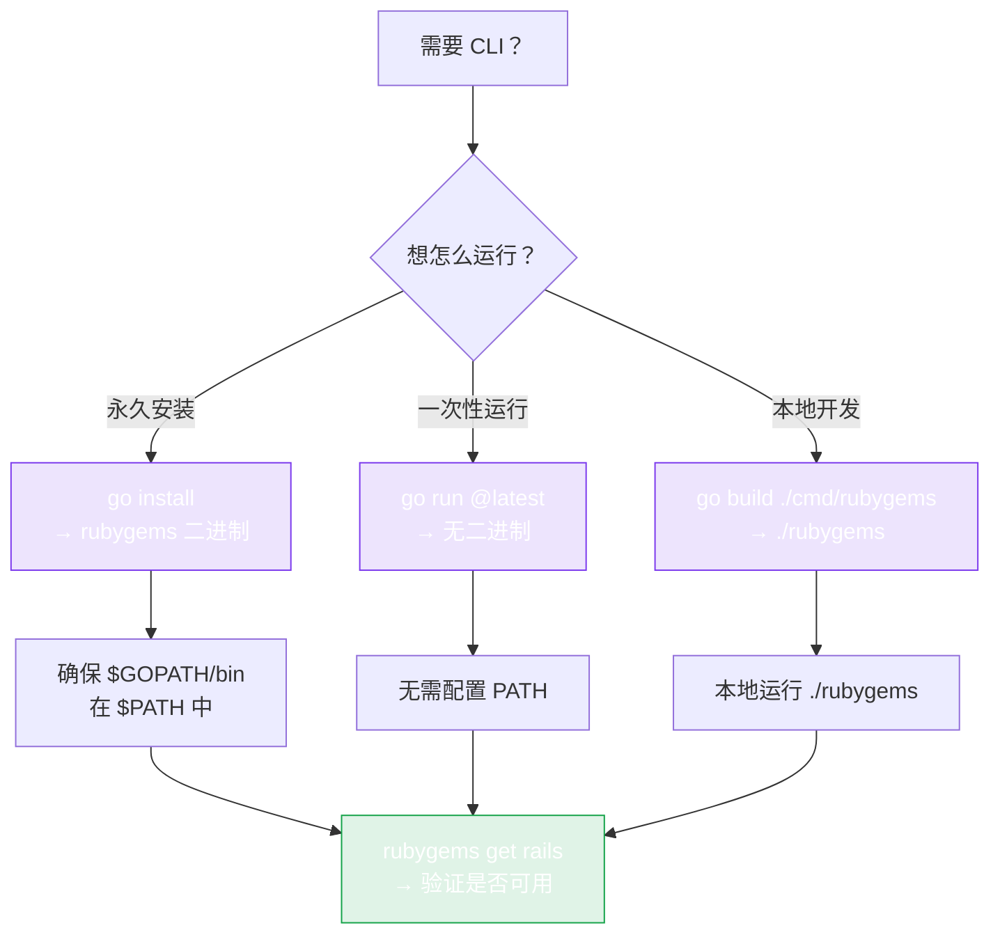

# CLI 安装

仓库在 `cmd/rubygems` 下附带了一个命令行工具 —— 基于 [cobra](https://github.com/spf13/cobra) 构建，暴露了完整的 SDK：读查询、批量操作、写操作，以及 Ruby/RubyGems 自动安装器。



## 安装

```bash
go install github.com/scagogogo/rubygems-skills/cmd/rubygems@latest
```

这会把 `rubygems` 二进制放到你的 `$GOPATH/bin`（或 `$GOBIN`）下。请确保该目录在 `PATH` 中：

```bash
export PATH="$PATH:$(go env GOPATH)/bin"
rubygems --help
```

## 从源码构建

```bash
git clone https://github.com/scagogogo/rubygems-skills.git
cd rubygems-skills
go build -o rubygems ./cmd/rubygems
./rubygems --help
```

## 验证

```bash
rubygems get rails
```

你应该会看到 rails gem 的名称、版本和下载次数。

## 命令分组

CLI 分为四组子命令：

| 分组 | 命令 | 认证 |
|---|---|---|
| **读** | `get`、`search`、`autocomplete`、`versions`、`latest-version`、`version-detail`、`version-contents`、`downloads`、`version-downloads`、`top-downloads`、`deps`、`rdeps`、`version-rdeps`、`latest-gems`、`just-updated`、`user-profile`、`owned-gems`、`gems-by-owner`、`gem-owners`、`attestations`、`mfa-status`、`timeframe` | 可选 `--token` |
| **批量** | `bulk-get`、`bulk-versions`、`bulk-deps`、`bulk-rdeps` | 可选 `--token` |
| **写** | `push`、`yank`、`add-owner`、`remove-owner`、`update-owner`、`list-webhooks`、`create-webhook`、`delete-webhook`、`fire-webhook`、`get-api-key`、`create-api-key`、`update-api-key`、`my-profile` | `--token` 或 HTTP Basic |
| **安装** | `install`、`platform` | 无 |

全局 flag（`--mirror`、`--server`、`--token`、`--proxy`、`--timeout`、`--json`、`--cache`、`--retry`）适用于绝大多数命令。详见 [命令](./commands)。

## 不想安装？用 `go run`

你也可以完全跳过二进制，直接即时运行：

```bash
go run github.com/scagogogo/rubygems-skills/cmd/rubygems@latest get rails
```

---

下一篇：[命令](./commands)。
