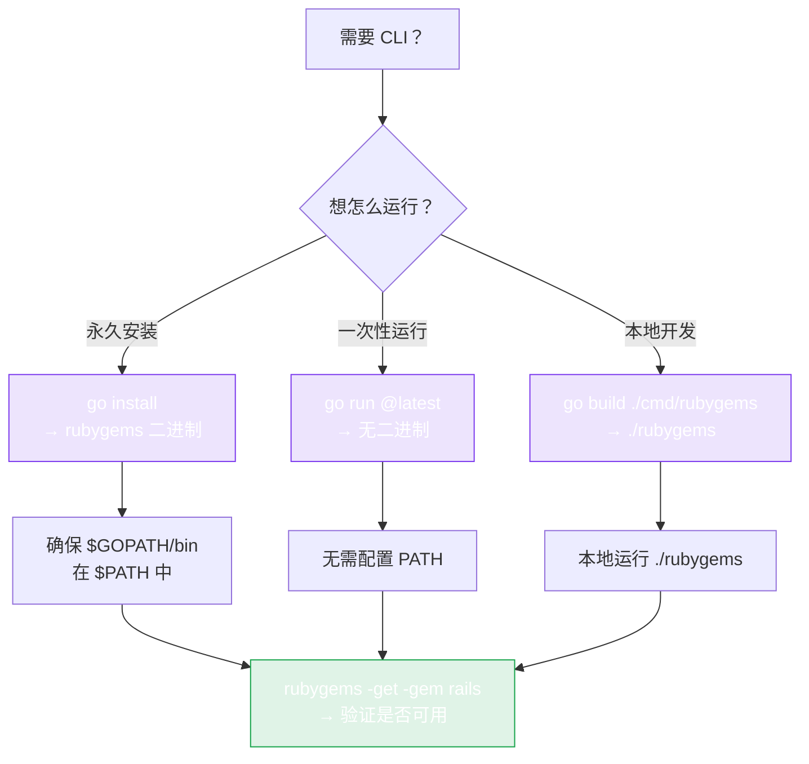

# CLI 安装

仓库在 `cmd/rubygems` 下附带了一个命令行工具 —— 从终端查询 gem、列出版本、搜索，以及自动安装 Ruby，全部搞定。适合快速查询、shell 脚本和 CI 场景。



## 安装

```bash
go install github.com/scagogogo/rubygems-skills/cmd/rubygems@latest
```

这会把 `rubygems` 二进制放到你的 `$GOPATH/bin`（或 `$GOBIN`）下。请确保该目录在 `PATH` 中：

```bash
export PATH="$PATH:$(go env GOPATH)/bin"
rubygems -help
```

## 从源码构建

```bash
git clone https://github.com/scagogogo/rubygems-skills.git
cd rubygems-skills
go build -o rubygems ./cmd/rubygems
./rubygems -help
```

## 验证

```bash
rubygems -get -gem rails
```

你应该会看到 rails gem 的名称、版本和下载次数。

## 功能一览

| 子命令（flag） | 作用 |
|---|---|
| `-get -gem NAME` | 获取包信息 |
| `-search -query QUERY` | 搜索包 |
| `-versions -gem NAME` | 列出版本 |
| `-deps -gem NAME` | 显示依赖 |
| `-rdeps -gem NAME` | 显示反向依赖 |
| `-install` | 在本机自动安装 Ruby/RubyGems |

另外还有输出/格式/镜像相关的 flag（`-json`、`-cache`、`-mirror`、`-limit`）。详见 [命令](./commands)。

## 不想安装？用 `go run`

你也可以完全跳过二进制，直接即时运行：

```bash
go run github.com/scagogogo/rubygems-skills/cmd/rubygems@latest -get -gem rails
```

---

下一篇：[命令](./commands)。
