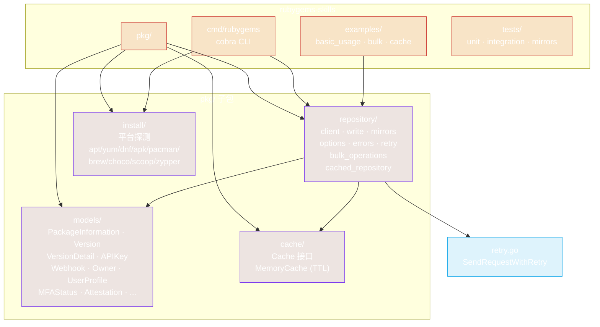
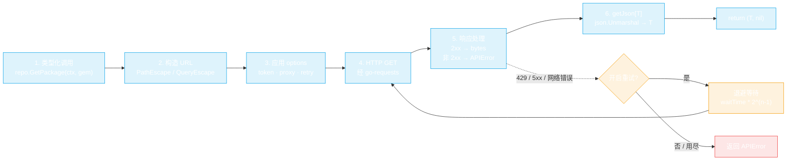
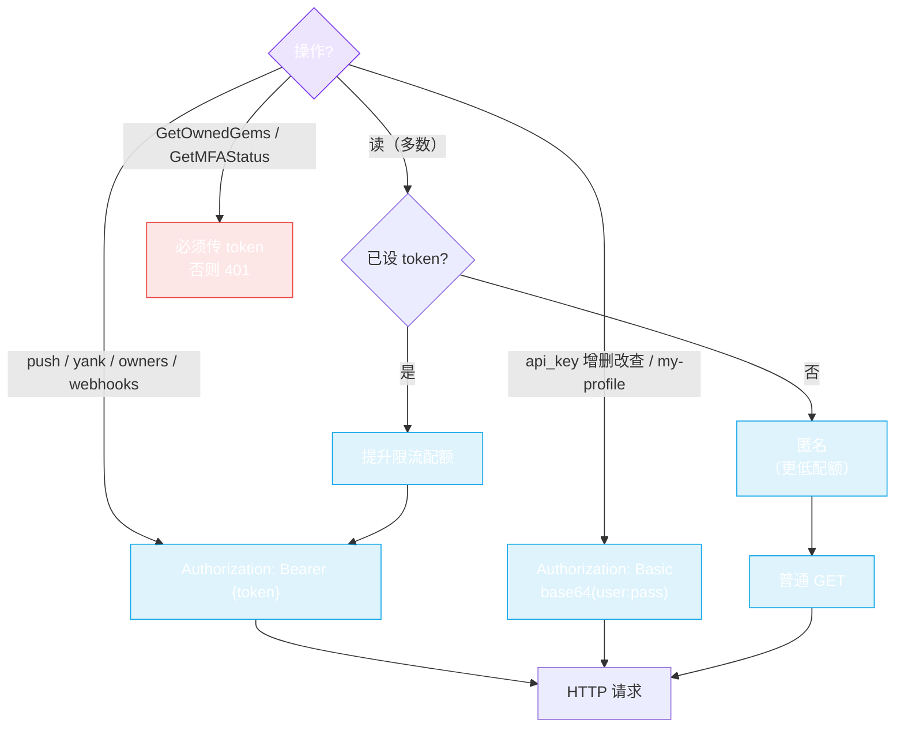
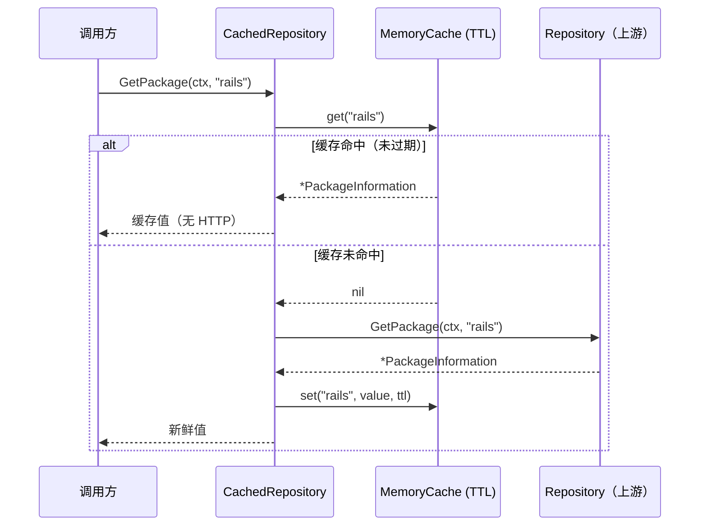
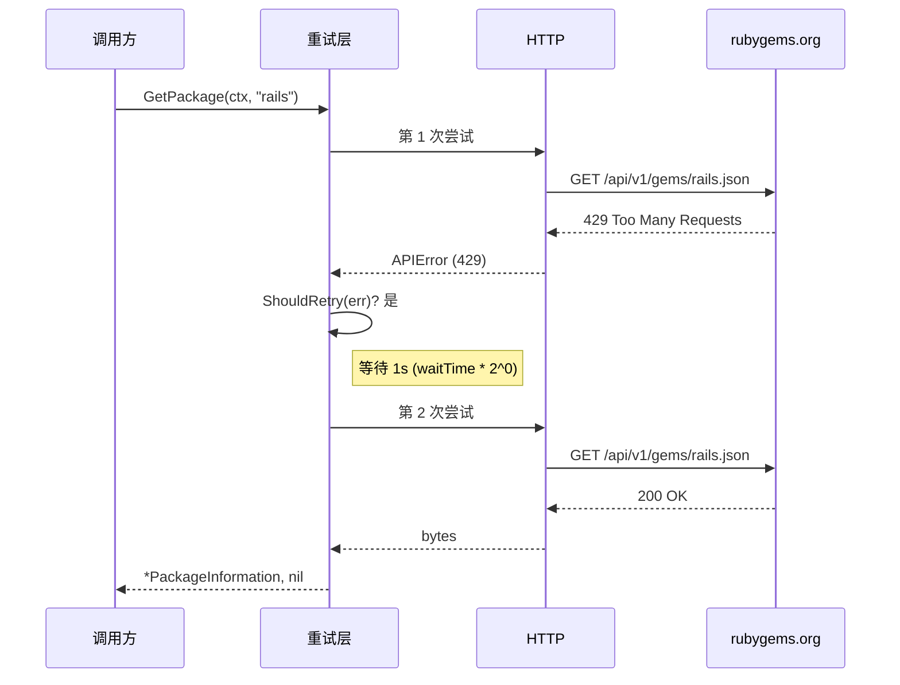
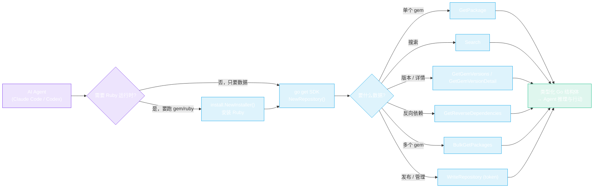

# 架构

深入剖析 rubygems-skills 的端到端结构——包布局、请求管线、认证模型与并发设计。读一遍，你就知道每个特性住在哪里。

## 包布局



四个包各司其职：`repository` 是 HTTP 客户端，`models` 存放类型化的 JSON 结构体，`cache` 是可插拔的 TTL 存储，`install` 是跨平台 Ruby 安装器。CLI 和 examples 都是 `repository`（及 `install`）的薄封装。

## 请求管线

每次读调用都经过相同的五个阶段。写调用在此基础上增加认证和 form/multipart 编码，其余共享同一管线。



两点注意：(1) **URL 编码集中处理**——每个路径段过 `url.PathEscape`，每个查询值过 `url.QueryEscape`，特殊字符不会破坏请求。(2) **重试按客户端可选**，通过 `Options.SetRetryOptions` 一次配置，对该客户端的每个请求（GET、POST、DELETE、form、multipart）生效。

## 认证模型

SDK 按端点选用两种认证策略。读端点可选传 token 以提升限流配额；写端点在 bearer token 与 HTTP Basic 之间二分。



**为何两种策略？** RubyGems.org 把 API Key 管理和完整认证资料放在 HTTP Basic Auth（用户名+密码）之后，而 gem 发布、撤回、所有者、webhook 操作接受 bearer API token。SDK 完全照此实现：`WriteRepository` 在 options 中携带 bearer token，`*APIKey*` / `GetMyProfile` 方法接受 `username, password` 参数并按请求应用 Basic Auth。

## 缓存装饰器

`CachedRepository` 包装任意 `Repository`，对重复读短路。同一接口，直接替换。



缓存以方法 + 参数为键，每项有 TTL，并有后台清理 goroutine。传入任意 `cache.Cache` 实现——`MemoryCache` 是进程内默认实现；你也可以实现该接口，用 Redis、文件系统等做后端。

## 重试与退避

设置了 `RetryOptions` 时，瞬态失败会以指数退避重试后再向上抛出。



默认：3 次尝试、1s 初始等待、指数退避（`waitTime * 2^(attempt-1)`，上限 30s）、任意错误都重试。可用 `NewDefaultRetryOptions().WithMaxAttempts(n).WithWaitTime(d)` 调整。同一重试层覆盖 GET、POST、DELETE、form、multipart 请求——`PushGem` 也会重试。

## 批量并发

`BulkGet*` 方法在固定大小的 worker 池上扇出。每个 worker 拥有独立的结果槽位，因此结果切片无需加锁。

```mermaid
flowchart TB
    Input["names[0..N-1]"] --> Dispatcher["分发器\n把索引 0..N-1 写入带缓冲 channel"]
    Dispatcher --> Ch(("索引 channel"))
    Ch --> W0["worker 0\n→ results[0]"])
    Ch --> W1["worker 1\n→ results[1]"])
    Ch --> W2["worker 2\n→ results[2]"])
    Ch --> WN["worker N-1\n→ results[N-1]"])
    W0 & W1 & W2 & WN --> Gather["预分配 results[]\n顺序与输入一致"]

    W0 -.->|"429?"| Retry["按请求重试\n（若开启）"]
    W0 -.->|"失败"| Slot["results[i].Error = err\n（其他继续）"]

    classDef io fill:#0ea5e922,stroke:#0ea5e9,color:#fff
    classDef worker fill:#7c3aed22,stroke:#7c3aed,color:#fff
    classDef alt fill:#f59e0b22,stroke:#f59e0b,color:#fff
    class Input,Dispatcher,Ch,Gather io
    class W0,W1,W2,WN worker
    class Retry,Slot alt
```

由于分发器派发的是**索引**（而非名字），每个 worker 只写自己的 `results[i]`，结果切片上没有数据竞争——无需互斥锁，无需拷贝。`ContinueOnError(false)` 在首次失败后停止派发；默认 `true` 则跑完所有项并收集各槽位的错误。详见[批量操作](./bulk-operations)。

## AI Agent 视角的端到端流程



Agent 完全不碰 HTTP、JSON 或 URL 编码——它调用类型化方法，对类型化结果做推理。当它需要实际的 `gem`/`ruby` 二进制（例如在 `PushGem` 前构建 `.gem`）时，先由安装器装好。

---

← 返回：[工作原理](./how-it-works) · 下一篇：[安装](./installation)
